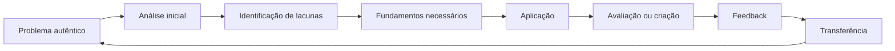
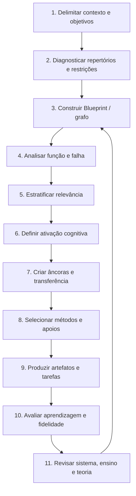
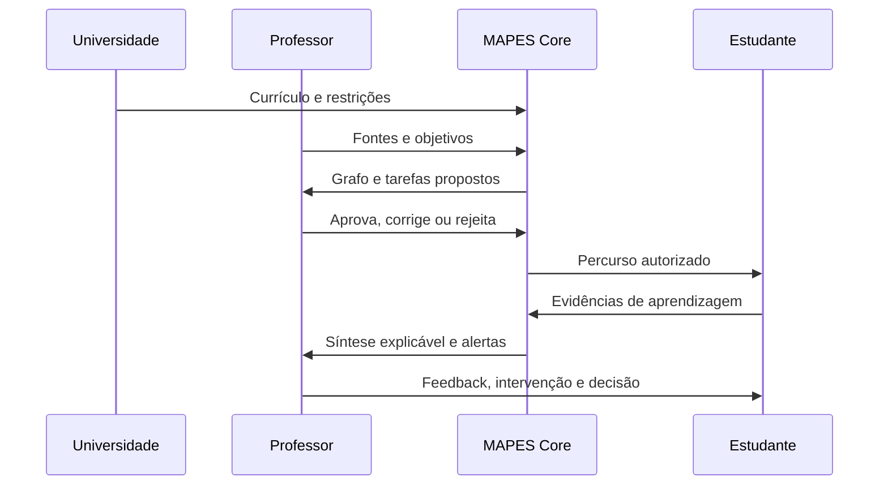
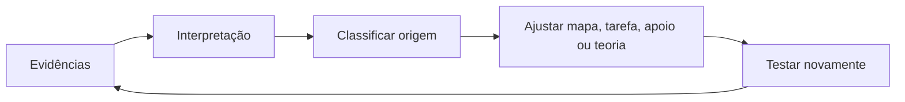
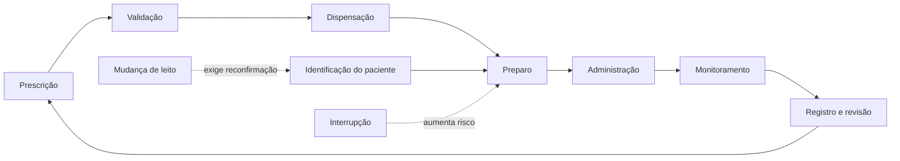

> **Nota de versionamento:** a versão 0.10.0 consolida a definição, a arquitetura operacional, a mensuração multidimensional da qualidade e a governança do framework. O número 1.0.0 permanece reservado a uma versão com instrumentos iniciais validados de fidelidade e resultados de implementação externa.
---
# Resumo / Abstract {.unnumbered}
## Resumo {.unnumbered}
O MAPES — Método de Aprendizagem por Estruturação Sistêmica — é um framework pedagógico, metodológico e institucional de aplicação transversal que organiza conhecimentos complexos como sistemas e orienta seu planejamento, apresentação, avaliação, adaptação e melhoria contínua. Seu núcleo conceitual articula Blueprint funcional, Teleonomia, Taxonomia Acelerada e Ancoragem Contextual, complementados pela Estratificação de Relevância Sistêmica. Seu problema de partida é a dificuldade de estudantes em selecionar, integrar e mobilizar conhecimento em uma ecologia contemporânea marcada por abundância informacional, fragmentação curricular, heterogeneidade de repertórios e concorrência atencional. O MAPES preserva a autoridade acadêmica do professor e pode ser apoiado por tecnologias digitais e inteligência artificial, sem depender delas para sua definição conceitual.
O framework articula quatro pilares: **Blueprint funcional**, representação multiescalar do domínio, formalizável como grafo sistêmico funcional; **Teleonomia**, análise da contribuição funcional, de dependências e falhas sem finalismo; **Taxonomia Acelerada**, introdução precoce e recorrente de tarefas autênticas de aplicação, análise, avaliação e criação, com fundamentos mobilizados de forma oportuna; e **Ancoragem Contextual**, construção de pontos de entrada compatíveis com repertórios dos estudantes, seguida de abstração e transferência. A **Estratificação de Relevância Sistêmica** é uma dimensão transversal independente da complexidade cognitiva.
O documento apresenta fundamentos, pressupostos, definições operacionais, relações entre constructos, proposições testáveis, condições de contorno, ciclo de implementação, três níveis de documentação — Essencial, Padrão e Pesquisa —, artefatos, rubricas, avaliação da aprendizagem, meta-avaliação, governança e agenda empírica. Também especifica o **MAPES Core**, arquitetura operacional normativa do framework cujas funções podem ser realizadas manualmente, digitalmente ou por combinação entre trabalho humano e automação. Software e IA são recursos de implementação do Core. A formulação assume caráter falibilista: benefícios são hipóteses; resultados nulos, custos, disparidades ou efeitos adversos devem revisar o framework.
**Palavras-chave:** aprendizagem sistêmica; design instrucional; aprendizagem ativa; grafos de conhecimento; taxonomia cognitiva; atenção; formação por competências; inteligência artificial na educação; avaliação; agência docente.
## Abstract {.unnumbered}
MAPES — the Systemic Structuring Learning Method — is a cross-domain pedagogical, methodological, and institutional framework that organizes complex knowledge as systems and guides its planning, presentation, assessment, adaptation, and continuous improvement. Its conceptual core articulates the Functional Blueprint, Teleonomy, Accelerated Taxonomy, and Contextual Anchoring, complemented by Systemic Relevance Stratification. MAPES preserves teachers’ academic authority and may be supported by digital technologies and artificial intelligence without depending on them for its conceptual definition.
The framework integrates four pillars: the **Functional Blueprint**, a multiscale representation of a domain that may be formally implemented as a systemic functional graph; **Teleonomy**, the analysis of functional contribution, dependencies, variation, and failure without finalism; **Accelerated Taxonomy**, the early and recurrent use of authentic application, analysis, evaluation, and creation tasks, with foundational knowledge mobilized when required; and **Contextual Anchoring**, the design of entry points connected to learners’ repertoires, followed by abstraction and transfer. **Systemic Relevance Stratification** is a transversal dimension independent from cognitive complexity.
This document defines foundations, assumptions, constructs, relationships, testable propositions, boundary conditions, implementation cycles, proportional documentation levels, artifacts, assessment, meta-evaluation, governance, and a research agenda. It also specifies **MAPES Core** as the framework’s normative operational architecture. Its functions may be performed manually, digitally, or through combined human work and automation; software and artificial intelligence are implementation resources. The formulation is explicitly fallibilist: benefits remain hypotheses, and null findings, costs, inequities, or adverse effects must inform revision.
**Keywords:** systemic learning; instructional design; active learning; knowledge graphs; cognitive taxonomy; attention; competency-based education; artificial intelligence in education; assessment; teacher agency.
---
# Introdução

## Informação disponível, conhecimento desorganizado

O contexto educacional contemporâneo não pode ser descrito apenas como transição da escassez para a abundância. Bibliotecas digitais, plataformas, vídeos, redes sociais e sistemas de inteligência artificial ampliaram radicalmente a disponibilidade de explicações e respostas, mas não distribuíram de modo equivalente as capacidades de selecionar fontes, identificar relações, avaliar confiança e mobilizar conhecimento. Acesso e aprendizagem não são sinônimos.

O manifesto que originou o MAPES utiliza a imagem de um galpão repleto de peças de automóvel sem planta de montagem (de Moura Castro & Guimaães, n.d.). A metáfora expressa uma distinção pedagógica importante: conhecer nomes e partes não assegura compreender a arquitetura que lhes atribui posição e função. Em termos acadêmicos, o problema pode ser formulado como discrepância entre **disponibilidade informacional** e **organização cognitiva, curricular e epistemológica**.

A ciência da aprendizagem mostra que conhecimentos prévios influenciam interpretação e memória; especialistas reconhecem estruturas profundas; e novatos podem perceber os mesmos materiais segundo características superficiais (Bransford et al., 2000; Chi et al., 1981; National Academies of Sciences, Engineering, and Medicine, 2018). Isso não significa que o professor deva simplesmente entregar um mapa completo. Significa que relações organizadoras precisam tornar-se objeto explícito de ensino, uso e revisão.

## O estudante em uma ecologia atencional de alta concorrência

O MAPES foi motivado, em parte, por uma percepção de crise moderna da atenção. A formulação exige precisão. A literatura não demonstra que todos os estudantes contemporâneos tenham uma capacidade atencional uniformemente menor. “Atenção” abrange processos distintos, e muitos problemas atribuídos a ela podem refletir sono, saúde, motivação, conhecimento prévio, ansiedade, desenho da tarefa, acessibilidade, ambiente social ou condições clínicas.

Há, contudo, mudanças reais na ecologia de aprendizagem. Estudantes podem alternar entre materiais, mensagens e plataformas; estudar diante de notificações; acessar explicações antes de formular o problema; e receber grandes quantidades de conteúdo sem hierarquia. Pesquisas associam uso intenso ou problemático de smartphones a resultados acadêmicos inferiores, mas estimativas variam e podem ser influenciadas por confundimento (Amez & Baert, 2020; Amez et al., 2023; Bjerre-Nielsen et al., 2020; Sunday et al., 2021). Meta-análises sobre a simples presença do aparelho chegaram a avaliações diferentes sobre a robustez do chamado *brain drain effect* (Böttger et al., 2023; Parry, 2024; Ward et al., 2017).

A evidência é mais direta quando a tecnologia produz competição durante a tarefa. Multitarefa de mídia, interrupções e alternância podem prejudicar processamento, especialmente quando as atividades disputam recursos e exigem manutenção de objetivos (Biedermann et al., 2021; Parry & le Roux, 2021; Sana et al., 2013; Uncapher & Wagner, 2018). Divagação mental, por sua vez, é fenômeno humano geral, mas pode aumentar durante exposições prolongadas e pouco interativas; testes interpolados e tarefas de recuperação podem reduzi-la em determinados contextos (Smallwood & Schooler, 2015; Szpunar et al., 2013; Zhang et al., 2020).

O MAPES adota, portanto, a expressão **ecologia atencional de alta concorrência**. Ela descreve um ambiente no qual selecionar, sustentar e retomar objetivos pode exigir esforço elevado. Essa formulação evita quatro erros:

1. não reduz o problema a smartphones;
2. não transforma correlação em causalidade;
3. não trata estudantes como geração deficitária;
4. não confunde desenho pedagógico com tratamento clínico.

## Fragmentação, desorientação e falsa fluência

O estudante pode encontrar três dificuldades simultâneas.

A primeira é **fragmentação**: conteúdos são distribuídos por aulas, disciplinas e materiais sem explicitação suficiente das relações. A segunda é **desorientação**: o estudante não sabe onde um detalhe se localiza, por que importa ou que outras ideias dependem dele. A terceira é **falsa fluência**: uma explicação clara ou uma resposta gerada pode produzir sensação de entendimento sem capacidade de recuperar, justificar, aplicar ou transferir.

Deslauriers et al. (2019) mostraram que estudantes podem sentir que aprendem mais em uma condição expositiva fluente enquanto aprendem efetivamente mais em uma condição ativa. Prática de recuperação e atividades generativas ajudam a revelar se o conhecimento está disponível para uso (Dunlosky et al., 2013; Fiorella & Mayer, 2015; Karpicke & Blunt, 2011; Roediger & Karpicke, 2006). O MAPES não se opõe à clareza; opõe-se a confundir clareza percebida com domínio demonstrado.

## Heterogeneidade e desigualdade no custo de integração

Sem arquitetura explícita, cada estudante precisa inferir relações. Aqueles que já conhecem o vocabulário do campo, possuem modelos mentais próximos ou têm acesso a apoio podem fazê-lo com menor custo. Outros recebem as mesmas partes, mas não os mesmos meios de integração. A heterogeneidade não deve ser respondida por currículos de exigência desigual. O ponto de entrada e o apoio podem variar; os conceitos nucleares e critérios de validade permanecem.

A literatura sobre reversão da expertise alerta que um apoio útil a novatos pode tornar-se redundante para avançados (Kalyuga, 2007). A personalização MAPES deve basear-se em evidência de conhecimento e desempenho, e não em rótulos fixos de “estilo de aprendizagem”.

## O professor como agente central

O objetivo do MAPES não é substituir o docente. Ao contrário, ambientes de abundância tornam mais valiosas funções que dependem de julgamento profissional e relação humana. O professor:

- define o que vale a pena aprender;
- valida fontes e representações;
- decide que simplificações são legítimas;
- interpreta erros e silêncios;
- constrói confiança, pertencimento e expectativa;
- organiza diálogo e conflito produtivo;
- oferece feedback responsivo;
- reconhece necessidades não capturadas por dados;
- arbitra avaliação e equidade;
- assume responsabilidade ética e institucional.

A IA pode gerar versões preliminares de mapas, tarefas e rubricas. Estudos sobre IA e design instrucional apontam ganhos potenciais, mas também necessidade de expertise, revisão e confiança calibrada (Celik et al., 2022; Choi et al., 2024; Luo et al., 2025; Moundridou et al., 2024; Nazaretsky et al., 2022). A formulação normativa é:

> **A IA estrutura, compara e propõe; o professor define, valida, interpreta, decide e responde pelas consequências.**

Essa relação constitui **autoria assistida**. A instituição estabelece políticas, limites, proteção de dados e governança; a tecnologia não desloca a autoria acadêmica nem a responsabilidade profissional do professor.

## Problema e finalidade do MAPES

O MAPES responde a cinco dificuldades relacionadas:

1. **fragmentação arquitetural:** partes sem relações explícitas;
2. **opacidade funcional:** identificação sem compreensão de contribuição, dependência e falha;
3. **estacionamento cognitivo:** predomínio de reconhecimento e reprodução sem uso complexo;
4. **distância contextual:** entrada pouco conectada ao repertório;
5. **sobrecarga de desenho:** dificuldade docente de transformar objetivos e fontes em experiências coerentes.

Sua finalidade é fornecer uma arquitetura para planejar, ensinar, aprender, avaliar e revisar conhecimentos complexos. O MAPES articula pilares, metodologias, práticas e artefatos; não prescreve uma única sequência nem uma plataforma.

## Estatuto epistemológico

O MAPES é apresentado como **framework pedagógico, metodológico e institucional de aplicação transversal**, em continuidade às decisões normativas consolidadas pelo Projeto MAPES (2026). Sua pesquisa constitui um programa de investigação, validação e aperfeiçoamento do framework. Esse programa preserva constructos definidos, relações, mecanismos, condições de contorno, predições observáveis, operacionalização, possibilidade de refutação e revisão acadêmica. O presente documento fornece essa arquitetura, mas não constitui validação de eficácia.

Não devem ser alegados como fatos estabelecidos:

- superioridade universal do MAPES;
- redução comprovada de ansiedade, evasão ou carga cognitiva;
- recuperação de uma suposta atenção perdida;
- transferência automática;
- eficácia transversal;
- equivalência entre satisfação e aprendizagem;
- precisão autônoma de sistemas de IA.

## Definição canônica

> **MAPES — Método de Aprendizagem por Estruturação Sistêmica — é um framework pedagógico, metodológico e institucional de aplicação transversal que organiza conhecimentos complexos como sistemas e orienta seu planejamento, apresentação, avaliação, adaptação e melhoria contínua. Seu núcleo conceitual articula Blueprint funcional, Teleonomia, Taxonomia Acelerada e Ancoragem Contextual, complementados pela Estratificação de Relevância Sistêmica.**

O MAPES preserva a autoridade acadêmica do professor e pode ser apoiado por tecnologias digitais e inteligência artificial, sem depender delas para sua definição conceitual.

## Objetivos deste documento

1. formalizar o MAPES;
2. contextualizar o problema do estudante sem alarmismo;
3. definir constructos e relações;
4. resolver a ambiguidade da Taxonomia Acelerada;
5. orientar implementação proporcional;
6. especificar artefatos e avaliação;
7. integrar tecnologia sem substituir o docente;
8. estabelecer governança piloto;
9. formular proposições e agenda de pesquisa.

---

# Fundamentação Teórica

## Conhecimento como organização relacional

O MAPES parte da tese de que aprendizagem de domínios complexos envolve mais que acumulação de proposições. Envolve construir representações nas quais componentes, relações, condições e funções possam ser recuperados e mobilizados. Ausubel (1968) destacou a relação entre novo conteúdo e estrutura cognitiva; Novak e Gowin (1984) operacionalizaram parte dessa ideia em mapas conceituais. Bransford et al. (2000) e National Academies of Sciences, Engineering, and Medicine (2018) sintetizam evidências sobre conhecimento prévio, organização e transferência.

O MAPES converge com essas tradições, mas propõe um objeto mais amplo que o mapa conceitual. Um sistema pode conter entidades de naturezas diferentes, fluxos, estados, relações probabilísticas, ciclos, falhas, técnicas e competências. O Blueprint funcional deve declarar que representação é adequada a um objetivo e que aspectos foram omitidos.

## Representação de especialistas e novatos

O estudo clássico de Chi et al. (1981) mostrou que especialistas em física classificavam problemas por princípios, enquanto novatos enfatizavam características superficiais. A implicação não é que uma figura pronta produza expertise. Especialistas possuem conhecimento organizado e práticas de reconhecimento construídas ao longo do tempo. O ensino pode, porém, tornar explícitas estruturas profundas e exigir que estudantes as usem para classificar, explicar e decidir.

No MAPES, um mapa é pedagógico apenas quando participa do raciocínio. Atividades devem solicitar localização, comparação, explicação de arestas, previsão de consequências e revisão da representação.

## Carga cognitiva e desenho

Memória de trabalho é limitada, e a interatividade entre elementos influencia dificuldade. A teoria da carga cognitiva sustenta orientação, exemplos e desenho compatível com expertise (Sweller, 1988; Sweller et al., 2019). O MAPES pode reduzir busca extrínseca ao oferecer organização, mas pode aumentar carga por densidade gráfica ou excesso de documentação.

Princípios derivados:

- visão geral antes de detalhe, sem exigir domínio imediato de todo o mapa;
- revelação progressiva de camadas;
- relações destacadas conforme a tarefa;
- exemplos resolvidos para novatos;
- prática de componentes quando necessária;
- retirada gradual de apoio;
- adaptação por evidência de domínio;
- separação entre complexidade inerente e apresentação confusa.

A reversão da expertise exige que a mesma interface não seja imposta a todos (Kalyuga, 2007). Personalização deve reduzir redundância, não criar currículos epistemicamente distintos.

## Aprendizagem generativa, recuperação e transferência

Fiorella e Mayer (2015) descrevem estratégias nas quais estudantes selecionam, organizam e integram: resumir, mapear, desenhar, explicar, imaginar e ensinar. Prática de recuperação melhora retenção e pode superar estudo elaborativo em certas condições (Karpicke & Blunt, 2011; Roediger & Karpicke, 2006). Essas evidências desafiam a ideia de que níveis “baixos” devam ser eliminados. Recuperar conceitos pode ser necessário para raciocínio complexo.

A Taxonomia Acelerada não rejeita memória; rejeita a manutenção da memória como destino exclusivo. Fundamentos são recuperados porque participam de uma decisão, explicação ou criação.

Transferência é variável e dependente de distância entre contextos, representação e prática (Barnett & Ceci, 2002; Norman, 2009). Por isso, toda âncora MAPES deve ser seguida por desancoragem e tarefa em contexto diferente.

## Aprendizagem ativa e ICAP

Aprendizagem ativa melhora resultados médios em várias áreas, particularmente quando envolve participação cognitiva efetiva (Freeman et al., 2014; Theobald et al., 2020). O ICAP distingue modos passivo, ativo, construtivo e interativo conforme o tipo de produto cognitivo, não apenas o movimento observável (Chi & Wylie, 2014; Chi, 2021).

O MAPES não é uma metodologia ativa isolada. Ele pode incorporar:

- exposição dialogada;
- modelagem e exemplo resolvido;
- estudo de caso;
- PBL;
- projeto;
- investigação guiada;
- simulação;
- sala invertida;
- discussão;
- prática de recuperação.

A seleção depende do objetivo. Uma aula expositiva pode ser adequada para modelar uma análise; um projeto pode ser inadequado se não houver tempo ou apoio.

## PBL, investigação, projetos e scaffolding

PBL e investigação não são ausência de orientação. Hmelo-Silver et al. (2007) destacam scaffolds distribuídos; Kirschner et al. (2006) alertam para instrução minimamente guiada em novatos. Meta-análise de investigação encontra papel decisivo do apoio (Lazonder & Harmsen, 2016), e simulações produzem melhores resultados quando acompanhadas de suporte (Chernikova et al., 2020).

No MAPES, scaffolding pode assumir forma de:

- mapa parcial;
- perguntas teleonômicas;
- comparação entre casos;
- exemplo resolvido;
- dados selecionados;
- glossário funcional;
- feedback por relação;
- rubrica;
- pares ou diálogo docente.

O apoio deve ter plano de retirada.

## Sala de aula invertida

A sala invertida pode melhorar desempenho médio, mas o rótulo não garante atividade cognitiva (Strelan et al., 2020). No MAPES, materiais prévios devem orientar para o Blueprint e preparar a tarefa; o encontro deve permitir diagnóstico, aplicação e feedback. Vídeo não é requisito, e consumir conteúdo antes da aula não é fim.

## Formação por competências

Educação por competências busca desempenho observável e progressão, mas pode degenerar em listas atomizadas. Competência é integração de conhecimento, habilidade, julgamento e disposições em situação (Frank et al., 2010; Le Deist & Winterton, 2005; Van Melle et al., 2019). O MAPES relaciona competência ao sistema:

- em que parte do domínio ocorre;
- que função é exercida;
- que relações precisam ser compreendidas;
- em que condições;
- com que evidência e padrão.

## Alinhamento construtivo e backward design

Biggs (1996) propõe alinhamento entre resultados, atividades e avaliação. Wiggins e McTighe (2005) recomendam iniciar por compreensões e evidências desejadas. O MAPES incorpora essas ideias e acrescenta dois eixos:

- **coerência arquitetural:** a tarefa mobiliza relações centrais do domínio?
- **coerência funcional:** o estudante explica por que e como componentes contribuem?

Alinhamento não deve produzir burocracia. Uma matriz só é útil se revelar uma decisão ou inconsistência.

## Bloom, SOLO e aprendizagem significativa

Bloom et al. (1956) e Anderson e Krathwohl (2001) fornecem linguagem para processos cognitivos. A revisão deslocou substantivos para verbos e acrescentou dimensão de conhecimento. Contudo, listas de verbos divergem e podem gerar falsa precisão (Newton et al., 2020). A taxonomia SOLO avalia estrutura da resposta, e Fink (2013) inclui integração, dimensão humana e aprender a aprender.

O MAPES usa essas taxonomias como lentes, não leis universais. Complexidade é definida pela tarefa, condições, número de relações, necessidade de justificação, novidade e qualidade da resposta.

## Ancoragem, mediação e aprendizagem situada

Vygotsky (1978) enfatiza mediação cultural; Lave e Wenger (1991), participação situada. A Ancoragem Contextual reconhece que estudantes interpretam o novo por repertórios existentes. A âncora não deve aprisionar o conceito nem substituir a disciplina. Ela é uma ponte com limite declarado.

A motivação não decorre apenas de utilidade. Autonomia, competência e vínculo social influenciam engajamento (Deci & Ryan, 2000). O professor constrói um ambiente em que erro pode ser analisado e esforço recebe direção.

## Atenção, tecnologia e desenho

Revisões sobre tecnologia e distração mostram que o meio pode prejudicar ou apoiar, conforme uso (Dontre, 2021; Firth et al., 2019; Wang et al., 2023; Wilmer et al., 2017). O MAPES não propõe proibir tecnologia como regra. Propõe reduzir competição desnecessária e dar à tecnologia função explícita.

Práticas compatíveis:

- blocos de trabalho com notificações silenciadas;
- objetivos de busca definidos;
- recursos limitados por etapa;
- checkpoints;
- perguntas antes de consulta à IA;
- recuperação sem apoio;
- explicação de fontes;
- tarefas que exigem síntese, não copiar respostas.

## IA generativa e agência docente

LLMs podem apoiar ideação, redação, feedback e planejamento, mas geram erros plausíveis e reproduzem vieses (Kasneci et al., 2023; Tlili et al., 2023). Revisões enfatizam o lugar dos professores e a necessidade de formação (Celik et al., 2022; Zawacki-Richter et al., 2019). Estudos de design mostram que IA pode criar mapas e planos iniciais, porém qualidade depende de conhecimento de domínio e design (Choi et al., 2024; Luo et al., 2025; Moundridou et al., 2024).

O MAPES adota IA como **copiloto documental e analítico**, não como professor autônomo. A agência docente deve ser protegida por explicação, controle e possibilidade de rejeição (Lan & Chen, 2024; Miao & Holmes, 2023; UNESCO, 2025).

## Grafos de conhecimento e aprendizagem personalizada

Revisões mostram crescimento de grafos educacionais para currículo, recomendação, mapeamento e personalização (Abu-Salih & Alotaibi, 2024; Peng et al., 2023; Qu et al., 2024). Learning analytics pode apoiar estudantes e professores, mas dashboards nem sempre produzem ação e podem induzir interpretações simplistas (Ifenthaler & Yau, 2020; Matcha et al., 2020).

O diferencial do MAPES Core seria combinar grafo com regras pedagógicas e proveniência. O grafo não decidiria sozinho. Recomendações devem indicar:

- evidência usada;
- relação curricular;
- incerteza;
- alternativa;
- decisão que requer professor.

## Avaliação, validade e meta-avaliação

Avaliação deve produzir evidência do constructo e apoiar aprendizagem. Feedback é mais útil quando reduz discrepância entre desempenho e objetivo e orienta ação (Hattie & Timperley, 2007). Avaliação formativa pode ser co-regulada (Andrade et al., 2021; Morris et al., 2021). Autenticidade exige semelhança funcional com práticas do domínio (Sokhanvar et al., 2021).

Validade é argumento sobre interpretação e uso (Kane, 2013; Messick, 1995). Meta-avaliação examina qualidade do próprio processo (Stufflebeam, 2011). O MAPES deverá avaliar aprendizagem, fidelidade, custo, equidade e consequências.

## Síntese e lacuna

Nenhuma teoria revisada, isoladamente, reúne todos os componentes do MAPES. Contudo, todos possuem antecedentes. A contribuição não é inventar mapas, funções, tarefas complexas ou contextualização, mas propor uma integração rastreável e operacional. A originalidade deverá ser demonstrada pela capacidade de explicar, orientar e prever além de abordagens existentes.

---

# Pressupostos e Princípios Epistemológicos do MAPES

## Falibilismo

Representações são provisórias. Um Blueprint é modelo orientado por finalidade, não cópia completa do mundo. O MAPES deve registrar incerteza, controvérsia e revisão.

## Realismo relacional moderado

O framework assume que componentes e relações do domínio não são arbitrários, embora toda representação dependa de escala, pergunta e evidência. Diferentes mapas podem ser legítimos se critérios e omissões forem explícitos.

## Pragmatismo pedagógico

Uma representação é pedagogicamente valiosa quando ajuda a localizar, explicar, aplicar, avaliar ou criar. Beleza gráfica e completude aparente não bastam.

## Conhecimento como sistema mobilizável

Conhecimento inclui fatos, conceitos, procedimentos, relações, critérios, práticas e capacidade de uso. Organização sem precisão é insuficiente; precisão sem integração também.

## Aprendizagem como reorganização e ação

Aprender envolve modificar representações e modos de agir. Receber um mapa não equivale a aprender. O estudante deve usar, explicar, testar e revisar.

## Mediação docente

O professor é autor do ambiente de aprendizagem, intérprete do domínio e responsável pelo julgamento. O MAPES é ferramenta de fortalecimento profissional.

## Agência do estudante

Estudantes devem conhecer objetivos, critérios e posição no sistema; produzir representações; justificar decisões; monitorar lacunas; e contestar classificações ou recomendações.

## Contextualização com invariância

Portas de entrada podem variar. O núcleo científico, as relações centrais e os critérios de validade não podem ser deformados para caber em analogias.

## Complexidade navegável

O MAPES não reduz complexidade a slogans nem a aumenta por prestígio. Busca selecionar relações suficientes ao objetivo e permitir aprofundamento.

## Tecnologia subordinada à pedagogia

Tecnologia deve ter função identificável, demonstrar benefício proporcional e preservar controle humano. Automação não constitui inovação por si mesma.

## Equidade e acessibilidade

Adaptações devem ampliar acesso sem baixar padrões nucleares. Artefatos devem considerar acessibilidade visual, textual, motora, auditiva e cognitiva.

## Evidência calibrada

Definições são decisões conceituais; hipóteses requerem teste; alegações causais exigem desenho apropriado. Comunicação deve refletir força da evidência.

## Proporcionalidade documental

Rigor não é sinônimo de formulário. Documentação deve ser proporcional ao risco, novidade e finalidade.

## Revisabilidade e aprendizagem institucional

Implementações produzem dados para melhorar o framework. Mudanças devem ser rastreadas; resultados negativos têm valor.

---

# Constructos Centrais

## Arquitetura geral

O MAPES pode ser representado como:

$$
\mathcal{M} = \langle G, F, C, R, A, P, O, V \rangle
$$

em que:

- $G$ = Blueprint/grafo sistêmico;
- $F$ = funções, mecanismos, dependências, variações e falhas;
- $C$ = ativação e progressão cognitiva;
- $R$ = relevância sistêmica;
- $A$ = ancoragem, abstração e transferência;
- $P$ = processos e metodologias;
- $O$ = orquestração, recursos e artefatos;
- $V$ = avaliação, fidelidade e revisão.

BTTA fornece os quatro pilares; a Estratificação de Relevância Sistêmica os complementa sem constituir um quinto pilar. Os demais elementos transformam essa arquitetura em unidade didática.

As identidades devem permanecer distintas:

> **MAPES ≠ BTTA ≠ MAPES Core**

- **MAPES** é o framework pedagógico, metodológico e institucional completo;
- **BTTA** é seu núcleo conceitual de quatro pilares;
- **MAPES Core** é a arquitetura operacional normativa que traduz o framework em funções, registros, gates e ciclos de trabalho.

Software e inteligência artificial não integram a ontologia principal. São recursos que podem apoiar a implementação das funções do Core.

## Blueprint funcional

#### Definição

> Representação explícita, multiescalar e revisável de um domínio como sistema, contendo fronteiras, componentes, relações, interfaces, entradas, transformações, saídas, estados e incertezas relevantes aos objetivos de aprendizagem.

#### Pergunta central

> Onde este elemento se localiza, com o que se relaciona e por que essa relação importa para o problema?

#### Requisitos

1. sistema e fronteira;
2. escala;
3. critérios de inclusão;
4. tipos de entidade;
5. relações tipadas;
6. direção/temporalidade quando pertinentes;
7. entradas e saídas;
8. feedback e emergência quando relevantes;
9. proveniência;
10. uso pedagógico.

#### Indicadores

- estudante localiza componentes;
- explica relações;
- compara caminhos;
- prevê efeito de alteração;
- identifica omissão;
- revisa o modelo.

#### Riscos

- mapa como verdade final;
- excesso de nós;
- proximidade visual confundida com relação;
- relações sem evidência;
- metáforas de engenharia aplicadas indevidamente;
- acessibilidade insuficiente.

## Grafo sistêmico funcional

O grafo é representação formal preferencial quando há relações muitos-para-muitos, estados ou feedback:

$$
G_t = \langle V_t, E_t, \tau_V, \tau_E, w_t, s_t, p \rangle
$$

- $V_t$: nós;
- $E_t$: arestas;
- $\tau_V$, $\tau_E$: tipos;
- $w_t$: pesos de relevância, confiança ou intensidade;
- $s_t$: estados;
- $p$: proveniência;
- $t$: tempo/condição.

Um mapa funcional é uma vista desse grafo. Uma vista para novato pode mostrar o núcleo; uma vista para especialista, controvérsias e exceções. O grafo não substitui narrativa, caso ou experiência.

As três representações não são sinônimas:

- **Blueprint funcional:** modelo conceitual da arquitetura do domínio e das escolhas pedagógicas relevantes;
- **grafo sistêmico funcional:** formalização analítica ou computacional do Blueprint por nós, relações tipadas, estados, pesos, tempo e proveniência;
- **mapa funcional:** visualização pedagógica selecionada do grafo para um objetivo, público ou momento.

## Teleonomia

#### Definição

> Análise da contribuição funcional de componentes e processos para estados, capacidades ou comportamentos do sistema, incluindo mecanismo, dependências, variações, compensações e falhas, sem atribuir intenção consciente ou finalidade metafísica.

#### Perguntas

- Que contribuição desempenha?
- Por qual mecanismo?
- Em que nível?
- De que depende?
- O que muda quando varia ou falha?
- Que compensações existem?

#### Distinções

- função não é intenção;
- função não é mecanismo;
- consequência clínica não é função biológica;
- um componente pode ter múltiplas funções;
- função depende do nível de análise.

#### Evidência

O estudante deve formular uma cadeia componente–mecanismo–função–condição–consequência e reconhecer incerteza.

## Taxonomia Acelerada

#### Definição

> Princípio de desenho que expõe o estudante, precoce e recorrentemente, a tarefas autênticas de aplicação, análise, avaliação e criação, mobilizando conhecimentos factuais, conceituais e procedimentais conforme as demandas da tarefa, com apoio e retorno aos fundamentos.

“Acelerada” refere-se à posição temporal das operações cognitivas, não ao tempo total de formação. A seção 5 apresenta sua operacionalização.

## Ancoragem Contextual

#### Definição

> Planejamento de pontos de entrada que relacionam conteúdo novo a conhecimentos, linguagens, problemas ou práticas do estudante, seguido de transição explícita para formulação disciplinar e transferência.

#### Ciclo

1. verificar repertório;
2. selecionar âncora;
3. declarar correspondências;
4. declarar limites;
5. introduzir linguagem disciplinar;
6. retirar a âncora;
7. transferir.

#### Evidência

O estudante deve explicar o conceito sem depender da analogia e aplicá-lo em novo contexto.

## Estratificação de Relevância Sistêmica

Dimensão transversal e independente da Taxonomia Acelerada. A classificação deve considerar, de forma justificada e sem conversão automática em escore:

1. centralidade no sistema;
2. criticidade;
3. precedência ou pré-requisito;
4. frequência de uso;
5. capacidade de transferência;
6. complexidade;
7. risco associado ao erro.

| Classe | Definição | Pergunta |
|---|---|---|
| Nuclear | indispensável à compreensão ou decisão | sem isto, o modelo perde coerência? |
| Habilitadora | pré-requisito, técnica ou recurso | isto permite executar outra operação? |
| Contextual | relevante em situação ou público | em que condição ganha importância? |
| Extensão | aprofundamento/especialização | pode ser adiado sem perder o núcleo? |

Relevância não determina complexidade cognitiva. Um fato nuclear pode exigir recuperação; uma extensão pode ser objeto de criação.

## Processos e metodologias

O MAPES incorpora métodos conforme finalidade. Para cada escolha, registrar:

- objetivo;
- pilar operacionalizado;
- conhecimento prévio;
- apoio;
- evidência;
- alternativa descartada.

## Orquestração e artefatos

Artefatos incluem mapas, casos, simulações, rubricas, textos, vídeos e interfaces. Cada um deve declarar função, momento, fonte, acessibilidade e versão. Um artefato não prova implementação.

## Avaliação e revisão

Avaliação produz evidência de aprendizagem e informação para revisar desenho. O ciclo é recursivo; uma resposta pode revelar erro no estudante, no mapa, na tarefa ou na explicação.

## Relações entre Blueprint, Teleonomia, Taxonomia Acelerada, Ancoragem e Relevância

Os componentes são analiticamente distintos e operacionalmente interdependentes:

| Componente | Camada adicionada | Pergunta de desenho | Registro no sistema |
|---|---|---|---|
| Blueprint funcional | topologia | quais elementos, fronteiras, interfaces e relações compõem o sistema? | nós, relações, tipos, escalas e fronteiras |
| Teleonomia | semântica funcional | que contribuição cada elemento ou relação desempenha, sob quais condições e com quais consequências de falha? | função, mecanismo, dependências, variações e falhas |
| Taxonomia Acelerada | operações e tarefas | o que o estudante precisa fazer cognitivamente com essa estrutura? | operação, tarefa, apoio, evidência, feedback e transferência |
| Ancoragem Contextual | portas de entrada | de qual repertório partir, como chegar à formulação disciplinar e como desancorar? | âncora, correspondências, limites, abstração e novo contexto |
| Estratificação de Relevância Sistêmica | prioridade | o que é Nuclear, Habilitadora, Contextual ou Extensão para este objetivo? | classe e justificativa pelos sete critérios |

O Blueprint define a topologia, mas não determina sozinho o significado funcional. A Teleonomia atribui semântica às posições e relações, sem converter função em intenção. A Taxonomia Acelerada transforma essa arquitetura funcional em operações observáveis e tarefas não lineares. A Ancoragem Contextual oferece entradas distintas para o mesmo núcleo, exige formulação disciplinar comum e termina em desancoragem e transferência. A Estratificação de Relevância prioriza o que deve receber atenção curricular; ela não mede complexidade cognitiva e não é um quinto pilar.

O grafo pode registrar dados produzidos por todas essas camadas, mas não é equivalente ao BTTA nem ao MAPES. A integração é iterativa: uma função pode exigir revisão da topologia; uma tarefa pode expor uma lacuna; uma âncora pode revelar correspondência inadequada; uma evidência pode modificar a relevância ou o próprio Blueprint.

Para o estudante, a integração pode ser operacionalizada por cinco perguntas metacognitivas:

1. Onde isto se encontra no sistema?
2. Que contribuição funcional desempenha?
3. O que preciso fazer com esse conhecimento?
4. Como se conecta ao meu repertório?
5. Consigo aplicá-lo em outro contexto?

O exemplo completo do processo seguro de administração de medicamentos, no Apêndice G, demonstra a passagem de cada camada aos registros e às tarefas.

## Invariantes

1. sistema e fronteira explícitos;
2. relações usadas em raciocínio;
3. função sem finalismo;
4. operações cognitivas observáveis;
5. entrada contextual com invariância;
6. tarefa de aplicação/transferência;
7. alinhamento entre objetivo, tarefa e evidência;
8. papel docente explícito;
9. fontes rastreáveis;
10. revisão baseada em resultados.

## Variações legítimas

Domínio, escala, método, sequência, artefato, modalidade, ritmo, exemplo, tecnologia e avaliação podem variar, desde que invariantes sejam preservados.

---

# Taxonomia Acelerada: Fundamentos, Desambiguação e Operacionalização

## Problema histórico

Materiais anteriores fundiram progressão cognitiva e importância do conteúdo. As dimensões são independentes. A versão atual reserva Taxonomia Acelerada à ativação cognitiva e denomina a outra dimensão Estratificação de Relevância Sistêmica.

## Núcleo conceitual

O foco é evitar que estudantes permaneçam por longos períodos apenas em lembrar e compreender antes de encontrar uso. A base não é pulada; é mobilizada em problemas que tornam sua necessidade visível.

## Ciclo problema–lacuna–fundamento–uso

Em notação sintética, o ciclo não linear é: **problema autêntico → análise → lacunas → fundamentos → aplicação → avaliação/criação → feedback → transferência**.



O ciclo não exige que toda aula comece com caso completo. Pode começar com fenômeno, decisão, erro, produto, controvérsia ou sistema incompleto.

## Operações cognitivas e evidências

| Operação | Evidência inadequada | Evidência adequada |
|---|---|---|
| Lembrar | reconhecer opção correta ao acaso | recuperar termo/relação sem apoio |
| Compreender | repetir definição | explicar, exemplificar e contrastar |
| Aplicar | resolver cópia do exemplo | usar regra em variação relevante |
| Analisar | rotular partes | decompor relações e causas |
| Avaliar | declarar preferência | julgar com critérios e evidência |
| Criar | produzir algo novo formalmente | elaborar solução coerente e justificável |

## Autenticidade

Uma tarefa é autêntica quando preserva funções e restrições relevantes da prática, não apenas quando menciona um cenário real. Pode ser simulada, hipotética ou simplificada. Deve exigir decisões que façam sentido no domínio.

## Fundamentos just-in-time

Fundamentos são introduzidos quando:

- bloqueiam compreensão;
- reduzem erros sistemáticos;
- permitem decisão;
- precisam ser automatizados;
- sustentam transferência.

O professor pode interromper o problema para modelar, explicar ou exercitar. A aceleração não proíbe instrução explícita.

## Scaffolding

Apoios devem ser selecionados por barreira:

- falta de vocabulário: glossário funcional;
- falta de esquema: mapa parcial;
- excesso de opções: dados selecionados;
- dificuldade de estratégia: exemplo resolvido;
- dificuldade de monitoramento: checklist;
- dificuldade de justificar: estrutura de argumento.

## Indicadores

1. tempo até primeira tarefa complexa;
2. proporção de tarefas de aplicação/análise/avaliação/criação;
3. recorrência;
4. integração de nós;
5. autenticidade;
6. retorno funcional aos fundamentos;
7. redução de apoio;
8. transferência;
9. carga e disparidades.

## Exemplo sintético: administração segura de medicamentos

**Problema autêntico:** um medicamento correto chega ao paciente errado após uma sequência de prescrição, dispensação e administração. O estudante analisa inicialmente onde o sistema falhou, explicita lacunas, recupera fundamentos necessários, aplica barreiras de segurança, avalia alternativas, recebe feedback e transfere o raciocínio a outro processo de alto risco.

- Blueprint: prescrição, validação, dispensação, identificação, preparo, administração, monitoramento e registro;
- Teleonomia: contribuição funcional de cada etapa, dependências e consequências de falha;
- Relevância: identificação e correspondência paciente–medicamento como Nucleares; consulta a protocolo como Habilitadora; arranjo local como Contextual; tecnologias especializadas como Extensão;
- Taxonomia Acelerada: análise do incidente, aplicação das barreiras, avaliação de alternativas e criação de uma revisão do fluxo;
- Ancoragem: portas de entrada distintas para saúde, engenharia, Administração e Direito, seguidas de linguagem comum de sistema sociotécnico;
- transferência: aplicar a estrutura a transfusão de hemocomponentes, manutenção industrial ou controle de acesso.

O Apêndice G apresenta nós, relações, funções, relevância, tarefas, evidências e ancoragens completas.

## Exemplo fora da saúde

**Direito:** analisar responsabilidade em falha de sistema automatizado.

- Blueprint: atores, normas, dados, decisões e recursos;
- Teleonomia: função de cada mecanismo regulatório;
- tarefa: avaliar nexo e propor salvaguarda;
- fundamentos: conceitos jurídicos mobilizados conforme caso;
- transferência: caso em outro setor.

## Critérios de interrupção

A estratégia deve ser revista se tarefas complexas produzem busca aleatória, erros persistentes, exclusão, sobrecarga ou dependência excessiva. “Mais alto” não é sempre melhor; o nível adequado depende do objetivo.

## Relação com atenção

Tarefas significativas podem orientar atenção ao fornecer objetivo e feedback, mas o MAPES não garante foco. A hipótese é que posição explícita, função e produção observável reduzem desorientação e passividade em determinadas condições. Isso será testado.


---

# O Ciclo MAPES: Etapas, Fluxos e Dinâmica

## Visão geral

O ciclo MAPES transforma uma intenção educacional em sistema de aprendizagem, atividade, evidência e revisão. Ele possui dois níveis:

- **macrodesign:** disciplina, curso ou módulo;
- **microciclo:** aula, caso, sequência ou interação.

A sequência não é algoritmo cognitivo obrigatório. Professores podem iterar, voltar ou combinar etapas. O ciclo serve para tornar decisões visíveis.



## Etapa 1 — Delimitar contexto e objetivos

Registrar:

- domínio e subdomínio;
- público e nível;
- duração;
- finalidade curricular;
- competências e resultados;
- modalidade;
- restrições;
- questões éticas;
- fontes de autoridade.

A delimitação evita mapas enciclopédicos. O sistema é definido em relação a uma pergunta.

**Saída:** declaração de escopo e resultados prioritários.

## Etapa 2 — Diagnosticar repertórios e restrições

O professor reúne evidências por sondagem, produtos anteriores, diálogo, observação e dados institucionais. Não se presume que curso, profissão ou idade definam conhecimento.

Diagnóstico inclui:

- conceitos e relações dominados;
- equívocos;
- vocabulário;
- experiência prática;
- acessibilidade;
- condições tecnológicas;
- expectativas;
- padrões de autorregulação.

**Saída:** hipóteses de entrada e apoio. Diagnóstico não deve rotular permanentemente.

## Etapa 3 — Construir o Blueprint/grafo

Procedimento:

1. declarar a pergunta central;
2. definir fronteira;
3. listar entidades candidatas;
4. agrupar por tipo e escala;
5. estabelecer relações;
6. indicar direção, condição e confiança;
7. identificar feedback;
8. vincular fontes;
9. produzir vista nuclear;
10. testar com tarefa.

O professor pode construir com especialistas, estudantes ou IA. A autoria e validação devem ser registradas.

**Saída:** grafo versionado e vistas pedagógicas.

## Etapa 4 — Analisar função, mecanismo e falha

Para nós e relações nucleares:

- o que faz;
- como faz;
- de que depende;
- em que condição;
- que variações existem;
- o que ocorre quando falha;
- como se compensa;
- que evidência sustenta.

**Saída:** matriz teleonômica.

## Etapa 5 — Estratificar relevância

Classificar elementos e justificar. A classificação pode variar por objetivo, mas deve preservar o núcleo. Dois revisores podem comparar classificação em unidades de alto impacto.

**Saída:** escopo priorizado e justificativa de omissões.

## Etapa 6 — Definir ativação cognitiva

Para cada resultado:

- operação real;
- conteúdo/relação;
- condição;
- critério;
- evidência;
- apoio;
- progressão.

Pergunta de teste: um estudante poderia realizar a tarefa usando um atalho sem mobilizar o constructo? Se sim, a evidência é inadequada.

**Saída:** matriz objetivo–tarefa–evidência.

## Etapa 7 — Criar âncoras, abstração e transferência

Selecionar ponto de entrada por repertório. Declarar:

- por que é pertinente;
- correspondências;
- limites;
- vocabulário de transição;
- formulação disciplinar;
- novo contexto.

**Saída:** roteiro de ancoragem e desancoragem.

## Etapa 8 — Selecionar metodologias e scaffolds

Escolher em função do objetivo:

| Necessidade | Possível estratégia |
|---|---|
| modelar raciocínio | exposição dialogada e exemplo trabalhado |
| integrar conceitos | caso, mapa e explicação |
| investigar relações | investigação guiada |
| praticar decisão | simulação ou caso ramificado |
| criar produto | projeto |
| recuperar fundamentos | teste de baixa consequência |
| confrontar perspectivas | discussão estruturada |

**Saída:** plano de atividade e retirada de apoio.

## Etapa 9 — Produzir artefatos

Todo artefato responde:

- para quem;
- para quê;
- quando;
- que pilar;
- que fonte;
- que instrução;
- que acessibilidade;
- que versão.

**Saída:** pacote didático mínimo, não coleção indiscriminada.

## Etapa 10 — Avaliar aprendizagem e fidelidade

A avaliação inclui:

- desempenho;
- processo;
- retenção;
- transferência;
- calibração;
- fidelidade;
- experiência;
- equidade;
- carga docente.

**Saída:** painel de evidências, não único escore.

## Etapa 11 — Revisar

Distinguir quatro fontes de problema:

1. estudante ainda não aprendeu;
2. tarefa não eliciou o raciocínio;
3. artefato ou explicação foi inadequado;
4. modelo do domínio estava incompleto ou errado.

A revisão pode alterar mapa, apoio, sequência, relevância ou constructo. Mudanças estruturais são registradas.

## Microciclo em sala

Um microciclo típico:

1. **orientar:** mostrar posição e pergunta;
2. **provocar:** apresentar problema;
3. **elicitar:** colher hipótese;
4. **estruturar:** relacionar ao grafo;
5. **aprofundar:** fornecer fundamento;
6. **aplicar:** testar em variação;
7. **explicar:** justificar;
8. **feedback:** comparar com critérios;
9. **transferir:** novo contexto;
10. **revisar:** atualizar mapa ou entendimento.

## Três níveis de implementação

### MAPES Essencial

Uso cotidiano. Responde seis perguntas:

1. Qual sistema/problema?
2. Quais relações e funções são indispensáveis?
3. O que o estudante fará?
4. Qual entrada contextual?
5. Que tarefa produzirá evidência?
6. Como feedback e revisão ocorrerão?

Tempo de documentação deve ser breve. Um professor pode usar papel ou editor simples.

### MAPES Padrão

Para módulos novos, disciplinas ou materiais compartilhados. Inclui:

- grafo;
- teleonomia;
- relevância;
- objetivos;
- âncoras;
- métodos;
- tarefas;
- rubricas;
- fontes;
- acessibilidade;
- versão.

### MAPES Pesquisa

Para estudos, validação ou produtos de alto impacto. Acrescenta:

- protocolo;
- fidelidade;
- logs;
- instrumentos;
- dados;
- desvios;
- custos;
- efeitos adversos;
- decisões de IA;
- análise de equidade.

## Critério contra overdesign

O valor de um campo deve exceder seu custo. Campos sem decisão associada devem ser removidos. A qualidade não é número de documentos, mas coerência e capacidade de aprender com resultados.

## Formação docente

Programa mínimo:

1. problema e princípios;
2. sistemas e grafos;
3. função sem finalismo;
4. tarefas e Taxonomia Acelerada;
5. âncoras e limites;
6. avaliação e rubricas;
7. uso crítico de IA;
8. aplicação supervisionada;
9. revisão entre pares.

Formação deve usar o próprio MAPES: problema autêntico, mapa, prática, feedback e transferência.

## Recursos de implementação

As funções do MAPES Core podem ser realizadas manualmente, digitalmente ou por combinação entre trabalho humano e automação. Quadro, cartões, planilhas, editores, plataformas e agentes de IA são recursos possíveis. Essa variedade não cria modalidades formais adicionais: os níveis continuam sendo MAPES Essencial, Padrão e Pesquisa. A distinção permite separar o efeito do framework do efeito de uma plataforma e preservar equidade de acesso.

## MAPES Core: arquitetura operacional normativa

### Definição

> MAPES Core é a arquitetura operacional normativa do framework que organiza funções, registros, gates de decisão, rastreabilidade e ciclos de revisão necessários a uma implementação MAPES.

O Core não é sinônimo do framework nem do BTTA. Ele pode ser executado sem software, com ferramentas digitais ou com combinação entre trabalho humano e automação. Quando houver produto digital, software e IA implementam funções do Core e devem declarar versão, cobertura e fidelidade.

### Entradas

**Instituição:** currículo, competências, carga horária, políticas, acessibilidade, governança de dados e critérios.  
**Professor:** fontes autorizadas, objetivos, casos, restrições, interpretações e validações.  
**Estudante:** produtos, respostas, histórico e preferências de interface consentidas.  
**Core:** grafos, modelos, regras, fontes, conflitos, lacunas e versões.

### Núcleo

$$
\text{MAPES Core} = \text{grafo} + \text{regras BTTA} + \text{relevância} + \text{alinhamento} + \text{proveniência} + \text{aprovação docente} + \text{versionamento}
$$

O núcleo deve manter:

- fontes autorizadas e sua precedência;
- proveniência de nós, relações, atividades, evidências e feedbacks;
- rastreabilidade entre objetivos, tarefas, decisões e fontes;
- conflitos entre fontes ou interpretações;
- lacunas documentais e pedagógicas;
- gate de aprovação docente antes de publicação ou uso de alto impacto;
- histórico de versões, responsáveis, alterações e possibilidade de reversão.

### Saídas

- vistas do grafo;
- sequências;
- tarefas;
- casos;
- feedback preliminar;
- alertas;
- relatórios docentes;
- propostas de revisão.

Relatórios docentes devem distinguir evidência observada de inferência e apresentar: evidência, confiança, alternativas explicativas, intervenções realizadas ou possíveis, evolução, recomendação não vinculante e decisão docente registrada.

### Fluxo humano no circuito



### Grafo do domínio e camada do estudante

O grafo do domínio é comum e validado. A camada do estudante representa evidências, não identidade definitiva. Somente são permitidas inferências provisórias sobre lacunas, com registro de:

- evidência observada;
- grau de confiança;
- alternativas explicativas;
- procedimento de confirmação;
- data ou condição de revisão.

Uma resposta errada não autoriza concluir incapacidade estável. O estudante pode solicitar ajuda, contestar a inferência e pedir revisão humana.

### Individualização, personalização e adaptação

- **individualização:** variação de ritmo, quantidade de prática e apoio;
- **personalização:** variação de exemplos, linguagem e contexto de entrada;
- **adaptação:** mudança dinâmica do percurso baseada em evidências revisáveis.

Nenhuma permite reduzir padrões nucleares sem decisão pedagógica documentada.

### Autoria assistida e IA

A autoria assistida distribui responsabilidades sem deslocar a autoridade acadêmica:

- **IA:** estrutura e propõe, podendo extrair, comparar, detectar lacunas e produzir versões preliminares;
- **professor:** define, valida, interpreta e decide, incluindo escopo, ciência, prioridades, atividades, avaliações e intervenções;
- **instituição:** estabelece políticas, limites, privacidade, segurança, responsabilização e governança.

A IA pode:

1. extrair conceitos com citação;
2. sugerir relações;
3. detectar lacunas;
4. gerar alternativas;
5. propor rubricas;
6. verificar alinhamento;
7. adaptar linguagem inicial;
8. resumir desempenho.

O professor valida. Saídas não aprovadas devem ser identificadas como rascunho, e a instituição deve assegurar condições reais para revisão.

### Proveniência

Cada nó, aresta, tarefa e feedback deve guardar:

- fonte;
- trecho ou localização;
- autor humano/sistema;
- data;
- modelo/versão;
- confiança;
- revisão;
- decisão.

### Explicabilidade

Uma recomendação deve responder:

- por que foi gerada;
- que evidência usou;
- qual objetivo atende;
- qual incerteza;
- que alternativa existe;
- quem pode alterar.

IA explicável em educação é requisito de confiança e contestabilidade (Khosravi et al., 2022).

### Privacidade e equidade

Aplicar minimização de dados, separação de finalidade, retenção limitada, controle de acesso e avaliação de disparidades. Algoritmos educacionais podem reproduzir viés (Idowu, 2024). Não usar inferências sensíveis sem necessidade, consentimento e base legal.

### Risco, intervenção e revisão humana

As automações e recomendações são classificadas pelo impacto:

- **baixo risco:** automação registrada e reversível;
- **risco intermediário:** recomendação com revisão por gatilho, amostragem ou antes de produzir consequência relevante;
- **alto risco:** revisão humana prévia obrigatória.

Notas finais, progressão, redução de exigências, sanções, diagnósticos e encaminhamentos são de alto risco e não podem ser decididos exclusivamente por IA. O pedido de ajuda do estudante é gatilho prioritário de atenção, independentemente das métricas.

### Critérios de fidelidade de produto

Um produto que se identifica como MAPES deve:

- implementar a versão declarada;
- preservar os constructos;
- mostrar fontes;
- permitir validação;
- explicar recomendações;
- registrar alterações;
- exportar dados e artefatos;
- monitorar equidade;
- separar métricas comerciais de evidência educacional.

## Papel institucional

A instituição define padrões, proteção de dados, formação, suporte e avaliação. A adoção não deve ser compra de ferramenta sem teoria de mudança. Professores e estudantes devem participar da governança do produto. Cada adoção deve manter um **Perfil Institucional MAPES** com versão adotada, adaptações, componentes omitidos, tecnologias, políticas de dados, critérios de avaliação, responsáveis e justificativas.

Evidências agregadas e adequadamente protegidas produzidas pelo Core podem subsidiar, de forma informativa, a revisão do Projeto Pedagógico Institucional (PPI), do Plano de Desenvolvimento Institucional (PDI) e da avaliação institucional. PPI, PDI e seus processos de aprovação são documentos institucionais externos ao escopo do MAPES; o Core não os produz nem os substitui.

## PDCA como macroestrutura administrativa

O PDCA pode organizar a gestão institucional em **Planejar, Executar, Verificar e Ajustar**. Ele não substitui o ciclo pedagógico MAPES. Dentro dessa macroestrutura permanecem Blueprint, análise funcional, relevância, ativação cognitiva, ancoragem, tarefa, avaliação, feedback e transferência.

## Dinâmica iterativa

O ciclo MAPES opera em três escalas:

- estudante revisa entendimento;
- professor revisa unidade;
- núcleo revisa framework.

As escalas não devem ser confundidas. Um erro de produto não invalida automaticamente a teoria; um resultado nulo repetido pode exigir revisão teórica.

---

# Artefatos e Instrumentos para Implementação

## Princípio de instrumentalidade

Artefato é meio que torna uma operação possível ou observável. Ele deve ser removido se não sustentar aprendizagem, decisão, acessibilidade ou pesquisa.

## Canvas MAPES Essencial

| Campo | Registro breve |
|---|---|
| Sistema/problema | O que organiza a unidade? |
| Relações/funções | Quais são indispensáveis? |
| Operação cognitiva | O que o estudante fará? |
| Âncora | De onde parte? |
| Tarefa/evidência | O que demonstrará aprendizagem? |
| Feedback/revisão | Como melhorar e transferir? |

## Especificação do Blueprint/grafo

| Campo | Descrição |
|---|---|
| Identificador | nome e versão |
| Pergunta | finalidade |
| Fronteira | incluído/excluído |
| Escala | nível de análise |
| Nós | tipo, rótulo e fonte |
| Arestas | tipo, direção, condição e fonte |
| Estados | quando pertinentes |
| Relevância | classe e justificativa |
| Confiança | força da evidência |
| Vistas | público e tarefa |
| Acessibilidade | descrição textual/alternativas |

## Matriz teleonômica

| Componente/processo | Mecanismo | Contribuição | Dependências | Variação/falha | Compensação | Evidência |
|---|---|---|---|---|---|---|
| | | | | | | |

## Matriz de relevância

| Elemento | Classe | Justificativa | Objetivo afetado | Pode ser adiado? | Revisor |
|---|---|---|---|---|---|
| | | | | | |

## Matriz normativa de alinhamento e rastreabilidade

Esta matriz é instrumento normativo do MAPES Core em implementações Padrão e Pesquisa. No nível Essencial, os mesmos vínculos podem ser registrados de forma abreviada.

| Objetivo | Nó principal | Nós relacionados | Relação | Função | Operação cognitiva | Relevância | Tarefa | Evidência | Feedback | Fonte | Confiança |
|---|---|---|---|---|---|---|---|---|---|---|---|
| | | | | | | | | | | | |

## Roteiro de Ancoragem Contextual

1. repertório observado;
2. âncora escolhida;
3. elementos correspondentes;
4. pontos em que a analogia falha;
5. vocabulário de transição;
6. formulação disciplinar;
7. tarefa de desancoragem;
8. tarefa de transferência;
9. equivalência de critérios.

## Roteiro de tarefa autêntica

- prática ou decisão representada;
- papel do estudante;
- dados;
- restrições;
- incerteza;
- produto;
- critérios;
- relações do grafo;
- risco de atalho;
- apoio;
- variante de transferência.

## Rubrica geral de resposta MAPES

| Nível | Estrutura | Função | Evidência | Transferência |
|---|---|---|---|---|
| 0 — ausente | fragmentos desconectados | finalismo/erro | sem justificativa | não aplica |
| 1 — inicial | relações superficiais | função declarada | evidência limitada | aplica por semelhança |
| 2 — competente | relações relevantes | mecanismo e condição | justificativa adequada | adapta a variação |
| 3 — avançado | modelo integrado e crítico | trade-offs e falhas | pesa evidências/incerteza | generaliza e revisa modelo |

Rubricas específicas devem adaptar linguagem e critérios.

## Checklist de fidelidade Essencial

- [ ] sistema e fronteira estão claros;
- [ ] relações são usadas na atividade;
- [ ] função é analisada sem finalismo;
- [ ] há tarefa de aplicação/análise/avaliação/criação;
- [ ] fundamentos necessários são apoiados;
- [ ] âncora conduz à abstração;
- [ ] há evidência e feedback;
- [ ] o professor validou conteúdo;
- [ ] fontes são rastreáveis;
- [ ] resultados informam revisão.

## Protocolo de proveniência

| ID | Objeto | Fonte | Localização | Gerador | Revisor | Data | Versão | Confiança |
|---|---|---|---|---|---|---|---|---|
| | | | | | | | | |

## Prompt estruturado para IA

> **Papel:** atue como assistente de design, não como autoridade final.  
> **Fontes autorizadas:** [inserir].  
> **Público e contexto:** [inserir].  
> **Objetivos:** [inserir].  
> **Tarefa:** extraia componentes e relações com citação; proponha funções; classifique relevância justificando; gere três tarefas em complexidades distintas; indique incertezas e não invente fontes.  
> **Formato:** tabela com proveniência.  
> **Restrições:** não alterar critérios nucleares; marcar qualquer inferência; solicitar revisão docente.

O professor deve verificar cada saída. Prompt não substitui governança.

## Roteiro de revisão docente de IA

1. cada afirmação está na fonte?
2. relações são válidas?
3. omissões alteram o sistema?
4. função confunde intenção?
5. tarefa mede o objetivo?
6. há viés ou estereótipo?
7. acessibilidade está adequada?
8. dados são necessários?
9. o professor explicaria e defenderia a decisão?

## Registro de decisão

**ID:**  
**Problema:**  
**Alternativas:**  
**Evidências:**  
**Decisão:**  
**Responsável:**  
**Impacto:**  
**Versão:**

## Caderno do estudante

O estudante pode manter:

- mapa inicial;
- perguntas;
- mudanças;
- evidências;
- erros produtivos;
- feedback;
- transferência;
- reflexão de confiança.

O caderno deve tornar recorrentes as cinco perguntas metacognitivas:

1. Onde isto se encontra no sistema?
2. Que contribuição funcional desempenha?
3. O que preciso fazer com esse conhecimento?
4. Como se conecta ao meu repertório?
5. Consigo aplicá-lo em outro contexto?

## Portfólio

O portfólio deve mostrar trajetória, não apenas produtos finais. Seleções precisam ser justificadas e relacionadas a critérios.

## Ambientes digitais

Uma interface MAPES deve oferecer:

- visão geral e foco;
- navegação por relações;
- descrição textual;
- busca;
- filtros de relevância;
- histórico;
- fontes;
- anotação;
- comparação de versões;
- exportação;
- controle docente.

## Acessibilidade

Grafos visuais precisam de alternativas:

- lista hierárquica;
- tabela de arestas;
- descrição narrativa;
- navegação por teclado;
- contraste e escala;
- leitura por tela;
- não depender apenas de cor;
- linguagem ajustável sem perda conceitual.

## Formação de pares revisores

Professores podem revisar unidades com protocolo curto: coerência, carga, função, evidência e equidade. Revisão deve ser formativa, não inspeção punitiva.

---

# Avaliação da Aprendizagem e Meta-avaliação do Processo

## Princípio geral

Avaliação MAPES responde a três perguntas:

1. o que o estudante aprendeu?
2. como o desenho contribuiu ou dificultou?
3. a inferência e a decisão são válidas, justas e úteis?

## Domínios de aprendizagem

### Precisão factual

Recuperar termos, valores, critérios e relações básicas. Pode usar testes breves, produção sem apoio e verificação espaçada.

### Compreensão relacional

Explicar como elementos se conectam; completar ou corrigir grafo; classificar problemas por estrutura.

### Explicação funcional

Relacionar mecanismo, função, condição e falha; comparar explicações alternativas.

### Aplicação

Usar o sistema em caso com variação relevante.

### Avaliação

Julgar soluções com critérios, evidência e incerteza.

### Criação

Construir modelo, solução, intervenção ou artefato coerente, testável e justificável.

### Transferência

Mobilizar princípios em contexto distinto. Avaliar distância e apoio.

### Metacognição

Calibrar confiança, identificar lacunas, escolher estratégia e revisar.

## Avaliação diagnóstica

Antes da unidade:

- mapa ou explicação inicial;
- caso curto;
- autoconfiança item a item;
- levantamento de repertório;
- requisitos de acesso.

O diagnóstico orienta apoio e não deve ser usado para fixar trajetórias.

## Avaliação formativa

- perguntas durante mapa;
- testes interpolados;
- explicação a pares;
- comparação de casos;
- feedback por relação;
- revisão de hipótese;
- mini-transferência.

Feedback deve indicar objetivo, estado atual e próxima ação (Hattie & Timperley, 2007).

## Avaliação somativa

Combinar tarefas que cubram núcleo e transferência. Critérios devem ser públicos e alinhados. IA pode apoiar correção preliminar, mas decisões de alto impacto exigem revisão humana.

## Avaliação autêntica

Autenticidade é função e restrição. Uma tarefa pode ser simplificada e ainda autêntica se preserva decisões relevantes. Evitar cenários decorativos.

## Retenção

Incluir medida tardia, quando possível. Desempenho imediato pode refletir apoio disponível.

## Calibração

Solicitar confiança e comparar com desempenho. Falsa fluência é resultado relevante. Feedback deve ajudar estudantes a usar evidência, não apenas “sentir-se confiantes”.

## Validade

Construir argumento de validade:

1. domínio e conteúdo;
2. processo de resposta;
3. estrutura interna;
4. relação com outras medidas;
5. consequências;
6. uso pretendido.

Não interpretar uma tarefa isolada como competência global.

## Confiabilidade

- treinamento de avaliadores;
- exemplos âncora;
- dupla codificação de amostra;
- revisão de desacordos;
- generalização entre tarefas;
- consistência quando apropriada.

Confiabilidade alta não compensa constructo inadequado.

## Fidelidade de implementação

Dimensões inspiradas em Carroll et al. (2007):

- aderência;
- exposição/dose;
- qualidade;
- responsividade;
- diferenciação;
- adaptações justificadas.

## Rubrica de fidelidade

| Dimensão | 0 | 1 | 2 | 3 |
|---|---|---|---|---|
| Blueprint | ausente | decorativo | usado parcialmente | orienta e é revisado |
| Teleonomia | nomes | função sem mecanismo | função e falha | trade-offs e níveis |
| Taxonomia | reprodução | tarefa complexa isolada | recorrente com apoio | espiral e transferência |
| Ancoragem | exemplo | conexão sem abstração | âncora e linguagem | desancoragem/transferência |
| Alinhamento | desconexo | parcial | coerente | evidência múltipla |
| Agência docente | automação opaca | revisão ocasional | validação regular | decisão e contestação explícitas |

Pontuação não deve virar certificação antes de validação.

## Meta-avaliação

A meta-avaliação mantém quatro níveis distintos:

1. **estudante:** validade, justiça e utilidade das inferências sobre aprendizagem;
2. **aula ou unidade:** alinhamento, qualidade pedagógica, fidelidade e efeitos;
3. **implementação tecnológica:** precisão, explicabilidade, segurança, acessibilidade, custo e reversibilidade;
4. **proposições do MAPES:** sustentação, limites, resultados nulos, efeitos adversos e necessidade de revisão do framework.

Em todos os níveis examinam-se utilidade, viabilidade, propriedade ética, precisão, transparência, equidade, custo, efeitos adversos e capacidade de revisão. Satisfação e engajamento não equivalem à aprendizagem.

## Mensuração multidimensional da qualidade do MAPES

A qualidade de uma implementação deve ser examinada em seis domínios. Os resultados permanecem separados até que estudos demonstrem validade para qualquer composição; a versão 0.10.0 **não autoriza escore agregado de qualidade**.

| Domínio | Objeto | Exemplos de evidência |
|---|---|---|
| Fidelidade estrutural | preservação dos invariantes e relações do MAPES | sistema e fronteira, relações funcionalmente justificadas, progressão observável, desancoragem, transferência, alinhamento, revisão docente e rastreabilidade |
| Qualidade pedagógica | coerência do desenho, mediação e adequação dos apoios | autenticidade da tarefa, scaffolding, feedback, acessibilidade, carga e qualidade da ancoragem |
| Aprendizagem | mudanças demonstradas pelo estudante | precisão, compreensão relacional, explicação funcional, aplicação, retenção, calibração e transferência |
| Qualidade operacional | viabilidade e confiabilidade do processo e das ferramentas | tempo líquido, erros, disponibilidade, reversibilidade, versionamento, segurança e custo |
| Valor institucional | contribuição para decisões e melhoria organizacional | adoção sustentável, formação, equidade, portabilidade e evidências agregadas úteis a processos institucionais |
| Qualidade das inferências | validade, incerteza e contestabilidade das conclusões | evidência usada, confiança, alternativas explicativas, confirmação, revisão, disparidades e concordância humana |

Cada domínio deve declarar indicadores, fonte de dados, responsável, periodicidade, limitações e critério de revisão. Medidas objetivas são desejáveis, mas não dispensam interpretação contextual nem validação dos instrumentos.

## Indicadores de processo

- tempo docente;
- número de revisões;
- uso do grafo;
- participação;
- episódios de desorientação;
- solicitações de ajuda;
- abandono;
- acessibilidade;
- taxa de correção de IA.

## Experiência não é aprendizagem

Satisfação, clareza e interesse são relevantes, mas secundários. Podem divergir de aprendizagem (Deslauriers et al., 2019).

## Equidade

Examinar:

- diferença de acesso;
- desempenho inicial e crescimento;
- erros do sistema por grupo;
- padrões de recomendação;
- participação;
- consequências de adaptações;
- acessibilidade.

Diferenças devem ser interpretadas com cautela e não transformar categorias em causas.

## Carga docente

Medir:

- tempo de preparação;
- tempo de revisão;
- tempo de feedback;
- carga percebida;
- retrabalho;
- reutilização;
- qualidade.

IA pode reduzir geração e aumentar revisão; o resultado líquido é empírico.

## Custo e sustentabilidade

Avaliar licenças, infraestrutura, formação, suporte, atualização, dependência e portabilidade. Uma intervenção eficaz pode ser inviável.

## Painel de decisão

Um painel MAPES não deve resumir tudo em nota. Deve mostrar:

- resultados primários;
- incerteza;
- evidência que sustenta cada inferência;
- confiança e alternativas explicativas;
- intervenções e evolução;
- fidelidade;
- disparidades;
- custo;
- comentários qualitativos;
- recomendação não vinculante;
- decisão docente e responsável.

## Ciclo de melhoria



---

# Governança, Autoria e Política de Citação

## Princípio de proporcionalidade

A fase piloto necessita rigor e agilidade. Governança extensa criaria órgãos sem capacidade real. Adota-se estrutura enxuta, com possibilidade de expansão por gatilhos.

## Núcleo Fundador

Composto por Ricardo Queiroz Guimaães, Hugo de Paula e Cláudio de Moura Castro.

Atribuições:

- visão e princípios;
- documento canônico;
- mudanças conceituais;
- alegações acadêmicas;
- autoria;
- licenças;
- relação com produto;
- representação institucional.

## Revisores externos ad hoc

Convidados para:

- mudança estrutural;
- novo instrumento;
- publicação teórica;
- alegação de eficácia;
- questão ética/tecnológica;
- especialidade disciplinar.

Não constituem conselho permanente. Parecer tem alto peso, mas o Núcleo decide e registra resposta.

## Rede de Aplicadores-Piloto

Professores e pesquisadores aplicam, registram dificuldades e sugerem. Não possuem obrigação de governança contínua. Contribuições são reconhecidas por produto.

## Regras de decisão

| Decisão | Regra |
|---|---|
| Correção editorial | um autor realiza; outro revisa |
| Revisão substantiva | aprovação mínima de 2/3 |
| Revisão estrutural | 2/3 + parecer externo ad hoc |
| Publicação | aprovação dos autores do produto e CRediT |
| Alegação de eficácia | protocolo, dados, análise e revisão |

Divergências estruturais são registradas. Divergências editoriais rotineiras não exigem ata.

## Ciclo de revisão

| Etapa | Descrição | Responsável |
|---|---|---|
| Proposta | problema, texto, fundamento e impacto | autor/aplicador |
| Revisão | análise interna; externa se necessário | relator + revisor |
| Decisão | aprovar, rejeitar ou ajustar | Núcleo |
| Consolidação | documento, versão e CHANGELOG | mantenedor designado |

## Versionamento

Durante o piloto:

- `v0.X.0`: revisão substantiva ou novo módulo;
- `v0.X.Y`: correção compatível;
- `v1.0.0`: especificação estável após critérios;
- `v2.0.0`: revisão estrutural posterior.

Compatível com versionamento semântico (Preston-Werner, 2013). Cada publicação deve indicar versão.

## CHANGELOG

Deve registrar:

- data;
- versão;
- autor/relator;
- tipo;
- descrição;
- motivação;
- impacto;
- compatibilidade.

## Log de decisões

Reservado a decisões conceituais, éticas e tecnológicas. Evita que mudança silenciosa altere sentido.

## Autoria

Autoria do documento fundador permanece com os três autores. Novos autores podem integrar versão estrutural futura quando cumprirem:

1. contribuição substancial à concepção, desenho teórico ou validação;
2. participação ativa em revisão/redação;
3. aprovação da versão;
4. responsabilidade pela integridade.

Contribuição a piloto não gera automaticamente autoria do documento fundador.

## Autoria por produto

Distinguir:

- teoria;
- estudo empírico;
- instrumento;
- software;
- caso;
- material;
- banco de dados.

Cada produto terá autoria e CRediT próprios. A taxonomia CRediT aumenta transparência, mas não define sozinha autoria (Brand et al., 2015; NISO, 2022).

## Contribuições CRediT

Papéis possíveis: conceituação, metodologia, software, validação, investigação, curadoria, análise, visualização, redação e supervisão. Declarações devem refletir trabalho real.

## Citação oficial

> Guimaães, R. Q., de Paula, H., & de Moura Castro, C. (2026). *MAPES — Método de Aprendizagem por Estruturação Sistêmica* (Versão 0.10.0) [Framework pedagógico, metodológico e institucional]. Projeto MAPES/LAPAN-UFMG.

Exemplos:

- (de Paula et al., 2026)
- Guimaães, de Paula e de Moura Castro (2026)

Após o depósito institucional, a referência deverá ser atualizada com o DOI ou URL persistente. A forma de sobrenomes segue a APA 7, e não a forma provisória “Hugo, R.”.

## Repositório e DOI

Depositar:

- documento;
- plano;
- revisão;
- CHANGELOG;
- licença;
- CRediT;
- materiais e instrumentos permitidos;
- RDF bibliográfico;
- versões anteriores.

Princípios FAIR orientam encontrabilidade e reutilização, sem obrigar abertura de dados pessoais (Wilkinson et al., 2016).

## Licença

O Núcleo deve escolher licença após análise institucional e estratégia de produto. A licença da teoria pode diferir da licença do software. O uso da marca MAPES pode exigir política própria.

## Governança do framework, do produto e da instituição

| Governança do framework | Governança do produto/Core digital | Governança institucional |
|---|---|---|
| define constructos e terminologia | implementa funcionalidades | define currículo e usos locais |
| aprova versões do MAPES | gerencia código, interfaces e releases | aprova o Perfil Institucional MAPES |
| controla alegações científicas | monitora operação, segurança e suporte | governa dados, acessos e retenção |
| mantém manual e critérios de fidelidade | mantém interoperabilidade e auditabilidade | assegura formação, revisão humana e canais de contestação |
| avalia evidências e revisa proposições | corrige incidentes e documenta versões | avalia valor, equidade, custos e conformidade |

Produto, fornecedor ou instituição não podem redefinir unilateralmente os pilares nem usar métricas comerciais como validação científica. Mudanças locais devem ser declaradas no Perfil Institucional, e alterações do framework seguem a governança científica.

## Gatilhos para expansão

Considerar conselho consultivo permanente quando houver:

- adoção multi-institucional regular;
- produto comercial amplo;
- pesquisa multicêntrica;
- comunidade recorrente;
- financiamento com partes múltiplas;
- transição estável.

## Conflitos de interesse

Publicações devem declarar vínculos financeiros, propriedade intelectual e papel da EdTech. Análise independente é recomendada para alegações comerciais.

---

# Limitações, Riscos e Agenda de Pesquisa Futura

## Limitação fundamental

O MAPES não foi validado como conjunto. A existência de evidência para componentes não demonstra efeito da integração.

## Originalidade por demonstrar

O framework combina elementos conhecidos. Deve mostrar valor explicativo, de desenho ou de resultado além de mapas, alinhamento, ICAP, 4C/ID ou PBL.

## Risco de reificação do grafo

Grafos podem parecer objetivos e completos. São escolhas. Devem registrar omissões, controvérsias e múltiplas escalas.

## Risco de sobrecarga

Um mapa denso e tarefas precoces podem sobrecarregar. Camadas e apoio devem ser testados.

## Risco de finalismo

Teleonomia pode virar “serve para” simplista. Função, mecanismo e evolução precisam ser separados.

## Risco de aceleração retórica

“Acelerada” pode ser interpretada como curso mais curto. Comunicação deve repetir que se trata de antecipação cognitiva.

## Risco de falsa autenticidade

Cenários decorativos podem mascarar exercícios. Autenticidade deve ser funcional.

## Risco de ancoragem estereotipada

Usar profissão como rótulo pode simplificar estudantes. Repertório deve ser verificado.

## Risco de burocratização

Matrizes podem gerar overdesign. Níveis proporcionais e automação revisável são mitigadores.

## Risco de tecnocentrismo

Um produto pode eclipsar a pedagogia. Aplicações sem tecnologia são referência necessária.

## Risco de substituição docente

Automação pode pressionar redução de trabalho humano. O MAPES estabelece agência docente como invariante. Instituições devem financiar tempo de revisão e formação.

## Riscos da IA

- alucinação;
- viés;
- opacidade;
- privacidade;
- propriedade intelectual;
- homogeneização;
- dependência;
- automação de avaliação;
- excesso de materiais.

Mitigação: proveniência, revisão, explicabilidade, minimização, auditoria e contestação.

## Risco de patologizar atenção

A linguagem de crise pode culpar estudantes ou produzir diagnóstico indevido. O MAPES trata condições pedagógicas e encaminha questões clínicas aos profissionais competentes.

## Risco de confundir engajamento e aprendizagem

Participação e satisfação são indicadores de processo, não resultados suficientes.

## Risco de equidade

Personalização pode oferecer tarefas menos exigentes. Critérios nucleares devem permanecer e disparidades devem ser monitoradas.

## Condições de contorno

Efeitos esperados podem ser menores:

- em tarefas simples;
- com especialistas e mapas redundantes;
- em domínios sem relações relevantes;
- quando tempo é insuficiente;
- quando professor não domina conteúdo;
- quando implementação é apenas visual;
- quando fontes são frágeis.

## Agenda de pesquisa

#### Programa A — validade de constructo

- painel de especialistas;
- entrevistas cognitivas;
- exemplos e contraexemplos;
- análise discriminante;
- rubricas.

#### Programa B — design e viabilidade

- ciclos DBR;
- diferentes domínios;
- tempo e formação;
- adaptações;
- efeitos adversos.

#### Programa C — componentes

- Blueprint versus lista;
- teleonomia versus nomenclatura;
- aceleração versus sequência convencional;
- ancoragem com versus sem abstração;
- relevância explícita.

#### Programa D — integração

Comparador ativo e bem desenhado. Avaliar valor incremental.

#### Programa E — atenção

Medidas específicas:

- divagação autorrelatada amostrada;
- tempo na tarefa;
- retomada após interrupção;
- comportamento de consulta;
- desorientação;
- desempenho.

Evitar “span” genérico.

#### Programa F — professor

- agência;
- confiança;
- carga;
- desenvolvimento profissional;
- qualidade de decisão;
- identidade e satisfação.

#### Programa G — tecnologia

- precisão do grafo;
- qualidade de tarefas;
- tempo líquido;
- explicabilidade;
- equidade;
- privacidade;
- comparação com design manual.

#### Programa H — transferência e longitudinalidade

- retenção tardia;
- contextos novos;
- aplicação profissional;
- navegação autônoma.

## Proposições testáveis

**P1:** Blueprint usado ativamente melhora compreensão relacional em domínios complexos.  
**P2:** Teleonomia melhora explicação funcional e diagnóstico.  
**P3:** Taxonomia Acelerada com scaffolding melhora aplicação e transferência.  
**P4:** Ancoragem com desancoragem melhora transferência; sem desancoragem, apenas familiaridade.  
**P5:** Integração BTTA supera componentes isolados sob fidelidade.  
**P6:** conhecimento prévio modera efeito e densidade ótima.  
**P7:** complexidade modera benefício.  
**P8:** fidelidade é condição de atribuição.  
**P9:** orientação sistêmica reduz desorientação e divagação em tarefas específicas.  
**P10:** IA reduz geração, mas efeito líquido depende da revisão.  
**P11:** controle e explicação aumentam confiança calibrada docente.  
**P12:** personalização com invariantes melhora acesso sem reduzir padrão.

## Critérios de revisão ou refutação

Rever se:

- constructos não se distinguem;
- grafos não são usados;
- aceleração prejudica consistentemente;
- âncoras não transferem;
- efeito desaparece com comparador adequado;
- custo é desproporcional;
- fidelidade é impraticável;
- IA reduz agência;
- equidade piora;
- replicações independentes são nulas.

## Caminho à versão 1.0

Requer:

1. definição estável;
2. revisão formal;
3. manual;
4. instrumento inicial;
5. múltiplos domínios;
6. equipes externas;
7. estudo comparativo;
8. retenção/transferência;
9. custos e riscos;
10. revisão independente.

## Declaração de alcance

O MAPES pretende ajudar professores e estudantes a tornar conhecimento complexo navegável, funcional e utilizável. Não pretende eliminar esforço, substituir expertise, automatizar a relação educativa nem oferecer resposta universal. Seu valor dependerá da capacidade de gerar melhores perguntas, representações, tarefas e evidências, e de mudar quando essas expectativas falharem.


---

# Referências

Abu-Salih, B., & Alotaibi, S. (2024). A systematic literature review of knowledge graph construction and application in education. *Heliyon, 10*(3), e25383. https://doi.org/10.1016/j.heliyon.2024.e25383

Amez, S., & Baert, S. (2020). Smartphone use and academic performance: A literature review. *International Journal of Educational Research, 103*, 101618. https://doi.org/10.1016/j.ijer.2020.101618

Amez, S., Vujić, S., De Marez, L., & Baert, S. (2023). Smartphone use and academic performance: First evidence from longitudinal data. *New Media & Society, 25*(3), 584–608. https://doi.org/10.1177/14614448211012374

Anderson, L. W., & Krathwohl, D. R. (Eds.). (2001). *A taxonomy for learning, teaching, and assessing: A revision of Bloom’s taxonomy of educational objectives*. Longman.

Andrade, H. L., Brookhart, S. M., & Yu, E. C. Y. (2021). Classroom assessment as co-regulated learning: A systematic review. *Frontiers in Education, 6*, 751168. https://doi.org/10.3389/feduc.2021.751168

Ausubel, D. P. (1968). *Educational psychology: A cognitive view*. Holt, Rinehart and Winston.

Barnett, S. M., & Ceci, S. J. (2002). When and where do we apply what we learn? A taxonomy for far transfer. *Psychological Bulletin, 128*(4), 612–637. https://doi.org/10.1037/0033-2909.128.4.612

Biedermann, D., Schneider, J., & Drachsler, H. (2021). Digital self-control interventions for distracting media multitasking: A systematic review. *Journal of Computer Assisted Learning, 37*(5), 1217–1231. https://doi.org/10.1111/jcal.12581

Biggs, J. (1996). Enhancing teaching through constructive alignment. *Higher Education, 32*(3), 347–364. https://doi.org/10.1007/BF00138871

Bjerre-Nielsen, A., Andersen, A., Minor, K., & Lassen, D. D. (2020). The negative effect of smartphone use on academic performance may be overestimated: Evidence from a 2-year panel study. *Psychological Science, 31*(11), 1351–1362. https://doi.org/10.1177/0956797620956613

Bloom, B. S., Engelhart, M. D., Furst, E. J., Hill, W. H., & Krathwohl, D. R. (1956). *Taxonomy of educational objectives: The classification of educational goals. Handbook I: Cognitive domain*. David McKay.

Brand, A., Allen, L., Altman, M., Hlava, M., & Scott, J. (2015). Beyond authorship: Attribution, contribution, collaboration, and credit. *Learned Publishing, 28*(2), 151–155. https://doi.org/10.1087/20150211

Bransford, J. D., Brown, A. L., & Cocking, R. R. (Eds.). (2000). *How people learn: Brain, mind, experience, and school* (Expanded ed.). National Academies Press. https://doi.org/10.17226/9853

Böttger, T., Poschik, M., & Zierer, K. (2023). Does the brain drain effect really exist? A meta-analysis. *Behavioral Sciences, 13*(9), 751. https://doi.org/10.3390/bs13090751

Carroll, C., Patterson, M., Wood, S., Booth, A., Rick, J., & Balain, S. (2007). A conceptual framework for implementation fidelity. *Implementation Science, 2*, 40. https://doi.org/10.1186/1748-5908-2-40

Celik, I., Dindar, M., Muukkonen, H., & Järvelä, S. (2022). The promises and challenges of artificial intelligence for teachers: A systematic review of research. *TechTrends, 66*(4), 616–630. https://doi.org/10.1007/s11528-022-00715-y

Chernikova, O., Heitzmann, N., Stadler, M., Holzberger, D., Seidel, T., & Fischer, F. (2020). Simulation-based learning in higher education: A meta-analysis. *Review of Educational Research, 90*(4), 499–541. https://doi.org/10.3102/0034654320933544

Chi, M. T. H., Feltovich, P. J., & Glaser, R. (1981). Categorization and representation of physics problems by experts and novices. *Cognitive Science, 5*(2), 121–152. https://doi.org/10.1207/s15516709cog0502_2

Chi, M. T. H., & Wylie, R. (2014). The ICAP framework: Linking cognitive engagement to active learning outcomes. *Educational Psychologist, 49*(4), 219–243. https://doi.org/10.1080/00461520.2014.965823

Chi, M. T. H. (2021). Translating a theory of active learning: An attempt to close the research-practice gap in education. *Topics in Cognitive Science, 13*(3), 441–463. https://doi.org/10.1111/tops.12539

Choi, G. W., Kim, S. H., Lee, D., & Moon, J. (2024). Utilizing generative AI for instructional design: Exploring strengths, weaknesses, opportunities, and threats. *TechTrends, 68*(4), 832–844. https://doi.org/10.1007/s11528-024-00967-w

de Moura Castro, C., & Guimaães, R. (n.d.). *MAPES — Método de Aprendizagem por Estruturação Sistêmica*. Projeto MAPES/LAPAN-UFMG.

Deci, E. L., & Ryan, R. M. (2000). The “what” and “why” of goal pursuits: Human needs and the self-determination of behavior. *Psychological Inquiry, 11*(4), 227–268. https://doi.org/10.1207/S15327965PLI1104_01

Deslauriers, L., McCarty, L. S., Miller, K., Callaghan, K., & Kestin, G. (2019). Measuring actual learning versus feeling of learning in response to being actively engaged in the classroom. *Proceedings of the National Academy of Sciences, 116*(39), 19251–19257. https://doi.org/10.1073/pnas.1821936116

Dontre, A. J. (2021). The influence of technology on academic distraction: A review. *Human Behavior and Emerging Technologies, 3*(3), 379–390. https://doi.org/10.1002/hbe2.229

Dunlosky, J., Rawson, K. A., Marsh, E. J., Nathan, M. J., & Willingham, D. T. (2013). Improving students’ learning with effective learning techniques: Promising directions from cognitive and educational psychology. *Psychological Science in the Public Interest, 14*(1), 4–58. https://doi.org/10.1177/1529100612453266

Fink, L. D. (2013). *Creating significant learning experiences: An integrated approach to designing college courses* (2nd ed.). Jossey-Bass.

Fiorella, L., & Mayer, R. E. (2015). *Learning as a generative activity: Eight learning strategies that promote understanding*. Cambridge University Press. https://doi.org/10.1017/CBO9781107707085

Firth, J., Torous, J., Stubbs, B., Firth, J. A., Steiner, G. Z., Smith, L., Alvarez-Jimenez, M., Gleeson, J., Vancampfort, D., Armitage, C. J., & Sarris, J. (2019). The “online brain”: How the Internet may be changing our cognition. *World Psychiatry, 18*(2), 119–129. https://doi.org/10.1002/wps.20617

Frank, J. R., Snell, L. S., ten Cate, O., Holmboe, E. S., Carraccio, C., Swing, S. R., Harris, P., Glasgow, N. J., Campbell, C., Dath, D., Harden, R. M., Iobst, W., Long, D. M., Mungroo, R., Richardson, D. L., Sherbino, J., Silver, I., Taber, S., Talbot, M., & Harris, K. A. (2010). Competency-based medical education: Theory to practice. *Medical Teacher, 32*(8), 638–645. https://doi.org/10.3109/0142159X.2010.501190

Freeman, S., Eddy, S. L., McDonough, M., Smith, M. K., Okoroafor, N., Jordt, H., & Wenderoth, M. P. (2014). Active learning increases student performance in science, engineering, and mathematics. *Proceedings of the National Academy of Sciences, 111*(23), 8410–8415. https://doi.org/10.1073/pnas.1319030111

Hattie, J., & Timperley, H. (2007). The power of feedback. *Review of Educational Research, 77*(1), 81–112. https://doi.org/10.3102/003465430298487

Hmelo-Silver, C. E., Duncan, R. G., & Chinn, C. A. (2007). Scaffolding and achievement in problem-based and inquiry learning: A response to Kirschner, Sweller, and Clark (2006). *Educational Psychologist, 42*(2), 99–107. https://doi.org/10.1080/00461520701263368

Idowu, J. A. (2024). Debiasing education algorithms. *International Journal of Artificial Intelligence in Education, 34*(4), 1510–1540. https://doi.org/10.1007/s40593-023-00389-4

Ifenthaler, D., & Yau, J. Y.-K. (2020). Utilising learning analytics to support study success in higher education: A systematic review. *Educational Technology Research and Development, 68*(4), 1961–1990. https://doi.org/10.1007/s11423-020-09788-z

Kalyuga, S. (2007). Expertise reversal effect and its implications for learner-tailored instruction. *Educational Psychology Review, 19*(4), 509–539. https://doi.org/10.1007/s10648-007-9054-3

Kane, M. T. (2013). Validating the interpretations and uses of test scores. *Journal of Educational Measurement, 50*(1), 1–73. https://doi.org/10.1111/jedm.12000

Karpicke, J. D., & Blunt, J. R. (2011). Retrieval practice produces more learning than elaborative studying with concept mapping. *Science, 331*(6018), 772–775. https://doi.org/10.1126/science.1199327

Kasneci, E., Sessler, K., Küchemann, S., Bannert, M., Dementieva, D., Fischer, F., Gasser, U., Groh, G., Günnemann, S., Hüllermeier, E., Krusche, S., Kutyniok, G., Michaeli, T., Nerdel, C., Pfeffer, J., Poquet, O., Sailer, M., Schmidt, A., Seidel, T., … Kasneci, G. (2023). ChatGPT for good? On opportunities and challenges of large language models for education. *Learning and Individual Differences, 103*, 102274. https://doi.org/10.1016/j.lindif.2023.102274

Khosravi, H., Shum, S. B., Chen, G., Conati, C., Tsai, Y.-S., Kay, J., Knight, S., Martinez-Maldonado, R., Sadiq, S., & Gašević, D. (2022). Explainable artificial intelligence in education. *Computers and Education: Artificial Intelligence, 3*, 100074. https://doi.org/10.1016/j.caeai.2022.100074

Kirschner, P. A., Sweller, J., & Clark, R. E. (2006). Why minimal guidance during instruction does not work: An analysis of the failure of constructivist, discovery, problem-based, experiential, and inquiry-based teaching. *Educational Psychologist, 41*(2), 75–86. https://doi.org/10.1207/s15326985ep4102_1

Lan, Y.-J., & Chen, N.-S. (2024). Teachers’ agency in the era of LLM and generative AI. *Educational Technology & Society, 27*(1), i–xviii. https://doi.org/10.30191/ETS.202401_27(1).PP01

Lave, J., & Wenger, E. (1991). *Situated learning: Legitimate peripheral participation*. Cambridge University Press. https://doi.org/10.1017/CBO9780511815355

Lazonder, A. W., & Harmsen, R. (2016). Meta-analysis of inquiry-based learning: Effects of guidance. *Review of Educational Research, 86*(3), 681–718. https://doi.org/10.3102/0034654315627366

Le Deist, F. D., & Winterton, J. (2005). What is competence? *Human Resource Development International, 8*(1), 27–46. https://doi.org/10.1080/1367886042000338227

Luo, T., Muljana, P. S., Ren, X., & Young, D. (2025). Exploring instructional designers’ utilization and perspectives on generative AI tools: A mixed methods study. *Educational Technology Research and Development, 73*(2), 741–766. https://doi.org/10.1007/s11423-024-10437-y

Matcha, W., Uzir, N. A. A., Gašević, D., & Pardo, A. (2020). A systematic review of empirical studies on learning analytics dashboards: A self-regulated learning perspective. *IEEE Transactions on Learning Technologies, 13*(2), 226–245. https://doi.org/10.1109/TLT.2019.2916802

Messick, S. (1995). Validity of psychological assessment: Validation of inferences from persons’ responses and performances as scientific inquiry into score meaning. *American Psychologist, 50*(9), 741–749. https://doi.org/10.1037/0003-066X.50.9.741

Miao, F., & Holmes, W. (2023). *Guidance for generative AI in education and research*. UNESCO. https://unesdoc.unesco.org/ark:/48223/pf0000386693

Morris, R., Perry, T., & Wardle, L. (2021). Formative assessment and feedback for learning in higher education: A systematic review. *Review of Education, 9*(3), e3292. https://doi.org/10.1002/rev3.3292

Moundridou, M., Matzakos, N. M., & Doukakis, S. (2024). Generative AI tools as educators’ assistants: Designing and implementing inquiry-based lesson plans. *Computers and Education: Artificial Intelligence, 7*, 100277. https://doi.org/10.1016/j.caeai.2024.100277

National Academies of Sciences, Engineering, and Medicine. (2018). *How people learn II: Learners, contexts, and cultures*. National Academies Press. https://doi.org/10.17226/24783

Nazaretsky, T., Ariely, M., Cukurova, M., & Alexandron, G. (2022). Teachers’ trust in AI-powered educational technology and a professional development program to improve it. *British Journal of Educational Technology, 53*(4), 914–931. https://doi.org/10.1111/bjet.13232

Newton, P. M., da Silva, A., & Peters, L. G. (2020). A pragmatic master list of action verbs for Bloom’s taxonomy. *Frontiers in Education, 5*, 107. https://doi.org/10.3389/feduc.2020.00107

NISO. (2022). *CRediT: Contributor roles taxonomy*. National Information Standards Organization. https://credit.niso.org/

Norman, G. (2009). Teaching basic science to optimize transfer. *Medical Teacher, 31*(9), 807–811. https://doi.org/10.1080/01421590903049814

Novak, J. D., & Gowin, D. B. (1984). *Learning how to learn*. Cambridge University Press. https://doi.org/10.1017/CBO9781139173469

Parry, D. A., & le Roux, D. B. (2021). “Cognitive control in media multitaskers” ten years on: A meta-analysis. *Cyberpsychology: Journal of Psychosocial Research on Cyberspace, 15*(2), Article 7. https://doi.org/10.5817/CP2021-2-7

Parry, D. A. (2024). Does the mere presence of a smartphone impact cognitive performance? A meta-analysis of the “brain drain effect”. *Media Psychology, 27*(5), 737–762. https://doi.org/10.1080/15213269.2023.2286647

Peng, C., Xia, F., Naseriparsa, M., & Osborne, F. (2023). Knowledge graphs: Opportunities and challenges. *Artificial Intelligence Review, 56*(11), 13071–13102. https://doi.org/10.1007/s10462-023-10465-9

Preston-Werner, T. (2013). *Semantic Versioning 2.0.0*. https://semver.org/

Projeto MAPES. (2026). *MAPES — consolidação conceitual, lessons learned e diretrizes para elaboração teórica* (Versão 1.0).

Qu, K., Li, K. C., Wong, B. T. M., Wu, M. M. F., & Liu, M. (2024). A survey of knowledge graph approaches and applications in education. *Electronics, 13*(13), 2537. https://doi.org/10.3390/electronics13132537

Roediger, H. L., III, & Karpicke, J. D. (2006). Test-enhanced learning: Taking memory tests improves long-term retention. *Psychological Science, 17*(3), 249–255. https://doi.org/10.1111/j.1467-9280.2006.01693.x

Sana, F., Weston, T., & Cepeda, N. J. (2013). Laptop multitasking hinders classroom learning for both users and nearby peers. *Computers & Education, 62*, 24–31. https://doi.org/10.1016/j.compedu.2012.10.003

Smallwood, J., & Schooler, J. W. (2015). The science of mind wandering: Empirically navigating the stream of consciousness. *Annual Review of Psychology, 66*, 487–518. https://doi.org/10.1146/annurev-psych-010814-015331

Sokhanvar, Z., Salehi, K., & Sokhanvar, F. (2021). Advantages of authentic assessment for improving the learning experience and employability skills of higher education students: A systematic literature review. *Studies in Educational Evaluation, 70*, 101030. https://doi.org/10.1016/j.stueduc.2021.101030

Strelan, P., Osborn, A., & Palmer, E. (2020). The flipped classroom: A meta-analysis of effects on student performance across disciplines and education levels. *Educational Research Review, 30*, 100314. https://doi.org/10.1016/j.edurev.2020.100314

Stufflebeam, D. L. (2011). Meta-evaluation. *Journal of MultiDisciplinary Evaluation, 7*(15), 99–158. https://doi.org/10.56645/jmde.v7i15.300

Sunday, O. J., Adesope, O. O., & Maarhuis, P. L. (2021). The effects of smartphone addiction on learning: A meta-analysis. *Computers in Human Behavior Reports, 4*, 100114. https://doi.org/10.1016/j.chbr.2021.100114

Sweller, J. (1988). Cognitive load during problem solving: Effects on learning. *Cognitive Science, 12*(2), 257–285. https://doi.org/10.1207/s15516709cog1202_4

Sweller, J., van Merriënboer, J. J. G., & Paas, F. (2019). Cognitive architecture and instructional design: 20 years later. *Educational Psychology Review, 31*(2), 261–292. https://doi.org/10.1007/s10648-019-09465-5

Szpunar, K. K., Khan, N. Y., & Schacter, D. L. (2013). Interpolated memory tests reduce mind wandering and improve learning of online lectures. *Proceedings of the National Academy of Sciences, 110*(16), 6313–6317. https://doi.org/10.1073/pnas.1221764110

Theobald, E. J., Hill, M. J., Tran, E., Agrawal, S., Arroyo, E. N., Behling, S., Chambwe, N., Cintrón, J. D., Cooper, J. D., Dunster, G., Grummer, J. A., Hennessey, K., Hsiao, J., Iranon, N., Jones, L. E., Jordt, H., Keller, M., Lacey, M. E., Littlefield, C. E., … Freeman, S. (2020). Active learning narrows achievement gaps for underrepresented students in undergraduate science, technology, engineering, and math. *Proceedings of the National Academy of Sciences, 117*(12), 6476–6483. https://doi.org/10.1073/pnas.1916903117

Tlili, A., Shehata, B., Adarkwah, M. A., Bozkurt, A., Hickey, D. T., Huang, R., & Agyemang, B. (2023). What if the devil is my guardian angel: ChatGPT as a case study of using chatbots in education. *Smart Learning Environments, 10*, 15. https://doi.org/10.1186/s40561-023-00237-x

Uncapher, M. R., & Wagner, A. D. (2018). Minds and brains of media multitaskers: Current findings and future directions. *Proceedings of the National Academy of Sciences, 115*(40), 9889–9896. https://doi.org/10.1073/pnas.1611612115

UNESCO. (2025). *Promoting and protecting teacher agency in the age of artificial intelligence* (Position paper). https://www.iicba.unesco.org/en/africa-education-knowledge-platform/promoting-and-protecting-teacher-agency-age-artificial-intelligence

Van Melle, E., Frank, J. R., Holmboe, E. S., Dagnone, D., Stockley, D., & Sherbino, J. (2019). A core components framework for evaluating implementation of competency-based medical education programs. *Academic Medicine, 94*(7), 1002–1009. https://doi.org/10.1097/ACM.0000000000002743

Vygotsky, L. S. (1978). *Mind in society: The development of higher psychological processes*. Harvard University Press.

Wang, J., Tigelaar, D. E. H., Zhou, T., & Admiraal, W. (2023). The effects of mobile technology usage on cognitive, affective, and behavioural learning outcomes in primary and secondary education: A systematic review with meta-analysis. *Journal of Computer Assisted Learning, 39*(2), 301–328. https://doi.org/10.1111/jcal.12759

Ward, A. F., Duke, K., Gneezy, A., & Bos, M. W. (2017). Brain drain: The mere presence of one’s own smartphone reduces available cognitive capacity. *Journal of the Association for Consumer Research, 2*(2), 140–154. https://doi.org/10.1086/691462

Wiggins, G., & McTighe, J. (2005). *Understanding by design* (2nd ed.). ASCD.

Wilkinson, M. D., Dumontier, M., Aalbersberg, I. J., Appleton, G., Axton, M., Baak, A., Blomberg, N., Boiten, J.-W., da Silva Santos, L. B., Bourne, P. E., Bouwman, J., Brookes, A. J., Clark, T., Crosas, M., Dillo, I., Dumon, O., Edmunds, S., Evelo, C. T., Finkers, R., … Mons, B. (2016). The FAIR guiding principles for scientific data management and stewardship. *Scientific Data, 3*, 160018. https://doi.org/10.1038/sdata.2016.18

Wilmer, H. H., Sherman, L. E., & Chein, J. M. (2017). Smartphones and cognition: A review of research exploring the links between mobile technology habits and cognitive functioning. *Frontiers in Psychology, 8*, 605. https://doi.org/10.3389/fpsyg.2017.00605

Zawacki-Richter, O., Marín, V. I., Bond, M., & Gouverneur, F. (2019). Systematic review of research on artificial intelligence applications in higher education: Where are the educators? *International Journal of Educational Technology in Higher Education, 16*, 39. https://doi.org/10.1186/s41239-019-0171-0

Zhang, H., Miller, K. F., Sun, X., & Cortina, K. S. (2020). Wandering eyes: Eye movements during mind wandering in video lectures. *Applied Cognitive Psychology, 34*(2), 449–464. https://doi.org/10.1002/acp.3632

---

\cleardoublepage
\appendix

# Glossário normativo

**Agência docente:** capacidade e autoridade profissional para definir, validar, interpretar, decidir e responder pelas consequências do ensino, inclusive quando utiliza IA.

**Ancoragem Contextual:** pilar que cria pontos de entrada relacionados ao repertório e conduz à abstração e transferência.

**Artefato:** recurso material, textual, visual ou digital que sustenta operação pedagógica identificável.

**Autoria assistida:** arranjo no qual IA estrutura e propõe; professor define, valida, interpreta e decide; instituição estabelece políticas e governança.

**Ativação Cognitiva Acelerada:** mecanismo interno da Taxonomia Acelerada que antecipa e torna recorrentes tarefas cognitivamente complexas.

**Blueprint funcional:** constructo que representa a arquitetura multiescalar do domínio.

**BTTA:** conjunto dos quatro pilares Blueprint funcional, Teleonomia, Taxonomia Acelerada e Ancoragem Contextual.

**Condição de contorno:** circunstância que delimita onde, para quem ou em que tarefas uma proposição é esperada.

**Desancoragem:** transição da analogia ou contexto inicial para formulação disciplinar independente.

**Ecologia atencional de alta concorrência:** ambiente de aprendizagem com múltiplas demandas, interrupções, fontes e decisões de seleção; não é diagnóstico clínico.

**Estratificação de Relevância Sistêmica:** classificação transversal de elementos em nucleares, habilitadores, contextuais e extensão.

**Fidelidade:** grau em que a implementação preserva componentes e relações definidos, com adaptações justificadas.

**Grafo sistêmico funcional:** formalização do Blueprint por nós, relações tipadas, estados, pesos, tempo e proveniência.

**MAPES Core:** arquitetura operacional normativa do framework que organiza funções, registros, gates de decisão, rastreabilidade e revisão; pode ser executada manualmente, digitalmente ou por combinação entre trabalho humano e automação.

**Mapa funcional:** visualização pedagógica de um grafo ou sistema para público e tarefa determinados.

**Meta-avaliação:** avaliação da qualidade, utilidade, ética, precisão, equidade e viabilidade da própria avaliação.

**PDI:** Plano de Desenvolvimento Institucional, documento institucional externo ao escopo do MAPES; não designa plano individual de aprendizagem.

**PDCA:** macroestrutura administrativa de Planejar, Executar, Verificar e Ajustar; não substitui o ciclo pedagógico MAPES.

**Proveniência:** registro da origem, transformação, revisão e versão de uma informação ou artefato.

**Scaffolding:** apoio temporário que torna possível uma operação e é reduzido conforme domínio.

**Sistema:** conjunto delimitado de componentes e relações relevantes a uma pergunta.

**Taxonomia Acelerada:** pilar que antecipa operações de aplicação, análise, avaliação e criação sem eliminar fundamentos.

**Teleonomia:** análise funcional sem intenção ou finalidade metafísica.

**Transferência:** uso do conhecimento em contexto diferente daquele de aprendizagem.

# Canvas MAPES Essencial preenchível

```markdown

## 1. Sistema ou problema
[Qual fenômeno, decisão, produto ou sistema organiza a unidade?]

## Relações e funções nucleares
- [Relação/função 1]
- [Relação/função 2]
- [Relação/função 3]

## Operação cognitiva
Ao final, o estudante será capaz de [ação real] em [condição], com [critério].

## Ancoragem Contextual
- Repertório de entrada:
- Âncora:
- Limite:
- Formulação disciplinar de destino:

## Tarefa e evidência
- Tarefa:
- Produto:
- Critérios:
- Atalho a impedir:

## Feedback e transferência
- Feedback:
- Revisão:
- Novo contexto:
```

# Ficha MAPES Padrão

**Identificação**  
Título:  
Domínio:  
Público:  
Duração:  
Responsável:  
Versão:

**Contexto**  
Finalidade curricular:  
Conhecimentos prévios:  
Equívocos esperados:  
Restrições:  
Acessibilidade:

**Blueprint**  
Pergunta:  
Fronteira:  
Escala:  
Nós:  
Relações:  
Feedback/estados:  
Fontes:  
Vista nuclear:

**Teleonomia**  
Funções:  
Mecanismos:  
Dependências:  
Falhas:  
Compensações:

**Relevância**  
Nuclear:  
Habilitadora:  
Contextual:  
Extensão:

**Taxonomia Acelerada**  
Problema inicial:  
Hipóteses:  
Fundamentos just-in-time:  
Aplicação:  
Avaliação/criação:  
Transferência:

**Ancoragem**  
Repertório:  
Âncora:  
Limite:  
Desancoragem:

**Metodologias e apoio**  
Método:  
Justificativa:  
Scaffolds:  
Retirada:

**Avaliação**  
Diagnóstica:  
Formativa:  
Somativa:  
Retenção:  
Transferência:  
Rubrica:

**Revisão**  
Resultados:  
Problemas:  
Alterações:  
Decisão de versão:

# Protocolo MAPES Pesquisa

Além da ficha Padrão, registrar:

1. pergunta e hipótese;
2. desenho e comparador;
3. participantes e amostragem;
4. desfecho primário;
5. desfechos secundários;
6. instrumentos e validade;
7. fidelidade;
8. análise;
9. ética e dados;
10. desvios;
11. efeitos adversos;
12. tempo e custo;
13. materiais e versões;
14. conflitos de interesse;
15. critérios de interpretação;
16. plano de divulgação.

# Rubrica detalhada do Blueprint/grafo

| Dimensão | 0 — ausente | 1 — inicial | 2 — adequado | 3 — avançado |
|---|---|---|---|---|
| Fronteira | não definida | implícita | explícita | comparada a alternativas |
| Escala | mistura níveis | nível incerto | nível coerente | navegação multiescalar |
| Nós | inventário arbitrário | seleção parcial | seleção justificada | tipos e incerteza explícitos |
| Relações | linhas sem sentido | rótulos genéricos | tipadas e justificadas | condicionais, temporais e comparáveis |
| Função | ausente | declarativa | mecanismo e consequência | trade-offs e emergência |
| Evidência | sem fonte | fontes gerais | fontes por elemento | confiança e controvérsia |
| Uso | decorativo | consulta ocasional | orienta tarefa | é criticado e revisado |
| Acessibilidade | apenas visual | alternativa parcial | alternativa completa | múltiplas formas equivalentes |

# Rubrica detalhada da Taxonomia Acelerada

| Dimensão | 0 | 1 | 2 | 3 |
|---|---|---|---|---|
| Entrada complexa | inexistente | tardia | precoce | precoce e calibrada |
| Recorrência | reprodução | evento isolado | múltiplos ciclos | espiral cumulativa |
| Fundamentos | ausentes ou decorativos | desconectados | just-in-time | recuperação e aprofundamento estratégico |
| Scaffolding | nenhum | genérico | específico | adaptado e retirado |
| Autenticidade | cenário decorativo | restrições mínimas | função realista | incerteza e trade-offs |
| Evidência | produto superficial | resposta correta | justificativa | revisão e transferência |
| Equidade | barreiras ignoradas | adaptação ad hoc | apoio planejado | disparidades monitoradas |

# Exemplo completo: processo seguro de administração de medicamentos

## Finalidade, público e fronteira

O exemplo ensina a analisar a administração segura de medicamentos como sistema sociotécnico. Destina-se a turma interdisciplinar de graduação ou formação profissional. Inclui prescrição, validação, dispensação, identificação do paciente, preparo, administração, monitoramento e registro; exclui farmacologia molecular sem função na decisão focal. O caso é educacional e não substitui protocolos clínicos ou normas institucionais.

## Problema autêntico

Um medicamento prescrito para o paciente A é separado corretamente, mas administrado ao paciente B após troca de leitos e interrupção durante o preparo. A equipe detecta o erro no monitoramento. O estudante deve localizar falhas, explicar contribuições funcionais, priorizar barreiras e propor revisão rastreável do processo.

## Nós e relações

| Nó | Tipo | Relações principais |
|---|---|---|
| prescrição | informação/decisão | autoriza → validação; especifica → medicamento, dose, via e tempo |
| validação | controle | verifica → prescrição; libera → dispensação |
| dispensação | processo | fornece → medicamento identificado |
| identificação do paciente | barreira | confirma correspondência → paciente–prescrição |
| preparo | processo | transforma → medicamento pronto; depende de → prescrição e identificação |
| administração | ação | entrega → medicamento ao paciente; depende de → correspondências verificadas |
| monitoramento | controle/feedback | detecta → resposta e evento adverso; informa → intervenção |
| registro | memória/auditoria | documenta → ações, evidências e responsáveis |
| interrupção | condição | aumenta risco em → preparo e conferência |
| mudança de leito | condição | altera → contexto de identificação |



## Funções e relevância

| Elemento/relação | Contribuição funcional | Consequência de falha | Classe | Justificativa |
|---|---|---|---|---|
| prescrição → validação | torna a ordem verificável antes da execução | erro não interceptado | Nuclear | alta centralidade, criticidade e risco do erro |
| identificação → correspondência | vincula paciente, prescrição e medicamento | administração ao paciente errado | Nuclear | precedência obrigatória e alto risco |
| dispensação → preparo | disponibiliza o item correto e rastreável | troca, atraso ou perda de proveniência | Nuclear | frequência e criticidade |
| interrupção → preparo | modifica condição de execução | omissão ou troca durante retomada | Contextual | relevância depende do ambiente, com alta transferência |
| consulta ao protocolo | habilita conferência padronizada | variabilidade não controlada | Habilitadora | precedência e frequência |
| automação por código de barras | amplia a barreira de correspondência | confiança indevida ou falha técnica | Extensão | tecnologia útil, mas não define o núcleo do processo |

A classificação considera centralidade, criticidade, precedência, frequência, transferência, complexidade e risco do erro. Ela não determina a operação cognitiva.

## Taxonomia Acelerada e tarefa cognitiva

1. **Problema autêntico:** apresentar o incidente sem explicação final.
2. **Análise inicial:** cada grupo constrói uma cadeia causal provisória e marca evidências ausentes.
3. **Lacunas:** distinguir erro ativo, condição, barreira, correspondência e feedback.
4. **Fundamentos:** introduzir os conceitos e o protocolo autorizado necessários às lacunas.
5. **Aplicação:** redesenhar o fluxo com pontos de verificação.
6. **Avaliação/criação:** comparar duas propostas e criar uma versão justificável.
7. **Feedback:** professor e pares confrontam relações, fontes, riscos e atalhos.
8. **Transferência:** aplicar a estrutura a outro processo de alto risco.

**Evidência esperada:** o estudante localiza o ponto de falha, relaciona pelo menos quatro nós, explica a função de duas barreiras, justifica a relevância pelos critérios e declara incertezas.

## Ancoragens e desancoragem

| Porta de entrada | Âncora inicial | Transição para o núcleo comum |
|---|---|---|
| Saúde | conferência à beira do leito e segurança do paciente | sistema sociotécnico, barreiras, correspondência e monitoramento |
| Engenharia | análise de perigos, redundância e controle de processo | nós, dependências, condições, falha e feedback |
| Administração | processo, responsabilidade, recursos e indicadores | governança do fluxo, rastreabilidade e melhoria contínua |
| Direito | dever de cuidado, evidência documental e responsabilização | norma, decisão, nexo, registro, incerteza e revisão |

Depois da entrada, todos os estudantes usam o mesmo vocabulário disciplinar, os mesmos nós nucleares e os mesmos critérios de evidência. A desancoragem exige explicar o processo sem depender da metáfora profissional de origem.

## Tarefa de transferência

Aplicar a arquitetura a um cenário de transfusão de hemocomponentes em que há mudança de identificação durante o transporte. O estudante deve:

- selecionar nós que permanecem e os que mudam;
- reconstruir relações e funções;
- reclassificar relevância quando necessário;
- propor uma barreira;
- declarar fonte, evidência, confiança e alternativa explicativa;
- indicar que decisão exige revisão humana.

A avaliação verifica transferência estrutural, não semelhança superficial.

# Exemplo interdisciplinar em sustentabilidade

## Problema

Uma universidade pretende reduzir consumo energético sem prejudicar conforto, acessibilidade ou atividades acadêmicas.

## Grafo

Nós: edifícios, usuários, clima, equipamentos, políticas, dados, custos, emissões.  
Arestas: consumo, controle, influência, restrição, feedback.

## Teleonomia

Analisar função de sensores, políticas, comportamento, manutenção e incentivos. Distinguir objetivo institucional de “finalidade” de componentes físicos.

## Taxonomia Acelerada

Estudantes recebem dados incompletos e propõem hipótese inicial. Fundamentos de energia, comportamento e análise de dados são introduzidos conforme necessidade.

## Ancoragem

Entradas diferentes:

- engenharia: controle e eficiência;
- administração: custo e governança;
- psicologia: comportamento;
- direito: regulação e responsabilidade.

O destino é um modelo comum e critérios compartilhados.

## Avaliação

Produzir intervenção, prever efeitos colaterais, definir indicadores e responder a cenário alterado.

# Especificação mínima de requisitos do MAPES Core

## Requisitos funcionais

- cadastro de fontes autorizadas e precedência;
- ingestão de fontes;
- extração assistida;
- edição de grafos;
- tipos de relações;
- proveniência e rastreabilidade;
- registro de conflitos e lacunas;
- relevância;
- matriz normativa de alinhamento;
- geração de tarefas;
- rubricas;
- modelo do estudante;
- feedback;
- relatórios docentes com evidência, confiança, alternativas, intervenções, evolução, recomendação e decisão;
- gate de aprovação docente;
- classificação de risco;
- solicitação de ajuda, contestação e revisão humana;
- exportação;
- versões e reversão.

## Requisitos não funcionais

- segurança;
- privacidade;
- acessibilidade;
- desempenho;
- portabilidade;
- interoperabilidade;
- explicabilidade;
- auditabilidade;
- disponibilidade;
- reversibilidade.

## Requisitos pedagógicos

- validação humana obrigatória;
- critérios invariantes;
- apoio adaptável;
- transferência;
- não dependência de estilos fixos;
- visibilidade de fontes;
- inferências provisórias e revisáveis;
- possibilidade de contestação e pedido de ajuda;
- revisão humana proporcional ao risco.

## Eventos auditáveis

- criação/alteração de nó;
- geração de tarefa;
- recomendação;
- aprovação/rejeição;
- contestação ou pedido de ajuda;
- revisão humana;
- mudança de modelo;
- decisão avaliativa;
- acesso a dado;
- exportação/exclusão.

# Programa de formação docente

## Módulo 1 — Diagnóstico

- abundância e fragmentação;
- atenção sem patologização;
- falsa fluência;
- papel do professor.

**Produto:** análise de uma unidade existente.

## Módulo 2 — Blueprint e grafo

- fronteira, escala, relações e proveniência;
- mapas como vistas;
- acessibilidade.

**Produto:** grafo nuclear.

## Módulo 3 — Teleonomia

- função, mecanismo, dependência e falha;
- finalismo;
- níveis.

**Produto:** matriz funcional.

## Módulo 4 — Taxonomia Acelerada

- problema-primeiro;
- scaffolding;
- fundamentos;
- relevância separada.

**Produto:** ciclo de tarefa.

## Módulo 5 — Ancoragem

- repertório;
- analogia;
- limites;
- desancoragem.

**Produto:** duas portas de entrada equivalentes.

## Módulo 6 — Avaliação

- evidência;
- rubrica;
- transferência;
- calibração;
- meta-avaliação.

**Produto:** tarefa e rubrica.

## Módulo 7 — IA e agência

- geração assistida;
- verificação;
- proveniência;
- privacidade;
- viés;
- decisão humana.

**Produto:** artefato gerado e auditado.

## Módulo 8 — Implementação

- aplicação;
- observação;
- revisão entre pares;
- plano de melhoria.

**Produto:** unidade completa.

# Matriz proposição–mecanismo–medida

| Proposição | Mecanismo | Desfecho | Moderador | Possível refutação |
|---|---|---|---|---|
| P1 Blueprint | orientação/integração | compreensão relacional | complexidade | nenhum ganho vs lista ativa |
| P2 Teleonomia | seleção funcional | explicação/diagnóstico | domínio | função não melhora desempenho |
| P3 Aceleração | geração e lacunas | aplicação/transferência | expertise | sobrecarga persistente |
| P4 Ancoragem | ativação e abstração | entrada/transferência | repertório | só familiaridade |
| P5 Integração | complementaridade | resultado composto | fidelidade | componentes isolados equivalentes |
| P6 Expertise | redundância/apoio | interação | conhecimento prévio | efeito homogêneo |
| P7 Complexidade | necessidade de arquitetura | interação | domínio | efeito maior em tarefas simples |
| P8 Fidelidade | dose/qualidade | associação | professor | resultados sem implementação |
| P9 Atenção | orientação de objetivo | desorientação/divagação | ambiente | nenhum efeito específico |
| P10 IA | automação/revisão | tempo líquido/qualidade | expertise docente | mais tempo e menor qualidade |
| P11 Agência | controle/explicação | confiança/decisão | formação | automação opaca equivalente |
| P12 Equidade | apoio com padrão comum | crescimento/disparidade | acesso | diferenças ampliadas |

# Checklist editorial e científico

## Definição e evidência

- [ ] definições não são apresentadas como resultados;
- [ ] hipóteses usam linguagem probabilística;
- [ ] causalidade tem desenho apropriado;
- [ ] toda alegação empírica tem fonte pertinente;
- [ ] metáfora não substitui mecanismo;
- [ ] limitações aparecem junto a alegações fortes.

## Atenção

- [ ] não há afirmação de declínio universal;
- [ ] distração, multitarefa, divagação e clínica estão separados;
- [ ] tecnologia pode apoiar ou prejudicar conforme desenho;
- [ ] MAPES não é tratamento.

## Docência e IA

- [ ] professor é agente central;
- [ ] saídas de IA são rascunhos até validação;
- [ ] fontes e versões são visíveis;
- [ ] decisões de alto impacto têm revisão humana;
- [ ] privacidade e equidade são tratadas;
- [ ] produto e teoria estão separados.

## Operacionalidade

- [ ] há tarefa que usa o grafo;
- [ ] função inclui mecanismo/condição;
- [ ] aceleração tem apoio;
- [ ] relevância está separada;
- [ ] âncora tem limite e transferência;
- [ ] documentação é proporcional;
- [ ] resultados informam revisão.

# Modelo de CHANGELOG

```markdown

## [0.10.0] — 2026-07-29

### Adicionado
- Definição canônica pedagógica, metodológica e institucional.
- MAPES Core como arquitetura operacional normativa.
- Mensuração multidimensional sem escore agregado.
- Autoria assistida e governança em três esferas.
- Perfil Institucional MAPES e matriz normativa.

### Alterado
- Pesquisa descrita como investigação, validação e aperfeiçoamento.
- Exemplo completo substituído pelo processo seguro de administração de medicamentos.

### Limitações
- Framework integrado ainda sem validação empírica.
```

# Declaração provisória de contribuições

A versão depositada deverá apresentar declaração CRediT validada pelos autores. Modelo:

| Autor | Conceituação | Metodologia | Redação | Supervisão | Validação | Outros |
|---|---|---|---|---|---|---|
| Ricardo Queiroz Guimaães | a confirmar | a confirmar | a confirmar | a confirmar | a confirmar | |
| Hugo de Paula | a confirmar | a confirmar | a confirmar | a confirmar | a confirmar | |
| Cláudio de Moura Castro | a confirmar | a confirmar | a confirmar | a confirmar | a confirmar | |

Não se deve preencher contribuições por inferência externa.

# Declaração normativa final

Até revisão formal, consideram-se vigentes:

1. MAPES é framework pedagógico, metodológico e institucional de aplicação transversal.
2. Seu objetivo é melhorar formação do estudante e apoiar o professor.
3. A crise de atenção é tratada como ecologia multifatorial, não déficit universal.
4. Blueprint é constructo; grafo é formalização; mapa é vista.
5. Teleonomia exclui finalismo.
6. Taxonomia Acelerada antecipa operações complexas e mantém fundamentos.
7. Relevância é dimensão separada e não constitui quinto pilar.
8. Ancoragem varia entrada e preserva validade.
9. As funções do Core podem ser realizadas manualmente, digitalmente ou por combinação entre trabalho humano e automação.
10. Software e IA são recursos de implementação, não ontologia principal.
11. Professor valida e decide.
12. Documentação é proporcional.
13. Governança do framework, do produto e da instituição são distintas.
14. Evidência pode modificar o framework.
15. A versão 1.0 depende de critérios, não de calendário.
