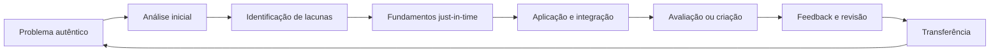

# Resumo Executivo {.unnumbered}
Esta revisão examina a literatura necessária para fundamentar o programa de investigação, validação e aperfeiçoamento do MAPES como framework pedagógico, metodológico e institucional. O ponto de partida do MAPES é um problema educacional composto: o estudante contemporâneo precisa aprender em um ambiente de abundância informacional, fragmentação curricular, múltiplas demandas atencionais, heterogeneidade de repertórios, crescente mediação algorítmica e facilidade de obtenção de respostas sem garantia de compreensão. A literatura não autoriza diagnosticar uma “geração sem atenção” nem atribuir causalmente esses problemas a uma tecnologia isolada. Ela sustenta, porém, uma formulação mais precisa: a ecologia atual de aprendizagem aumenta as oportunidades de interrupção, alternância de tarefas, terceirização cognitiva, consumo fragmentado e exposição a informações de qualidade desigual, ao mesmo tempo que exige maior autorregulação, avaliação de fontes, organização conceitual e transferência. Os efeitos dependem do padrão de uso, do desenho pedagógico, do conhecimento prévio, das condições sociais e da mediação docente (Dontre, 2021; Firth et al., 2019, 2024; Global Education Monitoring Report Team, 2023; OECD, 2023).
A revisão converge em cinco conclusões centrais. Primeiro, aprendizagem ativa tende a superar exposição exclusivamente passiva em múltiplos contextos, mas “atividade” não é um tratamento homogêneo: seus efeitos dependem da qualidade da tarefa, do alinhamento, do feedback, do suporte e da fidelidade de implementação (Deslauriers et al., 2019; Freeman et al., 2014; Hmelo-Silver et al., 2007; Lombardi et al., 2021; Theobald et al., 2020). Segundo, formação por competências torna expectativas e evidências mais explícitas, mas pode converter-se em burocracia de matrizes se a documentação não for proporcional ao risco e ao uso. Terceiro, taxonomias cognitivas são úteis quando descrevem operações efetivamente requeridas por tarefas e avaliações; tornam-se superficiais quando reduzidas a listas de verbos. Quarto, mapas conceituais, modelos de sistemas e grafos de conhecimento podem apoiar organização e navegação, mas sua eficácia depende de uso cognitivo ativo e de representações adequadas ao nível do estudante. Quinto, inteligência artificial pode reduzir trabalho mecânico, apoiar diferenciação e gerar artefatos, mas não deve assumir autoridade epistemológica ou pedagógica; o modelo mais defensável é híbrido, no qual a tecnologia amplia a capacidade do professor e mantém rastreabilidade, supervisão e responsabilidade humanas (Celik et al., 2022; Miao & Holmes, 2023; Molenaar, 2022; Zawacki-Richter et al., 2019).
A principal contribuição potencial do MAPES não está em substituir metodologias existentes, mas em oferecer uma arquitetura integradora que vincule: (a) uma representação sistêmica do domínio; (b) a contribuição funcional de componentes e relações; (c) a ativação precoce de operações cognitivas complexas; (d) pontos de entrada conectados ao repertório do estudante; (e) estratificação de relevância; (f) metodologias, tarefas, avaliação e artefatos; e (g) revisão orientada por evidências. O Blueprint funcional é fortalecido quando operacionalizado como **grafo sistêmico funcional**, enquanto mapas funcionais são entendidos como vistas pedagógicas desse grafo. A Taxonomia acelerada deve ser restrita à progressão e ativação cognitiva; a importância curricular deve ser tratada separadamente como **Estratificação de Relevância Sistêmica**.
A revisão também identifica o papel docente como condição constitutiva, não acessória. O MAPES não é um projeto de automação do ensino. O professor seleciona o que merece ser aprendido, julga a validade das representações, conecta o conteúdo à experiência dos estudantes, regula o suporte, interpreta evidências, media conflito cognitivo e assume responsabilidade ética. Uma plataforma EdTech baseada no MAPES pode automatizar extração, organização, geração preliminar de tarefas e personalização de percursos, mas seu núcleo deve ser concebido como sistema de apoio à decisão docente, e não como substituto do professor.
# Finalidade, escopo e perguntas da revisão

## Finalidade

A revisão cumpre quatro funções:

1. situar o MAPES em relação a teorias e frameworks consolidados;
2. identificar evidências, controvérsias e limites relevantes aos seus constructos;
3. converter a literatura em decisões explícitas de desenho teórico e operacional;
4. formular lacunas e proposições para um programa empírico de validação.

## Escopo temático

Foram considerados oito eixos:

1. metodologias ativas, aprendizagem baseada em problemas e projetos, sala de aula invertida, casos, simulações e *productive failure*;
2. formação e avaliação por competências;
3. taxonomias educacionais, complexidade cognitiva, engajamento e transferência;
4. aprendizagem significativa, organização do conhecimento, mapas conceituais, pensamento sistêmico e grafos de conhecimento;
5. carga cognitiva, *scaffolding*, conhecimento prévio, autorregulação, motivação e feedback;
6. tecnologias digitais, distração, multitarefa e a ecologia contemporânea de atenção;
7. inteligência artificial, aprendizagem adaptativa, *learning analytics*, explicabilidade e colaboração humano–IA;
8. governança, autoria, implementação, ciência aberta, versionamento e avaliação de frameworks.

## Perguntas orientadoras

- Que problemas do estudante contemporâneo são sustentados pela literatura sem recorrer a generalizações geracionais ou determinismo tecnológico?
- Que mecanismos plausíveis ligam organização sistêmica, função, contexto e atividade cognitiva a compreensão e transferência?
- Em que condições metodologias ativas produzem benefícios, resultados nulos ou efeitos adversos?
- Como currículos por competências podem obter clareza sem produzir sobrecarga documental?
- Como distinguir progressão cognitiva de relevância curricular?
- Quando mapas, grafos e representações de sistemas apoiam aprendizagem, e quando se tornam ornamentos ou fontes de carga extrínseca?
- Como a IA pode apoiar desenho, personalização e avaliação sem retirar do professor autoridade, agência e responsabilidade?
- Que elementos diferenciam o MAPES de uma simples combinação de práticas já conhecidas?
- Que proposições e medidas tornam o framework refutável e empiricamente investigável?

---

# Método da revisão

## Tipo de revisão

O trabalho foi conduzido como **revisão sistematizada de escopo com síntese crítica orientada por constructos**. A opção por escopo decorre da heterogeneidade das perguntas, que abrangem teorias, meta-análises, revisões sistemáticas, estudos experimentais, frameworks de implementação e documentos normativos. A organização segue princípios de transparência de PRISMA 2020 e PRISMA-ScR, mas este produto não deve ser descrito como revisão sistemática publicável em sua forma atual, porque a busca não foi registrada previamente, não houve triagem independente por dois revisores e não foi preservado um arquivo deduplicado de todos os registros inicialmente recuperados (Page et al., 2021; Tricco et al., 2018).

Essa limitação é deliberadamente explicitada. O documento fornece uma base teórica auditável e um protocolo que pode ser convertido, em etapa posterior, em revisão sistemática registrada, com buscas replicáveis em bases assinadas, dupla triagem e avaliação formal de risco de viés.

## Fontes consultadas

A busca utilizou mecanismos acadêmicos na web, páginas de periódicos e editoras, Crossref/DOI, PubMed quando aplicável e documentos institucionais de UNESCO, OECD, National Academies e Comissão Europeia. Foram priorizadas revisões sistemáticas, meta-análises, estudos experimentais com relação direta aos constructos e obras fundacionais indispensáveis.

Não foi presumido que uma referência sugerida nos documentos internos sustentasse automaticamente uma alegação. Cada obra foi vinculada a uma função argumentativa específica: definição, mecanismo, evidência de efeito, limite, implementação, mensuração ou governança.

## Janela temporal

A busca priorizou trabalhos publicados entre 2019 e julho de 2026. Obras anteriores foram mantidas quando cumprem uma destas funções:

- apresentam um constructo fundacional;
- constituem revisão ou experimento canônico ainda necessário à definição;
- fornecem framework de mensuração ou implementação não substituído por literatura recente;
- permitem compreender a genealogia e evitar que o MAPES renomeie conceitos existentes.

## Estratégias de busca

Foram combinados descritores em inglês e português. Exemplos:

```text
("active learning" OR "problem-based learning" OR "project-based learning" OR
 "flipped classroom" OR simulation OR "productive failure") AND
(meta-analysis OR systematic review OR higher education)

("competency-based education" OR "competency-based assessment") AND
(framework OR implementation OR validity OR rubric OR bureaucracy)

(Bloom taxonomy OR "higher-order thinking" OR ICAP OR transfer OR
 "retrieval practice") AND education

("systems thinking" OR "concept map" OR "knowledge graph" OR
 "structure-behavior-function") AND (learning OR education)

(attention OR distraction OR multitasking OR notifications OR smartphone OR
 digital media) AND (student OR classroom OR learning)

("artificial intelligence in education" OR "generative AI" OR
 "learning analytics" OR adaptive learning) AND
(teacher agency OR human-centred OR explainable OR ethics)

(open framework governance OR open source governance OR contributorship OR
 semantic versioning OR implementation fidelity)
```

## Critérios de inclusão

Foram incluídos trabalhos que:

- abordavam diretamente um eixo do MAPES;
- apresentavam definição, síntese empírica, mecanismo ou critério operacional;
- tinham metadados verificáveis;
- eram publicados em periódico, livro acadêmico, relatório institucional ou padrão reconhecido;
- permitiam calibrar tanto benefícios quanto riscos;
- contribuíam para contextos de educação superior, formação profissional ou aprendizagem de conhecimentos complexos.

## Critérios de exclusão

Foram excluídos ou não utilizados como sustentação principal:

- textos promocionais sem método ou evidência;
- estudos cuja conclusão excedia o desenho;
- registros bibliográficos não identificáveis;
- trabalhos sobre uso clínico ou empresarial de IA sem conexão educacional;
- estudos de atenção que permitiam apenas inferências muito indiretas;
- alegações universais baseadas em amostras pequenas ou em um único curso;
- fontes secundárias que distorciam o estudo original.

## Corpus e classificação

O acervo bibliográfico final contém **111 registros**, dos quais **82 foram incorporados diretamente à síntese** e **29 foram preservados como leituras complementares**. O arquivo RDF associado marca explicitamente essas categorias. O corpus reúne artigos, livros, capítulos, relatórios e um padrão de versionamento.

## Forma de síntese

A síntese foi organizada por constructos e problemas de desenho. Para cada eixo foram examinados:

- convergências;
- heterogeneidade e controvérsias;
- condições de implementação;
- riscos de extrapolação;
- implicações para o MAPES;
- proposições ou requisitos de mensuração.

---

# Base documental interna e delimitação

O documento legado do MAPES formula o problema original em torno da passagem de uma era de escassez informacional para uma ecologia de abundância, na qual estudantes recebem conteúdos fragmentados, precisam reconstruir sozinhos a arquitetura do domínio e podem permanecer presos a memorização de rótulos. O documento consolidado transformou essa narrativa em quatro dificuldades analíticas: fragmentação, opacidade funcional, progressão cognitiva implícita e distância contextual. Ele também impôs uma regra de rigor: crises de atenção, ansiedade, retenção ou evasão não devem ser atribuídas causalmente ao MAPES ou à tecnologia sem evidência correspondente.

---

# O problema contemporâneo do estudante: uma ecologia de aprendizagem, não uma patologia geracional

## Da escassez de acesso à escassez de organização e julgamento

A disponibilidade de informação alterou a natureza de parte do trabalho intelectual. Localizar uma definição, exemplo ou resposta tornou-se mais rápido; integrar informações, discriminar confiabilidade, compreender relações, construir explicações e transferir conhecimento permanecem tarefas cognitivamente exigentes. A abundância não torna o conhecimento factual dispensável. Ao contrário, avaliação crítica e uso de ferramentas externas dependem de conhecimento interno suficiente para reconhecer incoerências, formular perguntas e verificar respostas.

O problema, portanto, não é “informação demais” em abstrato. É a combinação entre volume, velocidade, heterogeneidade, baixa fricção para obter respostas e ausência de uma arquitetura que indique onde cada informação se situa. Essa combinação pode produzir **fluência sem estrutura**: o estudante reconhece termos, acompanha uma explicação e localiza respostas, mas não consegue reconstruir o sistema, explicar dependências ou agir diante de uma situação nova.

A literatura sobre expertise mostra que especialistas não diferem apenas pela quantidade de fatos, mas pela maneira como organizam problemas e mobilizam estruturas profundas. Novatos tendem a categorizar por características superficiais; especialistas reconhecem princípios, relações e condições de aplicação (Bransford et al., 2000; Chi et al., 1981). Esse achado dá suporte ao problema central do MAPES: tornar a arquitetura do domínio explicitamente ensinável, sem supor que ela emergirá espontaneamente da acumulação de tópicos.

## Fragmentação curricular e conhecimento inerte

Currículos disciplinares são necessários para preservar tradições epistêmicas, métodos e profundidade. O problema surge quando a divisão administrativa ou didática é percebida pelo estudante como ontologia do domínio. Um sistema biológico, uma decisão jurídica ou um processo econômico não se comporta segundo a sequência de aulas. Quando relações entre componentes, níveis e disciplinas permanecem implícitas, o estudante pode dominar elementos localmente e falhar em integração e transferência.

A literatura sobre transferência mostra que aplicação distante não é consequência automática de aprender um princípio. Ela depende de reconhecimento estrutural, variedade de exemplos, comparação, abstração, recuperação e prática em contextos distintos (Barnett & Ceci, 2002; Gentner et al., 2003; Pan & Rickard, 2018). Por isso, a promessa do MAPES não pode ser “mostrar o mapa uma vez”. O framework deve fazer o estudante navegar, reconstruir, comparar, justificar relações e usar o sistema em tarefas.

## Atenção como seleção limitada em ambientes de alta competição

A atenção é limitada e seletiva. O ambiente digital amplia possibilidades de interrupção, alertas, alternância, conteúdo concorrente e acesso imediato a estímulos recompensadores. Estudos sobre multitarefa em sala e durante estudo relatam associações e efeitos experimentais negativos sobre compreensão e desempenho, inclusive para colegas próximos em determinados contextos (Dontre, 2021; May & Elder, 2018; Sana et al., 2013; Zhou et al., 2023). Notificações podem interromper codificação e desempenho em tarefas breves, embora magnitudes e generalização dependam da tarefa, do indivíduo e da metodologia.

Os dados não sustentam três simplificações frequentes:

1. **tempo de tela é uma variável causal única** — diferentes atividades digitais têm funções cognitivas e sociais distintas;
2. **o telefone sempre reduz capacidade mesmo sem uso** — resultados sobre mera presença são heterogêneos e devem ser tratados com cautela;
3. **estudantes atuais perderam a capacidade de atenção** — diferenças individuais, autorregulação, design, contexto e expectativas explicam parte importante da variação.

O PISA 2022 registrou proporções relevantes de estudantes que relatam distração por dispositivos próprios ou de colegas, mas esses dados são autorrelatados e não demonstram, isoladamente, causalidade (OECD, 2023). O diagnóstico adequado é de **competição atencional aumentada e regulação mais exigente**, não de degeneração cognitiva coletiva.

## Multitarefa, alternância e custo de retomada

O termo “multitarefa” frequentemente descreve alternância rápida entre tarefas. Quando duas atividades exigem controle cognitivo, a alternância introduz custos de reorientação, perda de contexto e codificação mais superficial. Em aprendizagem, o risco não é apenas menor tempo na tarefa, mas fragmentação da representação construída. O estudante pode consumir segmentos corretos sem formar uma estrutura coerente.

Isso tem implicação direta para o MAPES. O Blueprint/grafo não deve ser apenas uma figura inicial. Ele deve funcionar como **mecanismo de retomada e orientação**: após interrupção ou mudança de escala, o estudante precisa saber em que região do sistema está, que questão está resolvendo e como a atividade local se conecta ao objetivo global.

## Sobrecarga cognitiva e desenho instrucional

A teoria da carga cognitiva distingue limites de memória de trabalho e conhecimento organizado em memória de longo prazo. Tarefas complexas podem sobrecarregar novatos quando exigem coordenação simultânea de muitos elementos, especialmente se a instrução é minimamente guiada ou contém informações redundantes e dispersas (Kirschner et al., 2006; Paas & van Merriënboer, 2020; Sweller et al., 2019). Isso não implica que estudantes devam permanecer em recepção passiva. Implica que a complexidade precisa ser **sequenciada, sinalizada e apoiada**.

O MAPES deve evitar duas formas opostas de erro:

- apresentar peças isoladas durante longos períodos, sem uso complexo;
- lançar o estudante em um problema aberto sem conhecimento, exemplos, heurísticas ou feedback suficientes.

A Taxonomia acelerada exige tarefas cognitivamente altas cedo, mas não instrução sem apoio. A aceleração refere-se à antecipação do tipo de raciocínio, não à remoção de fundamentos nem à pressa temporal.

## Conhecimento prévio e heterogeneidade

A mesma representação pode apoiar um estudante e sobrecarregar outro. Conhecimento prévio altera o que conta como elemento novo, quais relações são evidentes, quanto suporte é necessário e que analogias são úteis. Turmas multidisciplinares acrescentam heterogeneidade de vocabulário, epistemologia, procedimentos e experiências profissionais.

A Ancoragem Contextual responde a essa heterogeneidade por meio de portas de entrada diferentes para um núcleo conceitual comum. O princípio precisa, contudo, ser protegido contra personalização estereotipada. O professor deve verificar repertórios reais, explicitar limites das analogias e conduzir todos os estudantes à formulação disciplinar válida. Familiaridade inicial não é evidência de compreensão.

## Autorregulação, metacognição e ilusões de aprendizagem

Ambientes abundantes transferem ao estudante decisões sobre o que consultar, por quanto tempo, com que profundidade e quando interromper. Essa liberdade aumenta a importância da autorregulação. Estudantes podem confundir facilidade de leitura, disponibilidade da resposta ou sensação de fluência com aprendizagem durável. Estratégias como recuperação, espaçamento, autoexplicação e comparação são eficazes, mas nem sempre espontaneamente escolhidas (Agarwal et al., 2021; Bjork et al., 2013; Dunlosky et al., 2013; Weinstein et al., 2018).

Deslauriers et al. (2019) mostraram que estudantes em aprendizagem ativa podem sentir que aprenderam menos mesmo quando medidas indicam maior aprendizagem. Isso reforça uma função docente: tornar o processo cognitivo visível, explicar por que certas dificuldades são produtivas e calibrar a percepção do estudante com evidências.

## Motivação, relevância e sentido

Motivação não é simplesmente “tornar a aula divertida”. Teorias contemporâneas enfatizam autonomia, competência, pertencimento e valor percebido (Ryan & Deci, 2020). Problemas autênticos e funções podem aumentar o valor percebido, mas contexto sem desafio cognitivo vira decoração. De modo inverso, tarefas complexas sem propósito compreensível podem ser percebidas como exigências arbitrárias.

A Teleonomia e a Ancoragem Contextual podem apoiar sentido ao responder “que contribuição isto realiza?” e “por que este problema importa neste contexto?”. Essa é uma hipótese plausível, não garantia automática de interesse ou retenção.

## IA generativa: abundância de respostas e escassez de verificação

Modelos generativos tornam disponível uma produção rápida de explicações, resumos, exemplos, questões e código. Isso cria oportunidades de tutoria, feedback e prototipagem, mas introduz desafios específicos:

- respostas plausíveis sem garantia de veracidade;
- perda de proveniência;
- terceirização de etapas necessárias à formação de modelos mentais;
- homogeneização de respostas;
- vieses e desigualdade de acesso;
- dificuldade de avaliar autoria e processo;
- automação de tarefas cuja execução era parte do objetivo formativo.

A resposta não deve ser eliminar IA nem delegar-lhe o ensino. O estudante precisa aprender a formular, verificar, comparar, justificar e revisar. O professor precisa decidir em quais tarefas o uso é permitido, obrigatório, limitado ou inadequado, e que evidência demonstrará aprendizagem independente da ferramenta (Bond et al., 2024; Kasneci et al., 2023; Miao & Holmes, 2023).

## Síntese do diagnóstico

O MAPES deve responder a um **problema ecológico de aprendizagem** composto por:

| Dimensão | Manifestação possível | Risco educacional | Resposta projetada no MAPES |
|---|---|---|---|
| Abundância | muitas fontes e respostas | seleção sem critério | arquitetura explícita, relevância e proveniência |
| Fragmentação | tópicos e disciplinas pouco conectados | conhecimento local e inerte | grafo sistêmico funcional |
| Competição atencional | interrupções e alternância | codificação e retomada frágeis | orientação global–local e ciclos curtos de atividade |
| Sobrecarga | muitos elementos interativos | desorganização e abandono | multiescala, sinalização e *scaffolding* |
| Heterogeneidade | repertórios e linguagens distintos | entradas desiguais | Ancoragem Contextual com destino comum |
| Autorregulação | decisões sobre estudo e ferramentas | fluência ilusória | feedback, recuperação e meta-avaliação |
| Baixa transferência | êxito em exercícios familiares | falha em situações novas | tarefas autênticas e variação contextual |
| IA generativa | respostas de baixo custo | compreensão terceirizada | uso auditável, verificação e autoria docente |

---

# Metodologias ativas: evidência, heterogeneidade e condições de eficácia

## O que “ativo” precisa significar

Aprendizagem ativa é um rótulo amplo. A literatura recente recomenda descrevê-la pelo que o estudante faz cognitivamente, não apenas pela presença de movimento, discussão ou tecnologia. O framework ICAP distingue engajamento passivo, ativo, construtivo e interativo; atividades construtivas e interativas tendem a exigir geração de inferências, explicações e novas relações, mas seu efeito depende da qualidade da interação e do conteúdo (Chi & Wylie, 2014; Chi et al., 2018).

A implicação para o MAPES é direta: uma tarefa é considerada ativa quando obriga o estudante a operar sobre o sistema — localizar, relacionar, explicar, comparar, diagnosticar, avaliar ou criar — e produz evidência observável desse raciocínio.

## Evidência agregada

Meta-análises em STEM mostram melhora média de desempenho e redução de reprovação com aprendizagem ativa em comparação a aula expositiva tradicional (Freeman et al., 2014). A revisão de Theobald et al. (2020) indica que abordagens ativas podem reduzir diferenças de desempenho para grupos sub-representados quando implementadas de modo inclusivo. Esses efeitos não autorizam afirmar que qualquer técnica ativa funciona em qualquer contexto. Intervenções são heterogêneas, e comparadores também variam.

Além disso, sentir-se confortável não é sinônimo de aprender. A dissonância entre percepção e desempenho observada por Deslauriers et al. (2019) mostra que atividades exigentes precisam ser acompanhadas de comunicação e feedback.

## PBL, investigação e suporte

O debate entre instrução guiada e descoberta mostra que problemas autênticos não eliminam a necessidade de orientação. Críticas à instrução minimamente guiada são particularmente relevantes para novatos (Kirschner et al., 2006). Respostas a essa crítica mostram que PBL e investigação bem desenhados incluem *scaffolding*, recursos, facilitadores, momentos de explicitação e síntese (Hmelo-Silver et al., 2007).

O MAPES deve incorporar essa conclusão como regra:

> A complexidade da tarefa pode ser antecipada; o suporte deve ser adaptado ao conhecimento prévio e progressivamente retirado conforme o estudante demonstra domínio.

## Aprendizagem baseada em projetos

Meta-análises apontam efeitos positivos médios de PjBL, com moderação por desenho, duração, disciplina e avaliação (Chen & Yang, 2019). Revisões de sínteses mais recentes alertam para qualidade metodológica variável e para a dificuldade de isolar o componente responsável. Assim, PjBL é compatível com o MAPES, mas não equivalente a ele. Um projeto MAPES precisa tornar explícitas a arquitetura do domínio, a função dos componentes, a progressão cognitiva, a relevância e as evidências.

## Sala de aula invertida

Meta-análises relatam efeitos pequenos a moderados em desempenho, mas os benefícios dependem de como o tempo presencial é utilizado, da presença de atividades preparatórias e de mecanismos de responsabilização (van Alten et al., 2019). A inversão logística — vídeo antes, exercício depois — não é suficiente. No MAPES, o material prévio deve orientar o estudante no grafo e preparar a participação em uma tarefa complexa, enquanto o encontro com o professor é usado para diagnóstico, discussão, modelagem, feedback e integração.

## Simulações, casos e aprendizagem por falha produtiva

Simulações podem apoiar práticas complexas e seguras, especialmente quando há debriefing, feedback e crescente variabilidade (Chernikova et al., 2020). *Productive failure* sugere que tentativas iniciais de solução, seguidas por consolidação explícita, podem melhorar compreensão conceitual em condições específicas (Kapur, 2016). A ideia converge com a Taxonomia acelerada: o estudante encontra cedo uma situação de alta complexidade, identifica lacunas e retorna aos fundamentos com finalidade clara.

Entretanto, fracasso sem consolidação é apenas fracasso; caso sem comparação pode reforçar soluções superficiais; simulação sem debriefing pode treinar procedimentos sem compreensão.

## Implicação para o MAPES

O MAPES deve ser apresentado como **arquitetura de desenho** capaz de incorporar métodos ativos, e não como mais uma técnica. Seu diferencial deve ser avaliado pela coerência entre representações, tarefas, suporte, evidências e revisão.

---

# Formação por competências: clareza, evidência e risco de burocratização

## Contribuições

Educação baseada em competências desloca atenção de tempo de exposição para desempenho demonstrável. Definições operacionais enfatizam resultados observáveis, progressão, avaliação e flexibilidade (Frank et al., 2010; Gervais, 2016). Frameworks de implementação identificam elementos centrais como especificação de resultados, experiências sequenciadas, ensino responsivo e avaliação programática (Van Melle et al., 2019).

Essa literatura contribui para o MAPES em três pontos:

- objetivos precisam indicar o que o estudante fará com o conhecimento;
- critérios e evidências devem ser coerentes com a complexidade pretendida;
- competência é integrada e contextual, não uma coleção de microcomportamentos independentes.

## Risco de decomposição excessiva

A busca por observabilidade pode produzir listas extensas de competências, objetivos, indicadores e rubricas. Quando cada atividade exige documentação manual completa, o sistema consome tempo docente sem necessariamente melhorar decisões. A burocratização ocorre quando a matriz se torna fim em si, quando indicadores substituem julgamento profissional ou quando a decomposição destrói a integração que pretendia avaliar.

O MAPES deve responder com **documentação proporcional**. Os níveis Essencial, Padrão e Pesquisa permitem que o rigor aumente conforme a finalidade:

- uma aula rotineira precisa de um pequeno conjunto de decisões explícitas;
- uma disciplina nova exige documentação intermediária;
- um estudo de validação exige fidelidade, medidas, desvios e versões.

## Alinhamento construtivo e desenho reverso

O alinhamento entre resultados, atividades e avaliação é uma contribuição consolidada de Biggs e do *Understanding by Design* (Biggs & Tang, 2011; Wiggins & McTighe, 2005). O MAPES acrescenta duas perguntas: onde esse resultado se situa no sistema e que relações funcionais precisam ser mobilizadas? Assim, a matriz de alinhamento deixa de ser apenas linear e passa a relacionar objetivos a nós, arestas, funções, contextos e níveis de relevância.

## Avaliação de competência

Competências complexas requerem múltiplas evidências, tarefas autênticas, rubricas, feedback e julgamento. Uma única prova de reconhecimento não sustenta inferência de competência. Ao mesmo tempo, desempenho em caso familiar não garante transferência. O plano de avaliação MAPES deve combinar:

- conhecimento factual e conceitual quando necessário;
- explicação relacional e mecanística;
- desempenho em caso ou projeto;
- transferência para contexto novo;
- retenção;
- calibração metacognitiva;
- processo de revisão.

---

# Taxonomias cognitivas e a formalização da Taxonomia acelerada

## Valor e limite de Bloom

A taxonomia de Bloom e sua revisão oferecem linguagem para distinguir tipos de operação cognitiva (Anderson & Krathwohl, 2001; Bloom et al., 1956; Krathwohl, 2002). Seu valor não está em uma pirâmide rígida, mas em impedir que objetivos e avaliações permaneçam implicitamente concentrados em recordar e compreender.

O uso superficial ocorre quando verbos são adicionados a objetivos sem mudança da demanda real. “Analisar” pode introduzir uma questão de reconhecimento; “criar” pode pedir reprodução de um modelo. A classificação precisa considerar o produto, as condições, os recursos disponíveis, o grau de novidade e os critérios de julgamento.

## Níveis baixos não são dispensáveis

Evidências de prática de recuperação mostram que conhecimento factual recuperável pode apoiar aprendizagem posterior e transferência. Agarwal (2019) questiona a suposição de que fatos precisem ser inteiramente dominados antes de tarefas de ordem superior; os níveis podem ser articulados. Isso coincide com o princípio MAPES de não pular a base, mas usá-la em função de problemas.

## Definição recomendada

> **Taxonomia acelerada é o princípio de desenho pelo qual o estudante é exposto precocemente e de forma recorrente a tarefas autênticas que exigem aplicação, análise, integração, avaliação e criação. Conhecimentos factuais, conceituais e procedimentais são introduzidos, recuperados e aprofundados conforme as demandas dessas tarefas, em vez de constituírem uma fase extensa e autossuficiente que antecede todo uso complexo do conhecimento.**

“Acelerada” significa antecipação planejada das operações, não promessa de menor duração total. O constructo deve ser representado como ciclo:

**problema autêntico → análise → lacunas → fundamentos → aplicação → avaliação/criação → feedback → transferência**



## Separação da relevância

Complexidade cognitiva e importância curricular são dimensões independentes. O MAPES deve adotar **Estratificação de Relevância Sistêmica**:

- **Nuclear:** indispensável para compreender ou operar o sistema;
- **Habilitadora:** pré-requisito ou recurso necessário;
- **Contextual:** relevante para determinado perfil, situação ou domínio;
- **Extensão:** aprofundamento ou especialização.

Um elemento do grafo recebe pelo menos duas anotações:

$$
x_i = \langle C_i, R_i \rangle,
$$

em que $C_i$ representa a operação cognitiva esperada e $R_i$ a relevância sistêmica. Conteúdo nuclear pode exigir recuperação precisa; conteúdo de extensão pode ser usado em criação. Fundir as dimensões produziria inferências curriculares equivocadas.

## Indicadores de aceleração

- tempo até a primeira tarefa de aplicação/análise;
- proporção de tarefas que exigem construção, avaliação ou criação;
- número de relações do grafo mobilizadas por tarefa;
- uso de fundamentos em função de um problema;
- presença de feedback e revisão;
- transferência para contexto novo;
- adequação do *scaffolding*;
- desempenho sem suporte excessivo.

---

# Organização do conhecimento, pensamento sistêmico e grafos

## Mapas conceituais e aprendizagem

Mapas conceituais tornam relações explícitas e podem apoiar organização, comparação e avaliação. Meta-análises indicam benefícios de estudar e, especialmente, construir mapas, mas efeitos variam com treinamento, complexidade e forma de uso (Nesbit & Adesope, 2006; Schroeder et al., 2018). Um mapa fornecido pode orientar; um mapa construído revela o modelo do estudante. Nenhum deles garante compreensão se as relações não forem tipadas ou discutidas.

## Pensamento sistêmico

Sistemas complexos envolvem componentes, relações, níveis, feedback, não linearidade, emergência, incerteza e mudança temporal. Literatura de ensino de sistemas mostra que estudantes frequentemente reconhecem partes, mas têm dificuldade em relações dinâmicas e mecanismos (Jacobson & Wilensky, 2006; Yoon et al., 2018). Portanto, o Blueprint não deve congelar o domínio em caixas e setas indiferenciadas.

## De mapa a grafo sistêmico funcional

A distinção recomendada é:

- **Blueprint funcional:** constructo pedagógico que explicita a arquitetura do domínio;
- **grafo sistêmico funcional:** implementação formal/computacional preferencial em domínios complexos;
- **mapa funcional:** vista pedagógica selecionada do grafo para um público, tarefa ou escala.

Um grafo não é automaticamente dinâmico. A dinâmica requer direção, tipos de relação, pesos, estado, tempo, condições e feedback. Uma representação mínima é:

$$
G_t = \langle V_t,E_t,\tau_V,\tau_E,w_t,s_t\rangle,
$$

em que $V_t$ são entidades, $E_t$ relações, $\tau_V$ e $\tau_E$ tipos, $w_t$ pesos ou graus de confiança e $s_t$ estados. O índice $t$ permite representar variação.

A topologia pertence ao Blueprint; a semântica de contribuição funcional é informada pela Teleonomia; a dinâmica emerge de estados e regras de transição. Essa separação impede que “grafo funcional” dissolva os constructos.

Na arquitetura integrada, o Blueprint define topologia; a Teleonomia adiciona semântica funcional; a Taxonomia Acelerada associa operações e tarefas; a Ancoragem Contextual associa portas de entrada, abstração e transferência; e a Estratificação de Relevância Sistêmica adiciona prioridade. O grafo pode registrar essas camadas, mas não equivale ao BTTA nem ao framework.

## Grafos de conhecimento em educação

Revisões recentes descrevem uso de grafos para organização curricular, recomendação, busca semântica, modelagem de pré-requisitos e personalização (Abu-Salih & Alotaibi, 2024; Qu et al., 2024). As oportunidades vêm acompanhadas de riscos:

- ontologias opacas;
- relações inferidas sem validação;
- falsa precisão de pesos;
- dependência de dados históricos enviesados;
- dificuldade de explicar recomendações;
- confusão entre grafo do domínio e grafo de domínio do estudante.

No MAPES Core, o grafo disciplinar deve ser validado pelo professor; o modelo do estudante deve constituir camada separada; recomendações precisam ser justificáveis por objetivos e evidências.

---

# Teleonomia: função, mecanismo e prevenção do finalismo

A Teleonomia oferece ao MAPES uma pergunta funcional: que contribuição um componente ou processo realiza no sistema e o que ocorre quando varia ou falha? A distinção entre teleonomia e teleologia é necessária para não atribuir intenção a sistemas biológicos ou sociais (Mayr, 1974; Pittendrigh, 1958).

A análise funcional precisa evitar inferir mecanismo apenas a partir de efeito. Uma unidade MAPES deve distinguir:

- componente;
- relação;
- mecanismo proposto;
- contribuição funcional;
- contexto e nível de análise;
- variação/falha;
- compensação ou redundância;
- evidência e incerteza.

Modelos estrutura–comportamento–função mostram valor pedagógico para sistemas complexos, especialmente quando estudantes precisam conectar partes a processos e resultados. Entretanto, função não é necessariamente única, estável ou independente do contexto. A Teleonomia deve incluir *trade-offs*, emergência e múltiplos níveis.

---

# Ancoragem Contextual, analogias e transferência

Conhecimentos prévios são o principal recurso e uma possível fonte de erro. Organizadores prévios e aprendizagem significativa enfatizam a integração do novo a estruturas existentes (Ausubel, 1968; Novak & Gowin, 1984). Analogias podem apoiar transferência quando relações estruturais são comparadas, mas podem também importar correspondências inadequadas (Gentner et al., 2003).

A Ancoragem Contextual deve operar em quatro movimentos:

1. identificar repertório real, não presumido;
2. selecionar problema, linguagem ou experiência de entrada;
3. explicitar correspondências e limites;
4. conduzir à abstração e a uma tarefa de transferência.

O critério não é “o estudante gostou do exemplo”, mas a capacidade de abandonar a superfície familiar e usar a estrutura em novo contexto.

---

# Design instrucional e redução de burocracia

## Alinhamento e desenho de aprendizagem complexa

Design reverso, alinhamento construtivo, 4C/ID e ensino como ciência de design oferecem estruturas para ligar resultados, tarefas, suporte e avaliação (Biggs & Tang, 2011; Laurillard, 2012; van Merriënboer & Kirschner, 2018; Wiggins & McTighe, 2005). O MAPES não deve duplicar esses frameworks; deve acrescentar representação sistêmica, função, ativação cognitiva e ancoragem como camadas integradoras.

## Overdesign

Overdesign ocorre quando o esforço de especificação supera seu valor decisório, inibe adaptação ou transforma professores em operadores de formulários. A resposta recomendada é um sistema de três níveis:

| Nível | Finalidade | Documentação |
|---|---|---|
| MAPES Essencial | aula ou sequência rotineira | seis perguntas e um artefato de orientação |
| MAPES Padrão | módulo, disciplina ou implementação institucional | grafo, funções, relevância, tarefas, avaliação, fontes e acessibilidade |
| MAPES Pesquisa | validação, replicação ou publicação | protocolo completo, fidelidade, resultados, desvios, custos e versões |

A tecnologia pode ocultar complexidade operacional: inferir uma primeira matriz a partir de materiais, mostrar decisões críticas ao professor e registrar automaticamente proveniência. A simplificação da interface não pode eliminar o rigor subjacente.

---

# Avaliação da aprendizagem, transferência e meta-avaliação

## Avaliação formativa e feedback

Avaliação formativa produz evidências para ajustar ensino e aprendizagem. Seu valor depende da qualidade da inferência, do feedback e da oportunidade de agir (Bennett, 2011; Black & Wiliam, 2009; Hattie & Timperley, 2007). No MAPES, feedback deve localizar a dificuldade: nó ausente, relação equivocada, mecanismo incompleto, nível cognitivo insuficiente, uso inadequado da âncora ou falha de transferência.

## Validade

Não basta que uma tarefa pareça autêntica. A interpretação do desempenho deve ser sustentada por argumento de validade: que constructo está sendo inferido, que evidência o representa, que alternativas explicam o resultado e que uso será feito da decisão (American Educational Research Association et al., 2014; Kane, 2013).

## Resultados relevantes

- conhecimento necessário e recuperável;
- compreensão relacional;
- explicação funcional/mecanística;
- resolução de problema;
- transferência próxima e distante;
- retenção;
- qualidade de criação;
- calibração metacognitiva;
- autonomia com retirada de suporte.

## Meta-avaliação

A meta-avaliação examina se o próprio desenho MAPES é coerente, viável, equitativo e eficaz. Deve incluir:

- fidelidade;
- aceitabilidade;
- viabilidade e custo;
- carga de trabalho docente;
- experiência do estudante;
- acessibilidade;
- equidade;
- qualidade e erro de artefatos de IA;
- efeitos imprevistos;
- capacidade de revisão.

Satisfação não substitui aprendizagem; aprendizagem imediata não substitui retenção e transferência.

A qualidade do MAPES deve permanecer multidimensional, sem escore agregado antes de validação: fidelidade estrutural, qualidade pedagógica, aprendizagem, qualidade operacional, valor institucional e qualidade das inferências. A meta-avaliação distingue estudante, aula/unidade, implementação tecnológica e proposições do MAPES.

---

# Inteligência artificial, aprendizagem adaptativa e MAPES Core

## Estado da literatura

Revisões de IA na educação mostram crescimento rápido, mas também concentração em soluções técnicas, menor participação de educadores e insuficiência de avaliação ética e longitudinal (Bond et al., 2024; Zawacki-Richter et al., 2019). Revisões centradas em professores identificam oportunidades de planejamento, feedback, diferenciação e análise, acompanhadas por riscos de opacidade, dependência e mudança de papéis (Celik et al., 2022).

## Princípio de centralidade docente

A formulação adotada é:

> **A IA estrutura e propõe; o professor exerce autoridade epistemológica e pedagógica.**

Na autoria assistida, a instituição estabelece políticas e governança. Software e IA são recursos de implementação e não integram a ontologia principal do MAPES.

O professor:

- define objetivos e critérios;
- seleciona fontes autorizadas;
- valida o grafo e as relações;
- julga relevância;
- escolhe contexto e nível de suporte;
- interpreta o desempenho;
- responde por equidade, ética e conteúdo;
- decide quando a IA deve ou não ser usada.

O modelo híbrido humano–IA é mais defensável do que automação plena, porque combina processamento e personalização computacional com julgamento contextual e responsabilidade humana (Molenaar, 2022).

## Arquitetura do MAPES Core

O MAPES Core é a arquitetura operacional normativa do framework. Suas funções podem ser realizadas manualmente, digitalmente ou por combinação entre trabalho humano e automação. Um produto EdTech constitui uma implementação dessas funções:

$$
\text{MAPES Core} = G_D + BTTA + M_E + A_L + P_R + H,
$$

em que:

- $G_D$: grafo do domínio;
- $BTTA$: regras dos quatro pilares;
- $M_E$: modelo do estudante;
- $A_L$: motor de alinhamento;
- $P_R$: proveniência e rastreabilidade;
- $H$: supervisão e decisão humanas.

O Core deve incorporar fontes autorizadas, proveniência, rastreabilidade, conflitos, lacunas, gate de aprovação docente e versionamento. Inferências sobre lacunas do estudante permanecem provisórias, com evidência, confiança, alternativas, confirmação e revisão.

## Entradas e saídas

**Entradas institucionais:** currículo, competências, políticas, acessibilidade e regras de avaliação.  
**Entradas docentes:** materiais-fonte, objetivos, casos, restrições, erros frequentes e critérios.  
**Entradas do estudante:** desempenho, explicações, histórico, preferências relevantes e necessidades de suporte.  
**Saídas:** vistas do grafo, tarefas, casos, feedback, sequências, recursos e alertas ao professor.

## Personalização sem relativização

- **individualização:** ritmo, quantidade de prática e suporte;
- **personalização:** linguagem inicial, exemplos e contextos;
- **adaptação:** mudança do percurso conforme evidências.

O conteúdo validado e os critérios finais não devem ser reduzidos com base em perfis opacos. Personalizar a entrada não significa criar padrões de rigor desiguais.

## Riscos e controles

| Risco | Controle mínimo |
|---|---|
| alucinação | geração restrita a fontes, citação por trecho e validação docente |
| viés | auditoria de dados, exemplos e recomendações |
| opacidade | explicação da recomendação e relação com objetivos |
| automação indevida | pontos obrigatórios de decisão humana |
| privacidade | minimização de dados, finalidade, consentimento e segurança |
| dependência | tarefas que exigem produção e verificação do estudante |
| vigilância | evitar inferências afetivas ou diagnósticas não validadas |
| deskilling docente | formação e manutenção de autoria no design |

Intervenções devem usar três níveis de risco: baixo, com automação registrada e reversível; intermediário, com recomendação e revisão; e alto, com revisão humana prévia. O estudante deve poder solicitar ajuda, contestar inferências e pedir revisão humana.

---

# Governança, autoria e implementação

## Fidelidade sem rigidez

Frameworks de implementação distinguem componentes centrais de formas adaptáveis. Fidelidade deve avaliar se os mecanismos propostos estão presentes, sem prescrever uma única metodologia (Carroll et al., 2007; Century et al., 2010). Para o MAPES, os invariantes incluem sistema/relacionamento, função, ativação cognitiva, ancoragem com abstração, alinhamento, evidência e revisão. A forma dos artefatos pode variar.

## Governança proporcional à fase

Governança extensa é inadequada a um piloto pequeno. A literatura de comunidades abertas mostra que estruturas emergem com escala, conflito e necessidade de coordenação (O’Mahony & Ferraro, 2007). A fase piloto do MAPES requer Núcleo Fundador, revisão externa ad hoc e rede de aplicadores, não conselhos permanentes.

## Autoria e contribuição

Autoria deve ser diferenciada de contribuição. CRediT melhora transparência ao descrever papéis, mas não substitui critérios de autoria (Brand et al., 2015; McNutt et al., 2018). O documento fundador mantém seus autores; estudos, software e instrumentos podem ter autoria específica.

## Versionamento e ciência aberta

Versionamento semântico, `CHANGELOG.md`, repositório com DOI, materiais reproduzíveis e dados FAIR quando eticamente possíveis aumentam rastreabilidade (Wilkinson et al., 2016). Durante a fase piloto, versões `0.x.y` comunicam instabilidade controlada.

---

# Frameworks próximos e diferenciação do MAPES

| Framework/tradição | Contribuição | Proximidade | Diferença potencial do MAPES |
|---|---|---|---|
| Aprendizagem significativa / mapas | integração a conhecimento prévio e relações | Blueprint e Ancoragem | integra função, ativação cognitiva e implementação |
| Alinhamento construtivo / UbD | coerência entre resultados, atividades e avaliação | matriz MAPES | adiciona grafo, função, relevância e contexto |
| 4C/ID | aprendizagem de tarefas complexas e suporte | Taxonomia acelerada e *scaffolding* | organiza também arquitetura epistêmica do domínio |
| PBL/PjBL/casos | problema autêntico e produção | ciclo de tarefas | são metodologias incorporáveis, não o core |
| ICAP | qualidade do engajamento cognitivo | critérios de atividade | não representa domínio e função |
| Competency-based education | resultados e evidências | operações observáveis | MAPES tenta evitar decomposição burocrática e ligar desempenho ao sistema |
| Systems thinking/SBF | relações, mecanismos e dinâmica | Grafo + Teleonomia | acrescenta ancoragem, progressão, avaliação e governança |
| Learning analytics/adaptive learning | evidências e personalização | MAPES Core | exige proveniência, invariância e autoridade docente |

A originalidade do MAPES precisa ser demonstrada empiricamente e conceitualmente. A hipótese de contribuição é que sua unidade não reside em cada componente isolado, mas na **orquestração explícita e auditável** entre arquitetura, função, cognição, relevância, contexto e evidência.

---

# Lacunas e oportunidades que o MAPES pode endereçar

## Lacunas na literatura

1. Frameworks ativos descrevem tarefas, mas nem sempre formalizam a arquitetura do domínio.
2. Grafos e mapas organizam conceitos, mas nem sempre ligam representação a objetivos, funções e avaliação.
3. CBE explicita resultados, mas pode fragmentar competências e aumentar carga documental.
4. Taxonomias classificam demandas, mas não especificam como antecipar tarefas complexas com fundamentos just-in-time.
5. Personalização tecnológica pode adaptar sequências sem preservar invariância epistêmica.
6. *Learning analytics* frequentemente mostra dados sem indicar ação pedagógica e sem incorporar julgamento docente.
7. Estudos de eficácia raramente medem simultaneamente compreensão relacional, transferência, fidelidade e custo docente.
8. A literatura de atenção frequentemente separa distração do desenho do conhecimento; o MAPES pode testar se orientação sistêmica melhora retomada e persistência.

## Oportunidades

- criar linguagem comum para professores de áreas distintas;
- ligar grafos disciplinares a tarefas e rubricas;
- tornar a personalização explicável;
- reduzir documentação manual com IA assistiva;
- comparar componentes isolados e integrados;
- desenvolver instrumentos de fidelidade e compreensão relacional;
- investigar efeitos moderadores de conhecimento prévio e complexidade;
- formar estudantes para organizar novos conhecimentos, e não apenas completar um currículo fixo.

---

# Decisões de projeto derivadas da revisão

1. MAPES é um framework pedagógico, metodológico e institucional cuja eficácia integrada permanece em validação.
2. O problema do estudante será descrito como ecologia de abundância, competição atencional, fragmentação e exigência de autorregulação, sem patologia geracional.
3. O professor é componente constitutivo do framework.
4. Blueprint é o constructo; grafo sistêmico funcional é representação formal; mapa é vista pedagógica.
5. Teleonomia será separada de teleologia e de mecanismo.
6. Taxonomia acelerada será restrita à ativação cognitiva precoce e recorrente.
7. Relevância será dimensão independente.
8. Tarefas de níveis básicos permanecem permitidas como suporte funcional.
9. Metodologias ativas são incorporadas conforme objetivos e condições, sem alegação de superioridade universal.
10. Serão adotados três níveis de implementação para evitar burocratização.
11. MAPES, BTTA e MAPES Core permanecerão distintos; software e IA serão recursos de implementação do Core.
12. IA será usada para estruturar e propor sob validação docente e governança institucional.
13. Avaliação incluirá os seis domínios de qualidade, sem escore agregado antes de validação.
14. Governança do framework, do produto/Core digital e da instituição será separada.
15. Proposições serão formuladas com condições de contorno e critérios de revisão.

---

# Proposições preliminares sustentadas pela síntese

- **P1 — arquitetura:** o uso ativo de uma representação coerente do domínio melhora tarefas relacionais em comparação a uma sequência de tópicos equivalente.
- **P2 — função:** explicitar contribuição, mecanismo, dependências e falhas melhora explicação funcional e diagnóstico.
- **P3 — aceleração:** contato precoce com problemas complexos, acompanhado de suporte, melhora integração e transferência em comparação a uma longa fase exclusivamente reprodutiva.
- **P4 — ancoragem:** contexto inicial seguido de abstração e transferência melhora compreensão inicial sem sacrificar rigor.
- **P5 — integração:** a configuração integrada BTTA produz efeitos diferentes de mapa, analogia ou tarefa ativa isolados.
- **P6 — conhecimento prévio:** efeitos são moderados pelo conhecimento prévio; mapas detalhados e âncoras redundantes podem prejudicar estudantes experientes.
- **P7 — complexidade:** benefícios são maiores em domínios com múltiplas relações do que em tarefas simples e lineares.
- **P8 — fidelidade:** presença nominal de artefatos não produz efeitos sem uso cognitivo.
- **P9 — mediação docente:** qualidade da curadoria, do feedback e da adaptação docente medeia resultados.
- **P10 — IA assistiva:** IA com proveniência e validação reduz trabalho mecânico sem reduzir qualidade; IA autônoma aumenta risco de erro e desalinhamento.
- **P11 — atenção:** orientação global–local e tarefas com propósito podem melhorar retomada e reduzir dispersão comportamental, mas esse efeito deve ser testado, não presumido.
- **P12 — burocracia:** implementação proporcional e assistida por IA reduz carga de planejamento em comparação a matrizes manuais completas.

---

# Limitações desta revisão

- Não houve registro prospectivo do protocolo.
- Não foi realizada dupla triagem independente.
- Não há diagrama quantitativo PRISMA de todos os registros recuperados.
- O corpus inclui campos com diferentes padrões metodológicos.
- A literatura sobre IA muda rapidamente e pode requerer atualização antes de publicação.
- Muitos efeitos educacionais dependem de contexto, e médias agregadas não substituem estudos MAPES.
- A presença de literatura convergente não demonstra originalidade ou eficácia do framework.

---


# Referências utilizadas

Abu-Salih, B., & Alotaibi, S. (2024). A systematic literature review of knowledge graph construction and application in education. *Heliyon, 10*(3), e25383. https://doi.org/10.1016/j.heliyon.2024.e25383

Agarwal, P. K. (2019). Retrieval practice and Bloom’s taxonomy: Do students need fact knowledge before higher order learning? *Journal of Educational Psychology, 111*(2), 189–209. https://doi.org/10.1037/edu0000282

Agarwal, P. K., Nunes, L. D., & Blunt, J. R. (2021). Retrieval practice consistently benefits student learning: A systematic review of applied research in schools and classrooms. *Educational Psychology Review, 33*, 1409–1453. https://doi.org/10.1007/s10648-021-09595-9

American Educational Research Association, American Psychological Association, & National Council on Measurement in Education. (2014). *Standards for educational and psychological testing*. American Educational Research Association.

Anderson, L. W., & Krathwohl, D. R. (Eds.). (2001). *A taxonomy for learning, teaching, and assessing: A revision of Bloom’s taxonomy of educational objectives*. Longman.

Ausubel, D. P. (1968). *Educational psychology: A cognitive view*. Holt, Rinehart and Winston.

Barnett, S. M., & Ceci, S. J. (2002). When and where do we apply what we learn? A taxonomy for far transfer. *Psychological Bulletin, 128*(4), 612–637. https://doi.org/10.1037/0033-2909.128.4.612

Bennett, R. E. (2011). Formative assessment: A critical review. *Assessment in Education: Principles, Policy & Practice, 18*(1), 5–25. https://doi.org/10.1080/0969594X.2010.513678

Biggs, J., & Tang, C. (2011). *Teaching for quality learning at university* (4th ed.). Open University Press.

Bjork, R. A., Dunlosky, J., & Kornell, N. (2013). Self-regulated learning: Beliefs, techniques, and illusions. *Annual Review of Psychology, 64*, 417–444. https://doi.org/10.1146/annurev-psych-113011-143823

Black, P., & Wiliam, D. (2009). Developing the theory of formative assessment. *Educational Assessment, Evaluation and Accountability, 21*, 5–31. https://doi.org/10.1007/s11092-008-9068-5

Bloom, B. S., Engelhart, M. D., Furst, E. J., Hill, W. H., & Krathwohl, D. R. (1956). *Taxonomy of educational objectives: The classification of educational goals. Handbook I: Cognitive domain*. Longmans, Green.

Bond, M., Khosravi, H., de Laat, M., Bergdahl, N., Negrea, V., Oxley, E., Pham, P., Chong, S. W., & Siemens, G. (2024). A meta systematic review of artificial intelligence in higher education: A call for increased ethics, collaboration, and rigour. *International Journal of Educational Technology in Higher Education, 21*, 4. https://doi.org/10.1186/s41239-023-00436-z

Brand, A., Allen, L., Altman, M., Hlava, M., & Scott, J. (2015). Beyond authorship: Attribution, contribution, collaboration, and credit. *Learned Publishing, 28*(2), 151–155. https://doi.org/10.1087/20150211

Bransford, J. D., Brown, A. L., & Cocking, R. R. (Eds.). (2000). *How people learn: Brain, mind, experience, and school: Expanded edition*. National Academies Press. https://doi.org/10.17226/9853

Carroll, C., Patterson, M., Wood, S., Booth, A., Rick, J., & Balain, S. (2007). A conceptual framework for implementation fidelity. *Implementation Science, 2*, 40. https://doi.org/10.1186/1748-5908-2-40

Celik, I., Dindar, M., Muukkonen, H., & Järvelä, S. (2022). The promises and challenges of artificial intelligence for teachers: A systematic review of research. *TechTrends, 66*, 616–630. https://doi.org/10.1007/s11528-022-00715-y

Century, J., Rudnick, M., & Freeman, C. (2010). A framework for measuring fidelity of implementation: A foundation for shared language and accumulation of knowledge. *American Journal of Evaluation, 31*(2), 199–218. https://doi.org/10.1177/1098214010366173

Chen, C.-H., & Yang, Y.-C. (2019). Revisiting the effects of project-based learning on students’ academic achievement: A meta-analysis investigating moderators. *Educational Research Review, 26*, 71–81. https://doi.org/10.1016/j.edurev.2018.11.001

Chernikova, O., Heitzmann, N., Stadler, M., Holzberger, D., Seidel, T., & Fischer, F. (2020). Simulation-based learning in higher education: A meta-analysis. *Review of Educational Research, 90*(4), 499–541. https://doi.org/10.3102/0034654320933544

Chi, M. T. H., & Wylie, R. (2014). The ICAP framework: Linking cognitive engagement to active learning outcomes. *Educational Psychologist, 49*(4), 219–243. https://doi.org/10.1080/00461520.2014.965823

Chi, M. T. H., Adams, J., Bogusch, E. B., Bruchok, C., Kang, S., Lancaster, M., Levy, R., Li, N., McEldoon, K. L., Stump, G. S., Wylie, R., Xu, D., & Yaghmourian, D. L. (2018). Translating the ICAP theory of cognitive engagement into practice. *Cognitive Science, 42*(6), 1777–1832. https://doi.org/10.1111/cogs.12626

Chi, M. T. H., Feltovich, P. J., & Glaser, R. (1981). Categorization and representation of physics problems by experts and novices. *Cognitive Science, 5*(2), 121–152. https://doi.org/10.1207/s15516709cog0502_2

Deslauriers, L., McCarty, L. S., Miller, K., Callaghan, K., & Kestin, G. (2019). Measuring actual learning versus feeling of learning in response to being actively engaged in the classroom. *Proceedings of the National Academy of Sciences, 116*(39), 19251–19257. https://doi.org/10.1073/pnas.1821936116

Dontre, A. J. (2021). The influence of technology on academic distraction: A review. *Human Behavior and Emerging Technologies, 3*(3), 379–390. https://doi.org/10.1002/hbe2.229

Dunlosky, J., Rawson, K. A., Marsh, E. J., Nathan, M. J., & Willingham, D. T. (2013). Improving students’ learning with effective learning techniques: Promising directions from cognitive and educational psychology. *Psychological Science in the Public Interest, 14*(1), 4–58. https://doi.org/10.1177/1529100612453266

Firth, J., Torous, J., López-Gil, J. F., Linardon, J., Milton, A., Lambert, J., Smith, L., Jarić, I., Fabian, H., Vancampfort, D., Onyeaka, H., Schuch, F. B., & Firth, J. A. (2024). From “online brains” to “online lives”: Understanding the individualized impacts of Internet use across psychological, cognitive and social dimensions. *World Psychiatry, 23*(2), 176–190. https://doi.org/10.1002/wps.21188

Firth, J., Torous, J., Stubbs, B., Firth, J. A., Steiner, G. Z., Smith, L., Alvarez-Jimenez, M., Gleeson, J., Vancampfort, D., Armitage, C. J., & Sarris, J. (2019). The “online brain”: How the Internet may be changing our cognition. *World Psychiatry, 18*(2), 119–129. https://doi.org/10.1002/wps.20617

Frank, J. R., Snell, L. S., ten Cate, O., Holmboe, E. S., Carraccio, C., Swing, S. R., Harris, P., Glasgow, N. J., Campbell, C., Dath, D., Harden, R. M., Iobst, W., Long, D. M., Mungroo, R., Richardson, D. L., Sherbino, J., Silver, I., Taber, S., Talbot, M., & Harris, K. A. (2010). Competency-based medical education: Theory to practice. *Medical Teacher, 32*(8), 638–645. https://doi.org/10.3109/0142159X.2010.501190

Freeman, S., Eddy, S. L., McDonough, M., Smith, M. K., Okoroafor, N., Jordt, H., & Wenderoth, M. P. (2014). Active learning increases student performance in science, engineering, and mathematics. *Proceedings of the National Academy of Sciences, 111*(23), 8410–8415. https://doi.org/10.1073/pnas.1319030111

Gentner, D., Loewenstein, J., & Thompson, L. (2003). Learning and transfer: A general role for analogical encoding. *Journal of Educational Psychology, 95*(2), 393–408. https://doi.org/10.1037/0022-0663.95.2.393

Gervais, J. (2016). The operational definition of competency-based education. *Journal of Competency-Based Education, 1*(2), 98–106. https://doi.org/10.1002/cbe2.1011

Global Education Monitoring Report Team. (2023). *Global education monitoring report 2023: Technology in education—A tool on whose terms?*. UNESCO. https://unesdoc.unesco.org/ark:/48223/pf0000385723

Hattie, J., & Timperley, H. (2007). The power of feedback. *Review of Educational Research, 77*(1), 81–112. https://doi.org/10.3102/003465430298487

Hmelo-Silver, C. E., Duncan, R. G., & Chinn, C. A. (2007). Scaffolding and achievement in problem-based and inquiry learning: A response to Kirschner, Sweller, and Clark (2006). *Educational Psychologist, 42*(2), 99–107. https://doi.org/10.1080/00461520701263368

Jacobson, M. J., & Wilensky, U. (2006). Complex systems in education: Scientific and educational importance and implications for the learning sciences. *Journal of the Learning Sciences, 15*(1), 11–34. https://doi.org/10.1207/s15327809jls1501_4

Kane, M. T. (2013). Validating the interpretations and uses of test scores. *Journal of Educational Measurement, 50*(1), 1–73. https://doi.org/10.1111/jedm.12000

Kapur, M. (2016). Examining productive failure, productive success, unproductive failure, and unproductive success in learning. *Educational Psychologist, 51*(2), 289–299. https://doi.org/10.1080/00461520.2016.1155457

Kasneci, E., Sessler, K., Küchemann, S., Bannert, M., Dementieva, D., Fischer, F., Gasser, U., Groh, G., Günnemann, S., Hüllermeier, E., Krusche, S., Kutyniok, G., Michaeli, T., Nerdel, C., Pfeffer, J., Poquet, O., Sailer, M., Schmidt, A., Seidel, T., … Kasneci, G. (2023). ChatGPT for good? On opportunities and challenges of large language models for education. *Learning and Individual Differences, 103*, 102274. https://doi.org/10.1016/j.lindif.2023.102274

Kirschner, P. A., Sweller, J., & Clark, R. E. (2006). Why minimal guidance during instruction does not work: An analysis of the failure of constructivist, discovery, problem-based, experiential, and inquiry-based teaching. *Educational Psychologist, 41*(2), 75–86. https://doi.org/10.1207/s15326985ep4102_1

Krathwohl, D. R. (2002). A revision of Bloom’s taxonomy: An overview. *Theory Into Practice, 41*(4), 212–218. https://doi.org/10.1207/s15430421tip4104_2

Laurillard, D. (2012). *Teaching as a design science: Building pedagogical patterns for learning and technology*. Routledge. https://doi.org/10.4324/9780203125083

Lombardi, D., Shipley, T. F., Bailey, J. M., Brecht, K. F., Starkweather, K. N., Palmer, J. J., Sibley, B., Smith, E. M., Zander, L., Atkins, L. J., Bray Speth, E., Brewer, C. A., Brownell, S. E., DebBurman, S. K., Dolan, E. L., Fisher, K., Griffith, E. H., Hoskins, S. G., Knight, J. K., … Wright, C. D. (2021). The curious construct of active learning. *Psychological Science in the Public Interest, 22*(1), 8–43. https://doi.org/10.1177/1529100620973974

May, K. E., & Elder, A. D. (2018). Efficient, helpful, or distracting? A literature review of media multitasking in relation to academic performance. *International Journal of Educational Technology in Higher Education, 15*, 13. https://doi.org/10.1186/s41239-018-0096-z

Mayr, E. (1974). Teleological and teleonomic: A new analysis. In R. S. Cohen, & M. W. Wartofsky (Eds.), *Methodological and historical essays in the natural and social sciences* (pp. 91–117). Springer. https://doi.org/10.1007/978-94-010-2128-9_6

McNutt, M. K., Bradford, M., Drazen, J. M., Hanson, B., Howard, B., Jamieson, K. H., Kiermer, V., Marcus, E., Pope, B. K., Schekman, R., Swaminathan, S., Stang, P. J., & Verma, I. M. (2018). Transparency in authors’ contributions and responsibilities to promote integrity in scientific publication. *Proceedings of the National Academy of Sciences, 115*(11), 2557–2560. https://doi.org/10.1073/pnas.1715374115

Miao, F., & Holmes, W. (2023). *Guidance for generative AI in education and research*. UNESCO. https://doi.org/10.54675/EWZM9535

Molenaar, I. (2022). Towards hybrid human-AI learning technologies. *European Journal of Education, 57*(4), 632–645. https://doi.org/10.1111/ejed.12527

Nesbit, J. C., & Adesope, O. O. (2006). Learning with concept and knowledge maps: A meta-analysis. *Review of Educational Research, 76*(3), 413–448. https://doi.org/10.3102/00346543076003413

Novak, J. D., & Gowin, D. B. (1984). *Learning how to learn*. Cambridge University Press. https://doi.org/10.1017/CBO9781139173469

OECD. (2023). *PISA 2022 results (Volume II): Learning during—and from—disruption*. OECD Publishing. https://doi.org/10.1787/a97db61c-en

O’Mahony, S., & Ferraro, F. (2007). The emergence of governance in an open source community. *Academy of Management Journal, 50*(5), 1079–1106. https://doi.org/10.5465/amj.2007.27169153

Paas, F., & van Merriënboer, J. J. G. (2020). Cognitive-load theory: Methods to manage working memory load in the learning of complex tasks. *Current Directions in Psychological Science, 29*(4), 394–398. https://doi.org/10.1177/0963721420922183

Page, M. J., McKenzie, J. E., Bossuyt, P. M., Boutron, I., Hoffmann, T. C., Mulrow, C. D., Shamseer, L., Tetzlaff, J. M., Akl, E. A., Brennan, S. E., Chou, R., Glanville, J., Grimshaw, J. M., Hróbjartsson, A., Lalu, M. M., Li, T., Loder, E. W., Mayo-Wilson, E., McDonald, S., … Moher, D. (2021). The PRISMA 2020 statement: An updated guideline for reporting systematic reviews. *BMJ, 372*, n71. https://doi.org/10.1136/bmj.n71

Pan, S. C., & Rickard, T. C. (2018). Transfer of test-enhanced learning: Meta-analytic review and synthesis. *Psychological Bulletin, 144*(7), 710–756. https://doi.org/10.1037/bul0000151

Pittendrigh, C. S. (1958). Adaptation, natural selection, and behavior. In A. Roe, & G. G. Simpson (Eds.), *Behavior and evolution* (pp. 390–416). Yale University Press.

Qu, K., Li, K. C., Wong, B. T. M., Wu, M. M. F., & Liu, M. (2024). A survey of knowledge graph approaches and applications in education. *Electronics, 13*(13), 2537. https://doi.org/10.3390/electronics13132537

Ryan, R. M., & Deci, E. L. (2020). Intrinsic and extrinsic motivation from a self-determination theory perspective: Definitions, theory, practices, and future directions. *Contemporary Educational Psychology, 61*, 101860. https://doi.org/10.1016/j.cedpsych.2020.101860

Sana, F., Weston, T., & Cepeda, N. J. (2013). Laptop multitasking hinders classroom learning for both users and nearby peers. *Computers & Education, 62*, 24–31. https://doi.org/10.1016/j.compedu.2012.10.003

Schroeder, N. L., Nesbit, J. C., Anguiano, C. J., & Adesope, O. O. (2018). Studying and constructing concept maps: A meta-analysis. *Educational Psychology Review, 30*(2), 431–455. https://doi.org/10.1007/s10648-017-9403-9

Sweller, J., van Merriënboer, J. J. G., & Paas, F. (2019). Cognitive architecture and instructional design: 20 years later. *Educational Psychology Review, 31*, 261–292. https://doi.org/10.1007/s10648-019-09465-5

Theobald, E. J., Hill, M. J., Tran, E., Agrawal, S., Arroyo, E. N., Behling, S., Chambwe, N., Cintrón, D. L., Cooper, J. D., Dunster, G., Grummer, J. A., Hennessey, K., Hsiao, J., Iranon, N., Jones, L., Jordt, H., Keller, M., Lacey, M. E., Littlefield, C. E., … Freeman, S. (2020). Active learning narrows achievement gaps for underrepresented students in undergraduate science, technology, engineering, and math. *Proceedings of the National Academy of Sciences, 117*(12), 6476–6483. https://doi.org/10.1073/pnas.1916903117

Tricco, A. C., Lillie, E., Zarin, W., O’Brien, K. K., Colquhoun, H., Levac, D., Moher, D., Peters, M. D. J., Horsley, T., Weeks, L., Hempel, S., Akl, E. A., Chang, C., McGowan, J., Stewart, L., Hartling, L., Aldcroft, A., Wilson, M. G., Garritty, C., … Straus, S. E. (2018). PRISMA extension for scoping reviews (PRISMA-ScR): Checklist and explanation. *Annals of Internal Medicine, 169*(7), 467–473. https://doi.org/10.7326/M18-0850

van Alten, D. C. D., Phielix, C., Janssen, J., & Kester, L. (2019). Effects of flipping the classroom on learning outcomes and satisfaction: A meta-analysis. *Educational Research Review, 28*, 100281. https://doi.org/10.1016/j.edurev.2019.05.003

Van Melle, E., Frank, J. R., Holmboe, E. S., Dagnone, D., Stockley, D., & Sherbino, J. (2019). A core components framework for evaluating implementation of competency-based medical education programs. *Academic Medicine, 94*(7), 1002–1009. https://doi.org/10.1097/ACM.0000000000002743

van Merriënboer, J. J. G., & Kirschner, P. A. (2018). *Ten steps to complex learning: A systematic approach to four-component instructional design* (3rd ed.). Routledge. https://doi.org/10.4324/9781315113210

Weinstein, Y., Sumeracki, M. A., & Caviglioli, O. (2018). Teaching the science of learning. *Cognitive Research: Principles and Implications, 3*, 2. https://doi.org/10.1186/s41235-017-0087-y

Wiggins, G., & McTighe, J. (2005). *Understanding by design* (Expanded 2nd ed.). Association for Supervision and Curriculum Development.

Wilkinson, M. D., Dumontier, M., Aalbersberg, I. J., Appleton, G., Axton, M., Baak, A., Blomberg, N., Boiten, J.-W., da Silva Santos, L. B., Bourne, P. E., Bouwman, J., Brookes, A. J., Clark, T., Crosas, M., Dillo, I., Dumon, O., Edmunds, S., Evelo, C. T., Finkers, R., … Mons, B. (2016). The FAIR guiding principles for scientific data management and stewardship. *Scientific Data, 3*, 160018. https://doi.org/10.1038/sdata.2016.18

Yoon, S. A., Goh, S.-E., & Park, M. (2018). Teaching and learning about complex systems in K–12 science education: A review of empirical studies 1995–2015. *Review of Educational Research, 88*(2), 285–325. https://doi.org/10.3102/0034654317746090

Zawacki-Richter, O., Marín, V. I., Bond, M., & Gouverneur, F. (2019). Systematic review of research on artificial intelligence applications in higher education—Where are the educators? *International Journal of Educational Technology in Higher Education, 16*, 39. https://doi.org/10.1186/s41239-019-0171-0

Zhou, Y., & Deng, L. (2023). A systematic review of media multitasking in educational contexts: Trends, gaps, and antecedents. *Interactive Learning Environments, 31*(10), 6279–6294. https://doi.org/10.1080/10494820.2022.2032760

---

## Apêndice A — Leituras complementares preservadas no acervo Zotero

As referências a seguir foram pesquisadas e consideradas relevantes para fases posteriores, mas não são usadas como sustentação principal desta síntese. O arquivo RDF mestre contém ainda referências adicionais oriundas da auditoria ampliada.

Bramley, A. L., & McKenna, L. (2021). Entrustable professional activities in entry-level health professional education: A scoping review. *Medical Education, 55*(9), 1011–1032. https://doi.org/10.1111/medu.14539

Cano, E., Lluch, L., Grané, M., & Remesal, A. (2023). Competency-based assessment practices in higher education: Lessons from the pandemics. *Trends in Higher Education, 2*(1), 238–254. https://doi.org/10.3390/higheredu2010012

Chen, L., Chen, P., & Lin, Z. (2020). Artificial intelligence in education: A review. *IEEE Access, 8*, 75264–75278. https://doi.org/10.1109/ACCESS.2020.2988510

Clinton, V. (2019). Reading from paper compared to screens: A systematic review and meta-analysis. *Journal of Research in Reading, 42*(2), 288–325. https://doi.org/10.1111/1467-9817.12269

Crowe, A., Dirks, C., & Wenderoth, M. P. (2008). Biology in Bloom: Implementing Bloom’s taxonomy to enhance student learning in biology. *CBE—Life Sciences Education, 7*(4), 368–381. https://doi.org/10.1187/cbe.08-05-0024

Delgado, P., Vargas, C., Ackerman, R., & Salmerón, L. (2018). Don’t throw away your printed books: A meta-analysis on the effects of reading media on reading comprehension. *Educational Research Review, 25*, 23–38. https://doi.org/10.1016/j.edurev.2018.09.003

Deng, L., Zhou, Y., & Broadbent, J. (2024). Distraction, multitasking and self-regulation inside university classroom. *Education and Information Technologies, 29*, 23957–23979. https://doi.org/10.1007/s10639-024-12786-w

Double, K. S., McGrane, J. A., & Hopfenbeck, T. N. (2020). The impact of peer assessment on academic performance: A meta-analysis of control group studies. *Psychological Bulletin, 146*(6), 477–514. https://doi.org/10.1037/bul0000230

Goldstone, R. L., & Son, J. Y. (2005). The transfer of scientific principles using concrete and idealized simulations. *Journal of the Learning Sciences, 14*(1), 69–110. https://doi.org/10.1207/s15327809jls1401_4

Ifenthaler, D., & Yau, J. Y.-K. (2020). Utilising learning analytics to support study success in higher education: A systematic review. *Educational Technology Research and Development, 68*, 1963–1990. https://doi.org/10.1007/s11423-020-09788-z

Lo, C. K. (2023). What is the impact of ChatGPT on education? A rapid review of the literature. *Education Sciences, 13*(4), 410. https://doi.org/10.3390/educsci13040410

Merrill, M. D. (2002). First principles of instruction. *Educational Technology Research and Development, 50*(3), 43–59. https://doi.org/10.1007/BF02505024

Molenaar, I. (2022). The concept of hybrid human-AI regulation: Exemplifying how to support young learners’ self-regulated learning. *Computers and Education: Artificial Intelligence, 3*, 100070. https://doi.org/10.1016/j.caeai.2022.100070

Nodine, T. R. (2016). How did we get here? A brief history of competency-based higher education in the United States. *Journal of Competency-Based Education, 1*(1), 5–11. https://doi.org/10.1002/cbe2.1004

Nosek, B. A., Alter, G., Banks, G. C., Borsboom, D., Bowman, S. D., Breckler, S. J., Buck, S., Chambers, C. D., Chin, G., Christensen, G., Contestabile, M., Dafoe, A., Eich, E., Freese, J., Glennerster, R., Goroff, D., Green, D. P., Hesse, B., Humphreys, M., … Yarkoni, T. (2015). Promoting an open research culture. *Science, 348*(6242), 1422–1425. https://doi.org/10.1126/science.aab2374

Paterna, A., Alcaraz-Ibáñez, M., Aguilar-Parra, J. M., Salavera, C., Demetrovics, Z., & Griffiths, M. D. (2024). Problematic smartphone use and academic achievement: A systematic review and meta-analysis. *Journal of Behavioral Addictions, 13*(2), 313–326. https://doi.org/10.1556/2006.2024.00014

Patton, M. Q. (2011). *Developmental evaluation: Applying complexity concepts to enhance innovation and use*. Guilford Press.

Paulsen, L., & Lindsay, E. (2024). Learning analytics dashboards are increasingly becoming about learning and not just analytics: A systematic review. *Education and Information Technologies, 29*, 14279–14308. https://doi.org/10.1007/s10639-023-12401-4

Peng, C., Xia, F., Naseriparsa, M., & Osborne, F. (2023). Knowledge graphs: Opportunities and challenges. *Artificial Intelligence Review, 56*(11), 13071–13102. https://doi.org/10.1007/s10462-023-10465-9

Prince, M. (2004). Does active learning work? A review of the research. *Journal of Engineering Education, 93*(3), 223–231. https://doi.org/10.1002/j.2168-9830.2004.tb00809.x

Shaikh, M., & Henfridsson, O. (2017). Governing open source software through coordination processes. *Information and Organization, 27*(2), 116–135. https://doi.org/10.1016/j.infoandorg.2017.05.001

Swiecki, Z., Khosravi, H., Chen, G., Martinez-Maldonado, R., Lodge, J. M., Milligan, S., Selwyn, N., & Gašević, D. (2022). Assessment in the age of artificial intelligence. *Computers and Education: Artificial Intelligence, 3*, 100075. https://doi.org/10.1016/j.caeai.2022.100075

ten Cate, O. (2005). Entrustability of professional activities and competency-based training. *Medical Education, 39*(12), 1176–1177. https://doi.org/10.1111/j.1365-2929.2005.02341.x

Tlili, A., Shehata, B., Adarkwah, M. A., Bozkurt, A., Hickey, D. T., Huang, R., & Agyemang, B. (2023). What if the devil is my guardian angel: ChatGPT as a case study of using chatbots in education. *Smart Learning Environments, 10*, 15. https://doi.org/10.1186/s40561-023-00237-x

U.S. Department of Education, Office of Educational Technology. (2023). *Artificial intelligence and the future of teaching and learning: Insights and recommendations*. U.S. Department of Education. https://tech.ed.gov/ai-future-of-teaching-and-learning/

Ward, A. F., Duke, K., Gneezy, A., & Bos, M. W. (2017). Brain drain: The mere presence of one’s own smartphone reduces available cognitive capacity. *Journal of the Association for Consumer Research, 2*(2), 140–154. https://doi.org/10.1086/691462

## Apêndice B — Protocolo recomendado para conversão em revisão sistemática publicável

1. Registrar protocolo em OSF, incluindo perguntas, bases, strings e plano de síntese.
2. Executar buscas em ERIC, Scopus, Web of Science, PsycINFO, PubMed/MEDLINE e IEEE Xplore, conforme o eixo.
3. Exportar todos os registros com data e estratégia; deduplicar preservando identificadores.
4. Realizar triagem de títulos/resumos e texto integral por dois revisores, com resolução de divergências.
5. Avaliar qualidade ou risco de viés por instrumento adequado ao desenho.
6. Produzir diagrama PRISMA e tabela de exclusões em texto integral.
7. Separar síntese de efeitos, mecanismos, implementação e governança.
8. Atualizar o RDF, o documento teórico e o CHANGELOG a partir dos resultados.
