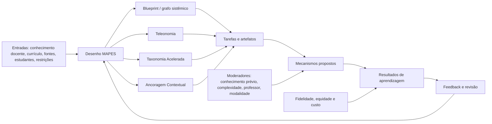
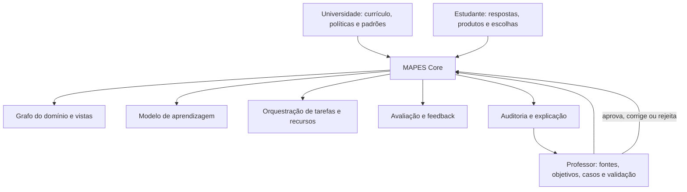

# Plano de pesquisa para investigação, validação e aperfeiçoamento do MAPES

**Nome do projeto:** MAPES — Método de Aprendizagem por Estruturação Sistêmica  
**Versão do plano:** 0.10.0  
**Data:** 29 de julho de 2026  
**Autores-fundadores:** Ricardo Queiroz Guimaães, Hugo de Paula e Cláudio de Moura Castro  
**Estatuto:** programa de investigação, validação e aperfeiçoamento do framework; não constitui registro de eficácia

## Resumo

Este plano define o programa de investigação, validação e aperfeiçoamento do MAPES. O MAPES é um framework pedagógico, metodológico e institucional de aplicação transversal que organiza conhecimentos complexos como sistemas e orienta seu planejamento, apresentação, avaliação, adaptação e melhoria contínua. Seu núcleo conceitual articula Blueprint funcional, Teleonomia, Taxonomia Acelerada e Ancoragem Contextual, complementados pela Estratificação de Relevância Sistêmica. O programa mantém proposições testáveis, mecanismos, condições de contorno, critérios de fidelidade, instrumentos, critérios de revisão e agenda empírica.

O programa está organizado em seis fases: saneamento conceitual; revisão sistemática formal; desenvolvimento de instrumentos; pesquisa baseada em design e viabilidade; estudos comparativos de componentes e integração; e validação multicêntrica, tecnológica e longitudinal. Os desfechos prioritários são compreensão relacional, explicação funcional, aplicação, retenção e transferência. Desfechos secundários incluem calibração metacognitiva, engajamento cognitivo, desorientação, carga percebida, equidade, fidelidade, carga de trabalho docente e custo de implementação.

A pesquisa adota métodos mistos e uma teoria de mudança explícita. O MAPES não é apresentado como tratamento para transtornos de atenção nem como substituto do professor. O problema contemporâneo é formulado como ecologia atencional de alta concorrência, combinada a fragmentação curricular, abundância de informações, incerteza epistemológica e heterogeneidade de repertórios. O professor permanece responsável por finalidades, validação do domínio, mediação, interpretação da turma, avaliação e decisões éticas. Sistemas de inteligência artificial podem extrair estruturas, gerar propostas e reduzir trabalho documental, mas devem manter proveniência, explicabilidade, supervisão e contestabilidade.

## 1. Base documental e decisões consolidadas

### 1.1 Corpus de origem

O plano se apoia no manifesto legado do MAPES e no documento de consolidação teórica (de Moura Castro & Guimaães, n.d.; Projeto MAPES, 2026). O primeiro formula o problema em termos de abundância de peças e escassez de arquitetura; o segundo define o MAPES como framework pedagógico em formalização, distingue definição de hipótese, delimita invariantes e reconhece a necessidade de proposições, instrumentos, fidelidade e validação.

### 1.2 Decisões conceituais vigentes

1. MAPES significa **Método de Aprendizagem por Estruturação Sistêmica**.
2. Sua natureza é **framework pedagógico, metodológico e institucional de aplicação transversal**.
3. Os pilares são Blueprint funcional, Teleonomia, Taxonomia Acelerada e Ancoragem Contextual.
4. O Blueprint pode ser representado formalmente por grafo sistêmico funcional; mapas são vistas pedagógicas.
5. Teleonomia descreve contribuição funcional sem intenção ou finalismo.
6. Taxonomia Acelerada antecipa e torna recorrentes tarefas de maior complexidade cognitiva; não promete menor duração total.
7. Relevância é dimensão separada, denominada Estratificação de Relevância Sistêmica.
8. MAPES pode incorporar PBL, projetos, casos, investigação, simulação, sala invertida e exposição guiada; não é sinônimo de nenhuma delas.
9. Há três níveis de implementação: Essencial, Padrão e Pesquisa.
10. **MAPES ≠ BTTA ≠ MAPES Core**: o Core é a arquitetura operacional normativa do framework.
11. As funções do Core podem ser realizadas manualmente, digitalmente ou por combinação entre trabalho humano e automação.
12. Software e IA são recursos de implementação do Core, não parte da ontologia principal.
13. A IA estrutura e propõe; o professor define, valida, interpreta e decide; a instituição estabelece políticas e governança.
14. A governança do framework, do produto/Core digital e da instituição é separada.

## 2. Problema de pesquisa

### 2.1 Problema educacional

Estudantes contemporâneos frequentemente precisam aprender domínios complexos em condições de:

- abundância de materiais e respostas;
- concorrência entre estímulos, tarefas e plataformas;
- currículos apresentados como sequências de partes;
- baixa visibilidade das relações e funções;
- heterogeneidade de conhecimentos prévios;
- avaliações concentradas em reprodução;
- facilidade de obter explicações sem produzir evidência de compreensão;
- crescente uso de IA com confiabilidade variável.

A literatura não demonstra uma redução universal da atenção. O problema é contextual e multidimensional. Uso de smartphone e desempenho apresentam associações heterogêneas; multitarefa concorrente e interrupções podem prejudicar aprendizagem; divagação mental ocorre também em ambientes não digitais; e tecnologia pode melhorar resultados quando integrada a desenho instrucional intencional (Amez & Baert, 2020; Biedermann et al., 2021; Bjerre-Nielsen et al., 2020; Parry, 2024; Smallwood & Schooler, 2015; Wang et al., 2023).

O MAPES propõe que explicitar arquitetura, função, nível cognitivo e entrada contextual pode orientar atenção e integração. Essa proposição ainda não foi testada como sistema.

### 2.2 Problema científico

Os mecanismos do MAPES possuem pontos de contato com teorias existentes, mas sua integração não foi validada. Permanecem questões:

- Os constructos são distinguíveis?
- O Blueprint acrescenta algo a mapas conceituais, knowledge graphs e organizadores prévios?
- Teleonomia melhora raciocínio ou apenas renomeia análise funcional?
- A Taxonomia Acelerada beneficia aprendizagem ou sobrecarrega novatos?
- A Ancoragem Contextual melhora transferência ou apenas familiaridade?
- O efeito integrado excede o de atividades ativas bem desenhadas?
- É possível avaliar fidelidade sem converter o framework em burocracia?
- A IA reduz trabalho líquido ou desloca carga para revisão?
- A personalização preserva padrões e equidade?

### 2.3 Formulação geral

> Em que condições a explicitação e o uso ativo da arquitetura sistêmica de um domínio, de suas contribuições funcionais, dos níveis cognitivos requeridos, da relevância dos elementos e de entradas contextuais favorecem compreensão relacional, aplicação, retenção e transferência, sem aumentar indevidamente carga cognitiva, burocracia docente ou desigualdade?

## 3. Objetivos

### 3.1 Objetivo geral

Investigar, validar e aperfeiçoar o MAPES, estabelecendo evidências sobre seus constructos, mecanismos, condições de contorno, fidelidade, aprendizagem, qualidade pedagógica, operação, valor institucional, equidade, custo e qualidade das inferências.

### 3.2 Objetivos específicos

1. Formalizar os constructos e suas relações.
2. Realizar revisão sistemática registrada e reprodutível.
3. Construir um modelo lógico e uma teoria de mudança.
4. Desenvolver instrumentos de fidelidade e resultados.
5. Avaliar compreensão dos termos por docentes e estudantes.
6. Testar viabilidade em diferentes domínios e níveis.
7. Estimar efeitos de componentes isolados e integração.
8. Examinar moderadores: conhecimento prévio, complexidade, modalidade e suporte.
9. Avaliar carga de trabalho e risco de overdesign.
10. Projetar e testar implementações do MAPES Core, com autoria assistida e autoridade docente.
11. Monitorar equidade, acessibilidade, privacidade e efeitos adversos.
12. Definir critérios para revisão, refutação e estabilização da versão 1.0.

## 4. Questões orientadoras

### 4.1 Questões conceituais

**QC1.** Os pilares têm definições não circulares e discriminantes?  
**QC2.** A Estratificação de Relevância é independente da demanda cognitiva?  
**QC3.** Quais elementos são invariantes e quais são adaptáveis?  
**QC4.** O que distingue uma implementação MAPES de um curso com mapa e metodologia ativa?  
**QC5.** Quais mecanismos são próprios e quais são herdados de teorias existentes?

### 4.2 Questões de aprendizagem

**QA1.** O uso ativo de Blueprint/grafo melhora compreensão relacional?  
**QA2.** A análise teleonômica melhora explicação e diagnóstico?  
**QA3.** A ativação precoce de tarefas complexas melhora aplicação e transferência?  
**QA4.** Que quantidade de scaffolding é necessária por nível de expertise?  
**QA5.** Ancoragem seguida de abstração melhora transferência?  
**QA6.** O MAPES reduz desorientação ou divagação durante tarefas?  
**QA7.** Os efeitos persistem após semanas ou meses?

### 4.3 Questões de implementação

**QI1.** Professores conseguem usar MAPES Essencial sem sobrecarga?  
**QI2.** Qual formação é necessária?  
**QI3.** Quais componentes sofrem maior desvio?  
**QI4.** Qual fidelidade mínima está associada a resultados?  
**QI5.** O framework é viável em domínios, instituições e públicos contrastantes?

### 4.4 Questões de tecnologia e agência

**QT1.** A IA reduz tempo de planejamento líquido?  
**QT2.** Qual taxa de erro exige revisão?  
**QT3.** Professores compreendem e contestam recomendações?  
**QT4.** Personalização melhora aprendizagem sem baixar padrões?  
**QT5.** Que dados são necessários e proporcionais?  
**QT6.** Como separar efeito do MAPES, da IA e da interface?

## 5. Referencial teórico sintetizado

### 5.1 Organização e aprendizagem significativa

Ausubel (1968), Novak e Gowin (1984), Bransford et al. (2000) e National Academies of Sciences, Engineering, and Medicine (2018) sustentam a centralidade dos conhecimentos prévios e da organização. Chi et al. (1981) demonstram diferenças entre estruturas representacionais de especialistas e novatos. Nesbit e Adesope (2006) fornecem evidência sobre mapas, mas também indicam heterogeneidade.

### 5.2 Carga, apoio e tarefas complexas

Sweller et al. (2019), van Merriënboer e Kirschner (2018), Kirschner et al. (2006) e Hmelo-Silver et al. (2007) fundamentam a necessidade de calibrar orientação. Kalyuga (2007) alerta para reversão da expertise. Kapur (2016) oferece condições para tentativa produtiva anterior à instrução explícita.

### 5.3 Aprendizagem ativa e engajamento

Freeman et al. (2014), Theobald et al. (2020), Chi e Wylie (2014) e Chi (2021) distinguem presença ativa de engajamento construtivo e interativo. Deslauriers et al. (2019) distinguem aprendizagem de sensação de aprendizagem.

### 5.4 Competências e alinhamento

Biggs (1996), Wiggins e McTighe (2005), Frank et al. (2010) e Van Melle et al. (2019) orientam coerência entre resultados, tarefas e evidência, mas o projeto deverá monitorar burocratização.

### 5.5 Taxonomias, transferência e avaliação

Anderson e Krathwohl (2001), Biggs e Collis (1982), Newton et al. (2020), Barnett e Ceci (2002) e Kane (2013) apoiam definição cuidadosa de complexidade, transferência e validade. A Taxonomia Acelerada será operacionalizada por características da tarefa e estrutura da resposta, não apenas por verbos.

### 5.6 Atenção e ambiente digital

Amez e Baert (2020), Bjerre-Nielsen et al. (2020), Parry e le Roux (2021), Smallwood e Schooler (2015) e Wang et al. (2023) orientam uma formulação não determinista. A variável-alvo não será “tempo de atenção” genérico, mas indicadores específicos: interrupção, alternância, divagação, tempo na tarefa, desorientação e recuperação.

### 5.7 IA, learning analytics e grafos

Abu-Salih e Alotaibi (2024), Qu et al. (2024), Ifenthaler e Yau (2020), Celik et al. (2022), Khosravi et al. (2022), Choi et al. (2024) e Miao e Holmes (2023) fundamentam potencial e riscos. Explicabilidade, proveniência e agência docente são requisitos, não funcionalidades opcionais.

### 5.8 Desenvolvimento e avaliação de frameworks educacionais

McKenney e Reeves (2019, 2021) apoiam pesquisa baseada em design. Carroll et al. (2007) orientam fidelidade. Messick (1995), Kane (2013) e Cook e Hatala (2016) orientam validade. Stufflebeam (2011) sustenta meta-avaliação.

## 6. Modelo lógico e teoria de mudança

### 6.1 Entradas

- conhecimento disciplinar e pedagógico do professor;
- currículo e competências institucionais;
- fontes e evidências;
- perfil agregado e evidências individuais;
- tempo, modalidade, acessibilidade e infraestrutura.

### 6.2 Atividades nucleares

- delimitar sistema e fronteira;
- representar componentes e relações;
- explicar função, mecanismo, dependência e falha;
- estratificar relevância;
- definir operações cognitivas e evidências;
- criar âncoras e transição para abstração;
- desenhar tarefas autênticas e apoios;
- avaliar e revisar.

### 6.3 Mecanismos propostos

1. **orientação:** redução de busca desnecessária sobre onde localizar elementos;
2. **integração:** conexão de informação nova a estrutura relacional;
3. **seleção funcional:** atenção dirigida a relações causais ou de contribuição;
4. **geração:** produção de explicações, comparações, decisões e artefatos;
5. **diagnóstico de lacunas:** problemas iniciais revelam necessidades de fundamento;
6. **contextualização e abstração:** entrada familiar seguida de generalização;
7. **monitoramento:** feedback e revisão de mapas apoiam metacognição.

### 6.4 Resultados esperados

- compreensão relacional;
- explicação mecanística/funcional;
- aplicação e diagnóstico;
- retenção;
- transferência próxima e distante;
- navegação autônoma no domínio;
- calibração entre confiança e desempenho.

### 6.5 Moderadores e condições de contorno

- conhecimento prévio;
- complexidade e estrutura do domínio;
- experiência docente;
- qualidade do grafo;
- quantidade de apoio;
- duração e intensidade;
- modalidade;
- ambiente digital;
- acessibilidade;
- cultura institucional.

## 7. Formalização dos constructos

### 7.1 Unidade didática

Propõe-se:

\[
\mathcal{M} = \langle G, F, C, R, A, P, O, V \rangle
\]

- \(G\): grafo sistêmico/Blueprint;
- \(F\): funções, mecanismos, dependências e falhas;
- \(C\): operações cognitivas e progressão;
- \(R\): relevância sistêmica;
- \(A\): âncoras, transição e transferência;
- \(P\): processos e metodologias;
- \(O\): orquestração e artefatos;
- \(V\): avaliação, fidelidade e revisão.

### 7.2 Grafo sistêmico funcional

\[
G_t = \langle V_t, E_t, \tau_V, \tau_E, w_t, s_t, p \rangle
\]

- nós e relações;
- tipos de nós e arestas;
- pesos de relevância/confiança;
- estados e temporalidade;
- proveniência \(p\).

### 7.3 Taxonomia Acelerada

Será avaliada por:

- tempo até primeira tarefa de aplicação/análise;
- proporção de tarefas complexas;
- recorrência ao longo da unidade;
- autenticidade;
- integração de múltiplos nós;
- uso just-in-time de fundamentos;
- presença de feedback e transferência.

### 7.4 Estratificação de Relevância

Cada nó ou relação poderá ser classificado como Nuclear, Habilitadora, Contextual ou Extensão. A justificativa considerará centralidade, criticidade, precedência, frequência, transferência, complexidade e risco do erro. Serão testadas confiabilidade entre avaliadores e utilidade para reduzir escopo, sem fundir relevância com operação cognitiva.

## 8. Sumário analítico do documento fundador

1. **Introdução:** ecologia contemporânea de aprendizagem, fragmentação, abundância e centralidade docente.
2. **Fundamentação:** teorias e evidências; convergências e tensões.
3. **Pressupostos:** conhecimento sistêmico, mediação, falibilismo, agência e tecnologia subordinada à pedagogia.
4. **Constructos:** definições, indicadores e relações.
5. **Taxonomia Acelerada:** desambiguação, ciclo problema-primeiro, relevância separada e exemplos.
6. **Ciclo MAPES:** macrodesign, microciclo, níveis Essencial/Padrão/Pesquisa e MAPES Core.
7. **Artefatos:** matrizes, rubricas, grafos, prompts e registros.
8. **Avaliação:** aprendizagem, fidelidade, meta-avaliação e equidade.
9. **Governança:** modelo piloto, autoria, versionamento e citação.
10. **Limitações e agenda:** riscos, refutação e programa empírico.
11. **Referências:** APA 7.
12. **Apêndices:** templates, rubricas, casos e requisitos tecnológicos.

## 9. Programa de pesquisa em fases

### Fase 0 — saneamento conceitual e revisão formal

**Objetivos:** concluir glossário, registrar protocolo de revisão e mapear sobreposição teórica.

**Métodos:** análise documental, revisão sistemática/escopo, workshops estruturados do Núcleo, pareceres ad hoc.

**Produtos:** revisões compatíveis da versão 0.10.x, glossário, matriz de alegações, revisão PRISMA e mapa de constructos.

**Critérios de passagem:** ausência de definições circulares; distinção Taxonomia/Relevância; acordo do Núcleo; parecer externo.

### Fase 1 — validade de conteúdo e compreensão

**Participantes indicativos:** 8–15 especialistas de educação, domínio, avaliação e tecnologia; 10–20 docentes; 15–30 estudantes em entrevistas iterativas.

**Métodos:** Delphi modificado ou painéis, índices de validade de conteúdo, entrevistas cognitivas, classificação de exemplos e não exemplos.

**Questões:** os itens representam os constructos? Os termos são interpretados como pretendido? Os pilares se confundem?

**Produtos:** rubricas preliminares, manual de codificação e revisão compatível subsequente.

### Fase 2 — pesquisa baseada em design

**Contextos:** pelo menos três domínios contrastantes, como Saúde, Direito e Engenharia/Ciências, sem atribuir estatuto privilegiado a um caso.

**Ciclos:** análise, desenho, implementação, avaliação, redesenho.

**Dados:** observação, gravações, produtos estudantis, entrevistas, questionários, logs, tempo docente e decisões.

**Desfechos:** viabilidade, aceitabilidade, clareza, qualidade dos artefatos, desvios, mecanismos plausíveis e efeitos adversos.

**Critério:** implementação reproduzível sem depender de um único autor.

### Fase 3 — estudos de componentes

Desenhos fatoriais ou quase experimentais, conforme viabilidade:

- lista de tópicos versus Blueprint usado ativamente;
- componente–nome versus função–mecanismo–falha;
- sequência fundamentos-primeiro versus problema-primeiro com apoio;
- exemplo genérico versus âncora com abstração;
- relevância implícita versus estratificação explícita.

**Desfechos primários:** compreensão relacional, explicação funcional e transferência.  
**Secundários:** retenção, carga percebida, tempo, confiança, experiência, desorientação.

### Fase 4 — integração e comparação

Comparar unidade MAPES integrada com desenho de boa qualidade baseado em alinhamento construtivo e aprendizagem ativa. O comparador não deve ser uma caricatura de ensino tradicional. O objetivo é estimar valor incremental da integração.

**Desenho preferencial:** ensaio por conglomerados ou crossover entre turmas, com análise multinível e registro prévio.

**Controles:** professor, tempo, conteúdo, avaliação, exposição e materiais.

### Fase 5 — replicação multicêntrica e longitudinal

Testar em instituições, docentes e domínios distintos. Medir retenção e transferência após 4–12 semanas e, quando viável, aplicação posterior.

**Critérios de generalização:** heterogeneidade explicável; replicação por equipes não fundadoras; resultados nulos publicados; custos aceitáveis.

### Fase 6 — MAPES Core e validação do produto

Separar três perguntas:

1. o framework é válido?
2. o software implementa o framework com fidelidade?
3. o produto melhora processos e resultados em comparação apropriada?

Testes incluem usabilidade, precisão de extração, qualidade de grafos, taxa de erro, tempo líquido, confiança calibrada, explicabilidade, segurança, privacidade e equidade.

## 10. Desenhos e análise

### 10.1 Métodos mistos

Será adotado desenho sequencial e integrado (Creswell & Plano Clark, 2018): estudos qualitativos refinam constructos; instrumentos quantitativos testam estrutura; experimentos estimam efeitos; dados qualitativos explicam heterogeneidade.

### 10.2 Amostragem e poder

Tamanhos informados neste plano são indicativos. Cada estudo comparativo deverá realizar análise de poder baseada no desfecho primário, unidade de alocação, correlação intraclasse, perdas e efeito mínimo educacionalmente relevante. Deve-se evitar planejar apenas com efeitos médios de meta-análises amplas.

### 10.3 Análises quantitativas

- modelos multinível para estudantes em turmas;
- modelos mistos para medidas repetidas;
- análise de mediação apenas com temporalidade e pressupostos explícitos;
- interação por conhecimento prévio e complexidade;
- análise de equivalência ou não inferioridade quando relevante;
- curvas de calibração;
- confiabilidade entre avaliadores;
- análise de funcionamento diferencial de itens;
- sensibilidade a perdas e adesão.

### 10.4 Análises qualitativas

Análise temática reflexiva, análise de episódios de raciocínio e comparação de casos (Braun & Clarke, 2021). Decisões analíticas, divergências e reflexividade serão documentadas.

### 10.5 Inferência causal

Estudos experimentais ou quase experimentais seguirão princípios de Shadish et al. (2002). Alegações causais serão restritas a desenhos adequados. Estudos de caso serão usados para mecanismo e viabilidade, não prova de eficácia.

## 11. Instrumentos

### 11.1 Rubrica de qualidade do Blueprint/grafo

Dimensões:

1. fronteira explícita;
2. adequação da escala;
3. seleção de componentes;
4. relações tipadas;
5. direção e temporalidade quando pertinentes;
6. feedback e incerteza;
7. proveniência;
8. uso em tarefa;
9. revisabilidade;
10. acessibilidade visual.

### 11.2 Rubrica teleonômica

- componente/processo;
- mecanismo;
- contribuição funcional;
- nível do sistema;
- dependências;
- variação/falha;
- compensação;
- ausência de finalismo;
- evidência.

### 11.3 Índice de ativação cognitiva acelerada

Proporção ponderada de tarefas por complexidade, momento da primeira tarefa complexa, recorrência, autenticidade, suporte e transferência. O índice não deverá somar verbos; será codificado por demandas reais.

### 11.4 Protocolo de Ancoragem Contextual

- repertório verificado;
- âncora;
- limite;
- conceito de destino;
- desancoragem;
- transferência;
- equivalência de padrão.

### 11.5 Fidelidade

Domínios: aderência, exposição, qualidade, responsividade, diferenciação e adaptação justificada (Carroll et al., 2007). Haverá versão Essencial breve e versão Pesquisa detalhada.

### 11.6 Resultados de aprendizagem

- teste de relações;
- tarefas de explicação;
- casos novos;
- transferência próxima/distante;
- retenção tardia;
- revisão de grafo;
- justificativa de decisão;
- calibração metacognitiva.

### 11.7 Experiência e carga

Medidas de carga percebida, desorientação, utilidade, pertencimento, esforço, experiência com tecnologia e carga docente serão secundárias. Não serão usadas como substitutas de aprendizagem.

## 12. Estratégia específica para Taxonomia Acelerada

### 12.1 Desambiguação

**Componente A — Ativação Cognitiva Acelerada:** antecipação e recorrência de aplicação, análise, avaliação e criação.  
**Componente B — Estratificação de Relevância Sistêmica:** nuclear, habilitadora, contextual e extensão.

O nome do pilar permanece Taxonomia Acelerada por continuidade histórica; seu mecanismo interno é Ativação Cognitiva Acelerada. Relevância é transversal.

### 12.2 Contrastes experimentais

- fundamentos-primeiro versus problema-primeiro com scaffolding;
- tarefa complexa inicial com versus sem retorno orientado aos fundamentos;
- mesma quantidade de conteúdo, diferente distribuição temporal;
- tarefa autêntica versus exercício apenas nominalmente “real”.

### 12.3 Critérios de segurança pedagógica

Aceleração será considerada inadequada quando:

- produz busca aleatória sem aprendizagem;
- exige conhecimentos indisponíveis sem apoio;
- aumenta erro persistente;
- reduz oportunidade de prática fundamental;
- cria ansiedade ou exclusão desproporcional;
- penaliza estudantes por não possuir repertório não ensinado.

### 12.4 Indicadores

- tempo até primeira tarefa complexa;
- frequência e espaçamento;
- integração de nós;
- qualidade da justificativa;
- uso de fundamentos;
- redução gradual de apoio;
- transferência;
- carga e disparidades.

## 13. Implementação sem burocratização

### 13.1 MAPES Essencial

Seis perguntas:

1. Qual sistema ou problema organiza a unidade?
2. Que relações e funções são indispensáveis?
3. O que o estudante fará cognitivamente?
4. Qual entrada é pertinente?
5. Que tarefa produzirá evidência?
6. Como feedback e revisão ocorrerão?

### 13.2 MAPES Padrão

Inclui grafo, funções, relevância, objetivos, âncoras, tarefas, rubricas, fontes e acessibilidade.

### 13.3 MAPES Pesquisa

Inclui protocolo, fidelidade, logs de decisão, instrumentos, dados, custo, desvios e efeitos adversos.

### 13.4 Critério de proporcionalidade

Nenhum campo será exigido se não tiver função pedagógica, científica, ética ou regulatória identificável. O sistema deve produzir documentação a partir do trabalho, não fazer do preenchimento o trabalho.

## 14. MAPES Core e programa tecnológico

### 14.1 Arquitetura

O MAPES Core é a arquitetura operacional normativa do framework. Suas funções podem ser realizadas manualmente, digitalmente ou por combinação entre trabalho humano e automação; software e IA são recursos de implementação. O programa tecnológico investiga produtos digitais sem confundi-los com o framework.

O Core deverá incorporar fontes autorizadas, proveniência, rastreabilidade, conflitos, lacunas, gate de aprovação docente e versionamento. A matriz normativa ligará objetivo, nó principal, nós relacionados, relação, função, operação cognitiva, relevância, tarefa, evidência, feedback, fonte e confiança.

### 14.2 Funções automatizáveis

- extração de conceitos e relações;
- detecção de inconsistências;
- proposta de relevância;
- geração de tarefas e variações;
- criação de rubricas preliminares;
- alinhamento automático;
- adaptação de apoio;
- sumarização de evidências;
- alertas ao professor.

Toda saída automatizada deverá declarar fonte, confiança, versão e possibilidade de reversão.

### 14.3 Funções não delegáveis integralmente

- definição de finalidades;
- validação epistemológica;
- interpretação de controvérsias;
- decisão sobre padrões;
- avaliação de alto impacto;
- intervenção relacional;
- juízo ético e contextual;
- responsabilidade institucional.

Na autoria assistida, a IA estrutura e propõe; o professor define, valida, interpreta e decide; a instituição estabelece políticas e governança.

### 14.4 Métricas do produto

- precisão e completude do grafo;
- rastreabilidade à fonte;
- taxa de alucinação;
- tempo bruto e líquido;
- taxa de aceitação/correção docente;
- qualidade independente das tarefas;
- explicabilidade;
- acessibilidade;
- disparidades;
- incidentes de privacidade;
- dependência do fornecedor.

### 14.5 Inferências, relatórios e níveis de risco

Inferências sobre lacunas do estudante serão provisórias e registrarão evidência, confiança, alternativas explicativas, confirmação e revisão. Relatórios ao professor incluirão evidência, confiança, alternativas, intervenções, evolução, recomendação não vinculante e decisão docente.

Os controles serão proporcionais ao risco:

- **baixo:** automação registrada e reversível;
- **intermediário:** recomendação com revisão;
- **alto:** revisão humana prévia.

O estudante poderá solicitar ajuda, contestar inferências e pedir revisão humana. Pedidos explícitos de ajuda constituem gatilho prioritário.

## 15. Ética, equidade, dados e integridade

### 15.1 Estudantes

- consentimento e alternativas quando pesquisa;
- não penalização por recusa de dados opcionais;
- acessibilidade;
- monitoramento de efeitos adversos;
- separação entre apoio educacional e diagnóstico clínico;
- comunicação de incerteza.
- direito de solicitar ajuda;
- direito de contestar inferências;
- direito de pedir revisão humana.

### 15.2 Dados

- minimização;
- finalidade específica;
- retenção limitada;
- pseudonimização;
- controle de acesso;
- registro de modelos e versões;
- avaliação de impacto;
- conformidade com LGPD e normas institucionais.

### 15.3 Equidade

Resultados serão estratificados quando ética e estatisticamente adequados. Individualização, personalização e adaptação serão tratadas como conceitos distintos. Nenhuma poderá reduzir objetivos nucleares com base em previsões opacas. Estudantes terão meios de contestar e corrigir o modelo.

### 15.4 Integridade científica

- pré-registro de estudos confirmatórios;
- protocolo e análise publicados;
- relato de resultados nulos;
- distinção entre exploração e confirmação;
- declaração de conflitos com eventual EdTech;
- transparência de contribuições CRediT;
- separação entre métricas comerciais e evidência científica.

## 16. Mensuração multidimensional da qualidade do MAPES

A mensuração será explicitamente multidimensional. Não será criado escore agregado antes da validação dos instrumentos, das relações entre domínios e dos usos pretendidos.

| Domínio | Pergunta operacional | Evidência indicativa |
|---|---|---|
| Fidelidade estrutural | A implementação preserva invariantes, relações e ciclo? | rubrica de fidelidade, rastreabilidade e desvios |
| Qualidade pedagógica | O desenho, a mediação, o apoio e o feedback são adequados? | revisão de tarefas, observação, acessibilidade e carga |
| Aprendizagem | O estudante demonstra compreensão, aplicação, retenção e transferência? | tarefas, rubricas, medidas tardias e calibração |
| Qualidade operacional | O processo é confiável, viável, seguro e reversível? | tempo líquido, erros, disponibilidade, custo e incidentes |
| Valor institucional | A implementação produz informação útil e sustentável para melhoria? | adoção, equidade, portabilidade e uso decisório agregado |
| Qualidade das inferências | As conclusões são válidas, incertas quando necessário e contestáveis? | evidência, confiança, alternativas, confirmação, revisão e disparidades |

Cada domínio deverá ter indicadores, fontes, periodicidade, responsáveis, limitações e critérios de revisão próprios. A meta-avaliação manterá quatro níveis: estudante; aula/unidade; implementação tecnológica; proposições do MAPES.

## 17. Cronograma indicativo de 36 meses

| Período | Atividade | Produto principal |
|---|---|---|
| Meses 1–3 | Atualizar protocolo, glossário e saneamento | v0.10.x e protocolo registrado |
| Meses 3–7 | Revisão sistemática e comparação de frameworks | artigo de revisão |
| Meses 5–9 | Validade de conteúdo e entrevistas | instrumentos v1 |
| Meses 8–15 | Ciclos DBR em três domínios contrastantes | manual revisado e casos |
| Meses 12–18 | Estudos de viabilidade e carga docente | relatório de implementação |
| Meses 16–24 | Estudos de componentes | artigos experimentais/quase experimentais |
| Meses 20–28 | Estudo integrado e retenção | estimativa de efeito incremental |
| Meses 18–30 | Protótipo MAPES Core e auditoria | versão alfa/beta validada |
| Meses 27–34 | Replicação multicêntrica | evidência externa |
| Meses 32–36 | Síntese, meta-avaliação e decisão v1.0 | framework/manual v1.0 ou revisão estrutural |

O cronograma é adaptável a financiamento, calendário acadêmico e aprovação ética. A versão 1.0 não depende apenas do decurso do tempo; depende de critérios de maturidade.

## 18. Critérios para transição à versão 1.0

1. definições estáveis e discriminantes;
2. manual de implementação;
3. instrumento de fidelidade com confiabilidade adequada;
4. ao menos três domínios e duas equipes não fundadoras;
5. evidência de viabilidade e custo;
6. pelo menos um estudo comparativo pré-registrado;
7. resultados de retenção/transferência;
8. efeitos adversos e limites documentados;
9. governança, licença e citação estáveis;
10. revisão externa independente.

A versão 1.0 significará uma especificação estável sustentada por um programa inicial de evidências, não eficácia universal comprovada.

## 19. Riscos e mitigação

| Risco | Consequência | Mitigação |
|---|---|---|
| Sobreposição com teorias existentes | baixa originalidade | comparação explícita e efeito incremental |
| Grafo excessivo | sobrecarga | camadas, tarefas e teste por expertise |
| Aceleração sem base | fracasso improdutivo | scaffolding e critérios de prontidão |
| Contextualização estereotipada | desigualdade | repertório verificado e abstração comum |
| Overdesign | baixa adoção | níveis Essencial/Padrão/Pesquisa |
| Efeito do professor confundido | atribuição indevida | múltiplos docentes e modelos multinível |
| IA incorreta ou opaca | dano epistemológico | proveniência, revisão e explicabilidade |
| Personalização que baixa padrões | inequidade | invariantes curriculares e auditoria |
| Uso comercial precoce | alegações exageradas | separação entre governança do framework, do produto e institucional |
| Viés de publicação | teoria artificialmente positiva | registro e resultados nulos |

## 20. Produtos previstos

1. revisão sistemática registrada;
2. documento fundador MAPES;
3. manual de implementação;
4. Canvas Essencial;
5. rubricas e instrumentos;
6. protocolo de fidelidade;
7. banco de casos e tarefas;
8. curso de formação docente;
9. especificação do MAPES Core;
10. artigos de validade, DBR, componentes e integração;
11. repositório com DOI, CHANGELOG e versões;
12. biblioteca Zotero/RDF atualizada.
13. backlog separado para futuro protocolo de piloto específico.

## 21. Governança do programa

O programa distingue:

- **governança do framework:** constructos, terminologia, evidências, fidelidade e alegações científicas;
- **governança do produto/Core digital:** código, interfaces, segurança, suporte, versões e operação;
- **governança institucional:** dados, usuários, políticas, currículo, Perfil Institucional e uso local.

### Núcleo Fundador

Ricardo Queiroz Guimaães, Hugo de Paula e Cláudio de Moura Castro. Decisões substantivas por dois terços; estruturais por dois terços e parecer externo ad hoc.

### Revisores ad hoc

Convidados para pilar, instrumento, publicação, alegação importante, ética ou tecnologia. Parecer consultivo documentado.

### Aplicadores-piloto

Docentes e pesquisadores que testam, registram e sugerem. Não constituem conselho permanente.

### Registros

- documento mestre;
- CHANGELOG;
- log curto de decisões;
- CRediT por produto;
- protocolo e repositório.

## 22. Política de disseminação

O programa deve publicar definições, instrumentos e resultados com licenças claras. Materiais abertos não implicam exposição de dados pessoais. Resultados negativos ou limites devem ser comunicados. Versões comerciais deverão citar a versão teórica implementada e declarar modificações.

## 23. Critérios de refutação e revisão

O MAPES deverá ser modificado se:

- os pilares não puderem ser distinguidos;
- o grafo não for usado no raciocínio;
- tarefas aceleradas prejudicarem de forma persistente novatos mesmo com apoio;
- âncoras não produzirem abstração;
- efeitos forem explicados integralmente por tempo na tarefa ou método comparador;
- fidelidade for impraticável;
- custo superar benefícios;
- personalização ampliar desigualdades;
- replicações independentes forem consistentemente nulas;
- professores perderem agência ou confiança calibrada.

Uma teoria útil precisa tornar possível aprender com seu fracasso.

## 24. Referências

Abu-Salih, B., & Alotaibi, S. (2024). A systematic literature review of knowledge graph construction and application in education. *Heliyon, 10*(3), e25383. https://doi.org/10.1016/j.heliyon.2024.e25383

Amez, S., & Baert, S. (2020). Smartphone use and academic performance: A literature review. *International Journal of Educational Research, 103*, 101618. https://doi.org/10.1016/j.ijer.2020.101618

Amez, S., Vujić, S., De Marez, L., & Baert, S. (2023). Smartphone use and academic performance: First evidence from longitudinal data. *New Media & Society, 25*(3), 584–608. https://doi.org/10.1177/14614448211012374

Anderson, L. W., & Krathwohl, D. R. (Eds.). (2001). *A taxonomy for learning, teaching, and assessing: A revision of Bloom’s taxonomy of educational objectives*. Longman.

Ausubel, D. P. (1968). *Educational psychology: A cognitive view*. Holt, Rinehart and Winston.

Barnett, S. M., & Ceci, S. J. (2002). When and where do we apply what we learn? A taxonomy for far transfer. *Psychological Bulletin, 128*(4), 612–637. https://doi.org/10.1037/0033-2909.128.4.612

Biedermann, D., Schneider, J., & Drachsler, H. (2021). Digital self-control interventions for distracting media multitasking: A systematic review. *Journal of Computer Assisted Learning, 37*(5), 1217–1231. https://doi.org/10.1111/jcal.12581

Biggs, J. B., & Collis, K. F. (1982). *Evaluating the quality of learning: The SOLO taxonomy*. Academic Press.

Biggs, J. (1996). Enhancing teaching through constructive alignment. *Higher Education, 32*(3), 347–364. https://doi.org/10.1007/BF00138871

Bjerre-Nielsen, A., Andersen, A., Minor, K., & Lassen, D. D. (2020). The negative effect of smartphone use on academic performance may be overestimated: Evidence from a 2-year panel study. *Psychological Science, 31*(11), 1351–1362. https://doi.org/10.1177/0956797620956613

Bransford, J. D., Brown, A. L., & Cocking, R. R. (Eds.). (2000). *How people learn: Brain, mind, experience, and school* (Expanded ed.). National Academies Press. https://doi.org/10.17226/9853

Braun, V., & Clarke, V. (2021). *Thematic analysis: A practical guide*. SAGE.

Carroll, C., Patterson, M., Wood, S., Booth, A., Rick, J., & Balain, S. (2007). A conceptual framework for implementation fidelity. *Implementation Science, 2*, 40. https://doi.org/10.1186/1748-5908-2-40

Celik, I., Dindar, M., Muukkonen, H., & Järvelä, S. (2022). The promises and challenges of artificial intelligence for teachers: A systematic review of research. *TechTrends, 66*(4), 616–630. https://doi.org/10.1007/s11528-022-00715-y

Chi, M. T. H., Feltovich, P. J., & Glaser, R. (1981). Categorization and representation of physics problems by experts and novices. *Cognitive Science, 5*(2), 121–152. https://doi.org/10.1207/s15516709cog0502_2

Chi, M. T. H., & Wylie, R. (2014). The ICAP framework: Linking cognitive engagement to active learning outcomes. *Educational Psychologist, 49*(4), 219–243. https://doi.org/10.1080/00461520.2014.965823

Chi, M. T. H. (2021). Translating a theory of active learning: An attempt to close the research-practice gap in education. *Topics in Cognitive Science, 13*(3), 441–463. https://doi.org/10.1111/tops.12539

Choi, G. W., Kim, S. H., Lee, D., & Moon, J. (2024). Utilizing generative AI for instructional design: Exploring strengths, weaknesses, opportunities, and threats. *TechTrends, 68*(4), 832–844. https://doi.org/10.1007/s11528-024-00967-w

Cook, D. A., & Hatala, R. (2016). Validation of educational assessments: A primer for simulation and beyond. *Advances in Simulation, 1*, 31. https://doi.org/10.1186/s41077-016-0033-y

Creswell, J. W., & Plano Clark, V. L. (2018). *Designing and conducting mixed methods research* (3rd ed.). SAGE.

de Moura Castro, C., & Guimaães, R. (n.d.). *MAPES — Método de Aprendizagem por Estruturação Sistêmica*. Projeto MAPES/LAPAN-UFMG.

Deslauriers, L., McCarty, L. S., Miller, K., Callaghan, K., & Kestin, G. (2019). Measuring actual learning versus feeling of learning in response to being actively engaged in the classroom. *Proceedings of the National Academy of Sciences, 116*(39), 19251–19257. https://doi.org/10.1073/pnas.1821936116

Frank, J. R., Snell, L. S., ten Cate, O., Holmboe, E. S., Carraccio, C., Swing, S. R., Harris, P., Glasgow, N. J., Campbell, C., Dath, D., Harden, R. M., Iobst, W., Long, D. M., Mungroo, R., Richardson, D. L., Sherbino, J., Silver, I., Taber, S., Talbot, M., & Harris, K. A. (2010). Competency-based medical education: Theory to practice. *Medical Teacher, 32*(8), 638–645. https://doi.org/10.3109/0142159X.2010.501190

Freeman, S., Eddy, S. L., McDonough, M., Smith, M. K., Okoroafor, N., Jordt, H., & Wenderoth, M. P. (2014). Active learning increases student performance in science, engineering, and mathematics. *Proceedings of the National Academy of Sciences, 111*(23), 8410–8415. https://doi.org/10.1073/pnas.1319030111

Hmelo-Silver, C. E., Duncan, R. G., & Chinn, C. A. (2007). Scaffolding and achievement in problem-based and inquiry learning: A response to Kirschner, Sweller, and Clark (2006). *Educational Psychologist, 42*(2), 99–107. https://doi.org/10.1080/00461520701263368

Ifenthaler, D., & Yau, J. Y.-K. (2020). Utilising learning analytics to support study success in higher education: A systematic review. *Educational Technology Research and Development, 68*(4), 1961–1990. https://doi.org/10.1007/s11423-020-09788-z

Kalyuga, S. (2007). Expertise reversal effect and its implications for learner-tailored instruction. *Educational Psychology Review, 19*(4), 509–539. https://doi.org/10.1007/s10648-007-9054-3

Kane, M. T. (2013). Validating the interpretations and uses of test scores. *Journal of Educational Measurement, 50*(1), 1–73. https://doi.org/10.1111/jedm.12000

Kapur, M. (2016). Examining productive failure, productive success, unproductive failure, and unproductive success in learning. *Educational Psychologist, 51*(2), 289–299. https://doi.org/10.1080/00461520.2016.1155457

Khosravi, H., Shum, S. B., Chen, G., Conati, C., Tsai, Y.-S., Kay, J., Knight, S., Martinez-Maldonado, R., Sadiq, S., & Gašević, D. (2022). Explainable artificial intelligence in education. *Computers and Education: Artificial Intelligence, 3*, 100074. https://doi.org/10.1016/j.caeai.2022.100074

Kirschner, P. A., Sweller, J., & Clark, R. E. (2006). Why minimal guidance during instruction does not work: An analysis of the failure of constructivist, discovery, problem-based, experiential, and inquiry-based teaching. *Educational Psychologist, 41*(2), 75–86. https://doi.org/10.1207/s15326985ep4102_1

Krathwohl, D. R. (2002). A revision of Bloom’s taxonomy: An overview. *Theory Into Practice, 41*(4), 212–218. https://doi.org/10.1207/s15430421tip4104_2

McKenney, S., & Reeves, T. C. (2019). *Conducting educational design research* (2nd ed.). Routledge. https://doi.org/10.4324/9781315105642

McKenney, S., & Reeves, T. C. (2021). Educational design research: Portraying, conducting, and enhancing productive scholarship. *Medical Education, 55*(1), 82–92. https://doi.org/10.1111/medu.14280

Messick, S. (1995). Validity of psychological assessment: Validation of inferences from persons’ responses and performances as scientific inquiry into score meaning. *American Psychologist, 50*(9), 741–749. https://doi.org/10.1037/0003-066X.50.9.741

Miao, F., & Holmes, W. (2023). *Guidance for generative AI in education and research*. UNESCO. https://unesdoc.unesco.org/ark:/48223/pf0000386693

National Academies of Sciences, Engineering, and Medicine. (2018). *How people learn II: Learners, contexts, and cultures*. National Academies Press. https://doi.org/10.17226/24783

Nesbit, J. C., & Adesope, O. O. (2006). Learning with concept and knowledge maps: A meta-analysis. *Review of Educational Research, 76*(3), 413–448. https://doi.org/10.3102/00346543076003413

Newton, P. M., da Silva, A., & Peters, L. G. (2020). A pragmatic master list of action verbs for Bloom’s taxonomy. *Frontiers in Education, 5*, 107. https://doi.org/10.3389/feduc.2020.00107

Novak, J. D., & Gowin, D. B. (1984). *Learning how to learn*. Cambridge University Press. https://doi.org/10.1017/CBO9781139173469

Parry, D. A., & le Roux, D. B. (2021). “Cognitive control in media multitaskers” ten years on: A meta-analysis. *Cyberpsychology: Journal of Psychosocial Research on Cyberspace, 15*(2), Article 7. https://doi.org/10.5817/CP2021-2-7

Parry, D. A. (2024). Does the mere presence of a smartphone impact cognitive performance? A meta-analysis of the “brain drain effect”. *Media Psychology, 27*(5), 737–762. https://doi.org/10.1080/15213269.2023.2286647

Projeto MAPES. (2026). *MAPES — consolidação conceitual, lessons learned e diretrizes para elaboração teórica* (Versão 1.0).

Qu, K., Li, K. C., Wong, B. T. M., Wu, M. M. F., & Liu, M. (2024). A survey of knowledge graph approaches and applications in education. *Electronics, 13*(13), 2537. https://doi.org/10.3390/electronics13132537

Shadish, W. R., Cook, T. D., & Campbell, D. T. (2002). *Experimental and quasi-experimental designs for generalized causal inference*. Houghton Mifflin.

Smallwood, J., & Schooler, J. W. (2015). The science of mind wandering: Empirically navigating the stream of consciousness. *Annual Review of Psychology, 66*, 487–518. https://doi.org/10.1146/annurev-psych-010814-015331

Stufflebeam, D. L. (2011). Meta-evaluation. *Journal of MultiDisciplinary Evaluation, 7*(15), 99–158. https://doi.org/10.56645/jmde.v7i15.300

Sweller, J., van Merriënboer, J. J. G., & Paas, F. (2019). Cognitive architecture and instructional design: 20 years later. *Educational Psychology Review, 31*(2), 261–292. https://doi.org/10.1007/s10648-019-09465-5

Theobald, E. J., Hill, M. J., Tran, E., Agrawal, S., Arroyo, E. N., Behling, S., Chambwe, N., Cintrón, J. D., Cooper, J. D., Dunster, G., Grummer, J. A., Hennessey, K., Hsiao, J., Iranon, N., Jones, L. E., Jordt, H., Keller, M., Lacey, M. E., Littlefield, C. E., … Freeman, S. (2020). Active learning narrows achievement gaps for underrepresented students in undergraduate science, technology, engineering, and math. *Proceedings of the National Academy of Sciences, 117*(12), 6476–6483. https://doi.org/10.1073/pnas.1916903117

Van Melle, E., Frank, J. R., Holmboe, E. S., Dagnone, D., Stockley, D., & Sherbino, J. (2019). A core components framework for evaluating implementation of competency-based medical education programs. *Academic Medicine, 94*(7), 1002–1009. https://doi.org/10.1097/ACM.0000000000002743

van Merriënboer, J. J. G., & Kirschner, P. A. (2018). *Ten steps to complex learning: A systematic approach to four-component instructional design* (3rd ed.). Routledge. https://doi.org/10.4324/9781315113210

Wang, J., Tigelaar, D. E. H., Zhou, T., & Admiraal, W. (2023). The effects of mobile technology usage on cognitive, affective, and behavioural learning outcomes in primary and secondary education: A systematic review with meta-analysis. *Journal of Computer Assisted Learning, 39*(2), 301–328. https://doi.org/10.1111/jcal.12759

Wiggins, G., & McTighe, J. (2005). *Understanding by design* (2nd ed.). ASCD.
