# Por que o MAPES

Informação disponível não é, por si só, conhecimento utilizável. Em muitos domínios, estudantes reconhecem termos e reproduzem passos isolados, mas não conseguem explicar relações, prever consequências ou agir diante de uma situação nova. O MAPES organiza o trabalho pedagógico que transforma um conjunto de conteúdos em um sistema que pode ser compreendido, usado e revisto.

O framework não atribui esse problema a uma geração ou a uma tecnologia. Atenção, repertório prévio, qualidade das tarefas, apoio oferecido e condições do contexto importam. Seu ponto de partida é mais modesto: tornar explícitas a estrutura do domínio, a função de suas partes, a operação cognitiva pedida e a ponte entre situação concreta e abstração.

# A proposta do MAPES

MAPES significa Método de Aprendizagem por Estruturação Sistêmica. É um framework pedagógico, não uma plataforma nem uma garantia de resultado. Ele orienta escolhas docentes para que objetivos, fontes, relações conceituais, tarefas, evidências e revisão formem uma cadeia inteligível. O professor conserva a decisão acadêmica em cada ponto dessa cadeia e aprova os materiais antes de sua utilização.

O exemplo contínuo deste livro é uma aula sobre administração segura de medicamentos. Em vez de começar por uma lista de etapas, a aula começa por uma situação: uma prescrição exige verificar paciente, medicamento, dose, via e horário antes da administração. A situação torna visível por que fatos isolados não bastam.

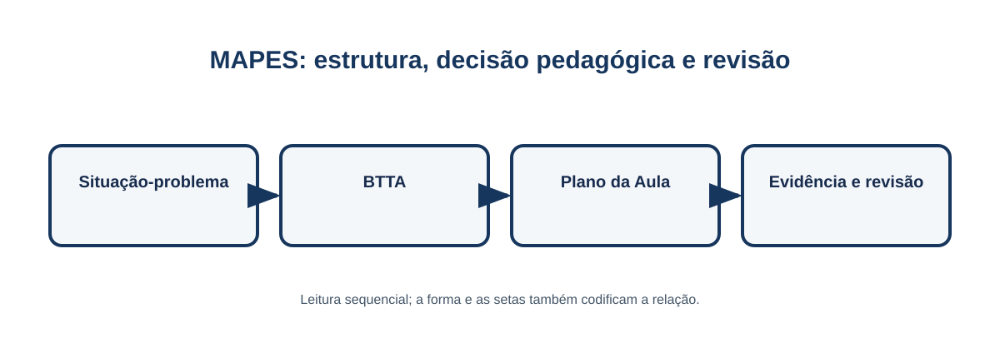{#fig-01-visao-geral  width=90% }

# Conhecimento como sistema

Um sistema tem fronteira, componentes e relações. A fronteira define o que será tratado naquela aula; os componentes permitem nomear elementos relevantes; as relações mostram dependências, fluxos, condições e consequências. Um mapa só é útil quando ajuda o estudante a explicar ou decidir algo. Não se trata de desenhar todos os detalhes, mas de selecionar relações que mudam a compreensão da situação-problema.

No exemplo, prescrição, identificação do paciente, cálculo de dose, via de administração e registro são componentes. Uma relação crucial é que a conferência da prescrição condiciona a decisão de administrar. O erro frequente é transformar o Blueprint em inventário decorativo: se a representação não sustenta uma pergunta ou tarefa, ela deve ser simplificada.

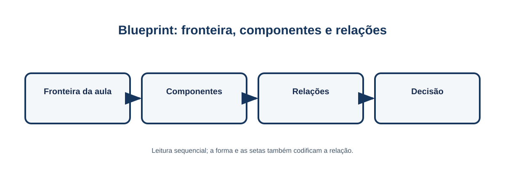{#fig-03-blueprint-sistema  width=88% }

# Os quatro pilares BTTA

Os pilares oferecem quatro perguntas complementares, e não quatro formulários independentes. Juntos, evitam que o planejamento se reduza a tópicos, verbos ou exemplos desconectados.

## Blueprint

O Blueprint responde “como este domínio se organiza?”. Ele explicita fronteira, componentes e relações. Na aula de medicamentos, ele mostra que a segurança depende de uma cadeia de verificações, não apenas da memorização dos “certos”. Sua consequência pedagógica é escolher poucas relações que o estudante deverá reconstruir e usar. O erro frequente é confundir amplitude com qualidade: um diagrama excessivo aumenta carga e não melhora a orientação.

## Teleonomia

Teleonomia pergunta “que contribuição este componente oferece ao funcionamento observado?”. Ela liga componente, mecanismo, função e consequência sem supor intenção onde há apenas relação causal. A identificação do paciente, por exemplo, reduz a possibilidade de administrar o medicamento à pessoa errada; a consequência esperada é maior segurança do processo. O erro frequente é usar linguagem finalista como explicação: dizer que um componente “existe para” algo não substitui mostrar o mecanismo.

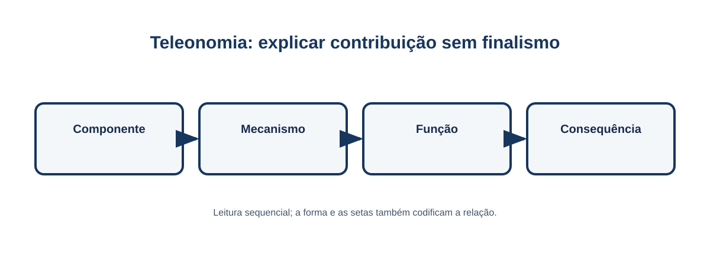{#fig-04-teleonomia  width=82% }

## Taxonomia Acelerada

A Taxonomia Acelerada organiza a entrada precoce em operações cognitivas de maior exigência, com fundamentos fornecidos quando se tornam necessários. Não elimina memorização, prática guiada ou explicação; reposiciona-os a serviço de uma ação significativa. Na aula, os estudantes precisam decidir se uma administração pode prosseguir, justificar a decisão e consultar os fundamentos necessários. O erro frequente é transformar “acelerada” em pressa ou em uma lista de verbos abstratos.

## Ancoragem Contextual

Ancoragem Contextual cria uma ponte entre uma situação reconhecível, a abstração do domínio e a transferência para outra situação. O caso da prescrição dá entrada ao problema; a abstração explicita relações gerais de segurança; um segundo caso com dose ou via diferente testa se a regra foi transferida. O erro frequente é parar na narrativa familiar e não retornar ao conceito que pode viajar para outro contexto.

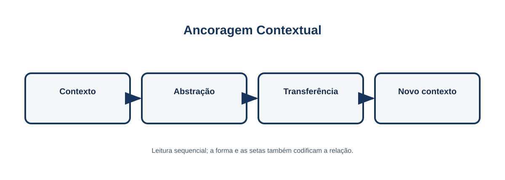{#fig-07-ancoragem  width=82% }

# Relevância Sistêmica e complexidade cognitiva

Relevância Sistêmica define prioridade de conteúdo; complexidade cognitiva define o tipo de trabalho mental pedido. São decisões diferentes. Um conteúdo pode ser central e exigir reconhecimento inicial, ou ser complementar e exigir análise sofisticada em uma tarefa específica.

Use **Núcleo** para relações sem as quais o sistema não pode ser explicado ou usado com segurança; **Apoio** para conhecimentos que sustentam ou esclarecem o núcleo; e **Aprofundamento** para extensões úteis quando a finalidade e o tempo justificam explorá-las. Frequência, precedência, transferência e consequência do erro podem informar a decisão, mas não viram campos universais obrigatórios. No exemplo, conferir a identidade do paciente é Núcleo; detalhes históricos de protocolos podem ser Aprofundamento. O erro comum é chamar o Núcleo de “mais difícil”: prioridade não mede dificuldade.

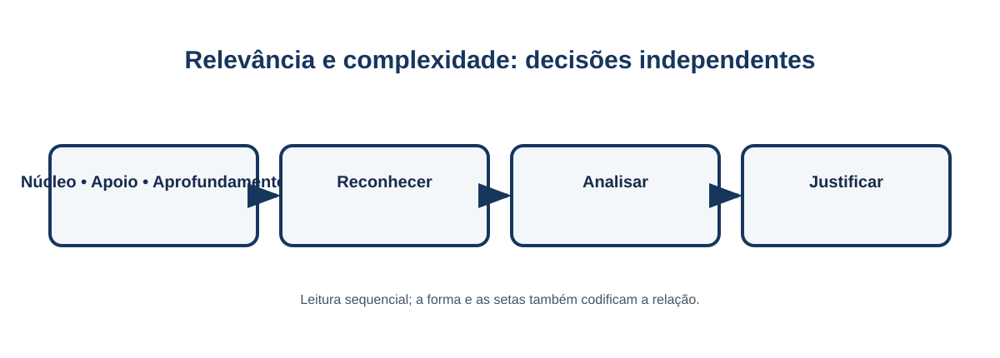{#fig-05-relevancia-complexidade  width=90% }

# O processo MAPES em seis etapas

O processo é único e adaptável. A documentação deve ser proporcional à aula e à finalidade; pesquisa pode acompanhar uma implementação, mas não é um nível superior do método.

1. **Preparar.** Delimitar contexto, estudantes, fontes autorizadas, objetivo e situação-problema.
2. **Estruturar.** Construir o Blueprint, selecionar relações e explicitar funções relevantes.
3. **Planejar.** Priorizar com Relevância Sistêmica, definir operações cognitivas, âncoras, atividades e evidências.
4. **Organizar e produzir.** Preparar materiais e apoios necessários. O framework não determina quem os executa; todo material recebe revisão e aprovação docente.
5. **Implementar.** Conduzir a experiência, observar evidências e ajustar o suporte sem perder o objetivo.
6. **Avaliar e revisar.** Interpretar evidências de aprendizagem e de viabilidade, decidir o que manter, corrigir ou investigar.

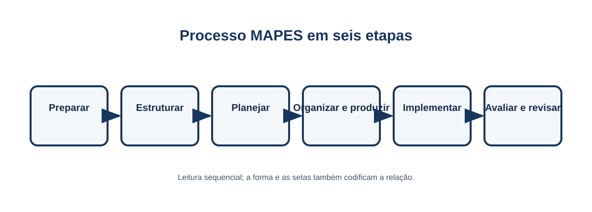{#fig-09-processo-seis-etapas  width=95% }

# Plano MAPES da Aula

O Plano MAPES da Aula é o artefato pedagógico central. Ele reúne decisões que antes ficavam dispersas em canvas, lesson brief e matrizes. Não é uma burocracia adicional: seu propósito é registrar apenas o que permite ao professor justificar uma decisão, preparar a aula e revisá-la depois. Um plano proporcional pode conter frases curtas; um plano para atividade de maior risco pode exigir fontes e critérios mais detalhados.

O plano liga contexto e fontes à estrutura BTTA; em seguida, relaciona prioridade, objetivo, tarefa, materiais, evidência e revisão. Um Manifesto da Aula pode ser gerado a partir dele como registro técnico opcional, mas não substitui nem governa a decisão pedagógica.

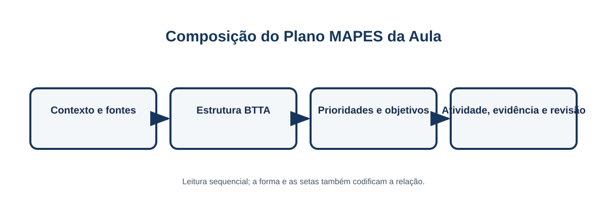{#fig-10-plano-aula  width=94% }

# Organização, produção e implementação

Produzir material é uma etapa necessária, mas não define quem produz. Professor, equipe humana e ferramentas podem colaborar; a responsabilidade acadêmica e a aprovação permanecem docentes. Um roteiro, um slide, uma simulação ou uma ficha só entram na aula quando tornam uma relação, uma função ou uma tarefa mais acessível — não quando apenas tornam o material mais abundante.

Durante a implementação, o professor apresenta a situação, pede uma primeira hipótese, oferece fontes ou apoio no momento necessário e exige que a decisão seja justificada pelas relações do sistema. Feedback útil indica o que o estudante fez, que evidência faltou e qual relação deve ser revisitada. O erro frequente é medir satisfação como se fosse aprendizagem.

# Avaliar e revisar

A avaliação deve pedir o uso do sistema: explicar relações, prever uma consequência, justificar uma decisão ou transferir um princípio. No exemplo, uma segunda prescrição com informação incompleta permite observar se o estudante apenas recita passos ou identifica a verificação ausente e interrompe o processo com justificativa.

A revisão compara a evidência com o objetivo e também observa a viabilidade: a fronteira estava adequada? O material apoiou ou distraiu? A tarefa exigiu a operação pretendida? Essas perguntas produzem uma próxima versão da aula, não uma alegação automática de eficácia do framework.

# Limites, evidência e pesquisa

O MAPES reúne ideias apoiadas em literaturas sobre organização do conhecimento, aprendizagem ativa, alinhamento, feedback, transferência e carga cognitiva. Essa convergência não valida o framework integrado. A revisão disponível é sistematizada e seletiva; não deve ser apresentada como revisão sistemática concluída nem como prova de efeito.

Quando uma implementação também é objeto de investigação, o desenho de pesquisa acrescenta pergunta, método, registros e cuidados apropriados. Pesquisa é uma atividade associada, não uma etapa ou nível do MAPES. O protocolo publicado indica como realizar uma futura revisão sistemática sem inventar buscas, números PRISMA ou instrumentos validados.

# Diagramas de consulta

Os diagramas seguintes retomam relações que o livro usa no planejamento. Eles não substituem a explicação anterior; servem para que professor e estudantes revisitem a sequência de decisões durante a preparação, a produção e a revisão.

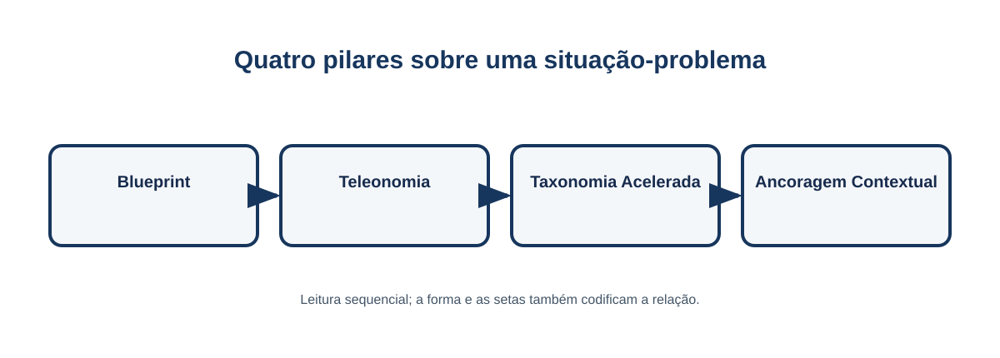{#fig-02-btta-situacao  width=94% }

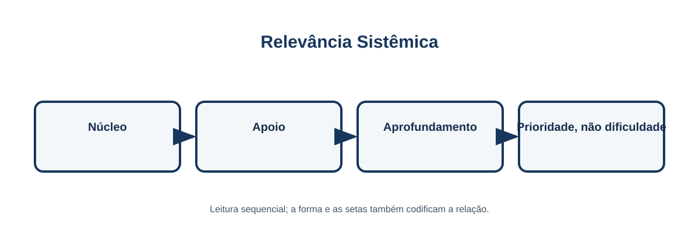{#fig-06-relevancia  width=88% }

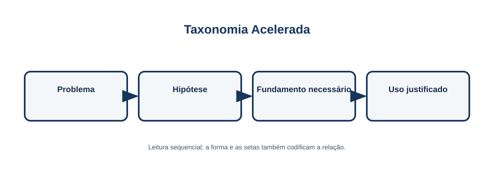{#fig-08-taxonomia  width=88% }

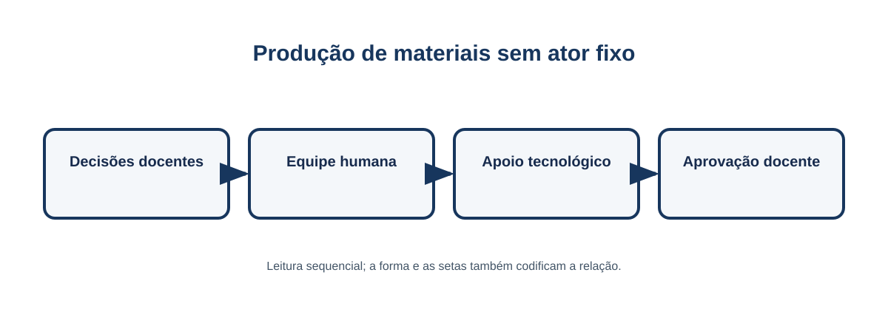{#fig-11-producao  width=94% }

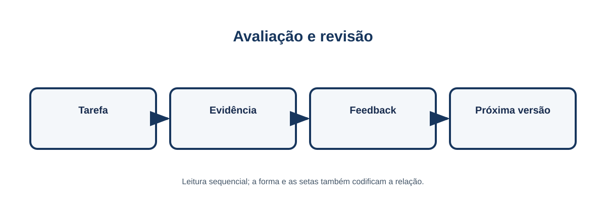{#fig-12-avaliacao  width=88% }

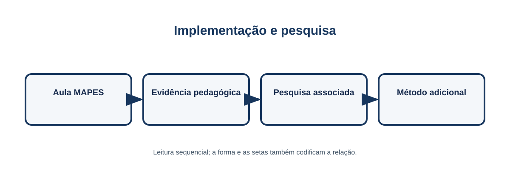{#fig-13-implementacao-pesquisa  width=94% }
