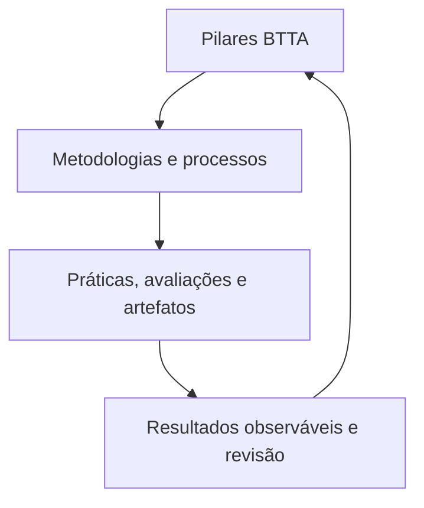

# MAPES — consolidação conceitual, *lessons learned* e diretrizes para elaboração teórica

**Nome oficial:** MAPES — Método de Aprendizagem por Estruturação Sistêmica  
**Natureza atual:** framework pedagógico em processo de formalização teórica  
**Versão deste documento:** 1.0  
**Data:** 23 de julho de 2026  
**Status:** documento normativo de consolidação e orientação; não constitui validação empírica do framework

---

## Resumo executivo

O MAPES é um framework pedagógico de aplicação transversal destinado a organizar o ensino e a aprendizagem de conhecimentos complexos como sistemas de componentes, relações, funções, níveis de domínio e contextos de aplicação. Seu problema de partida é a fragmentação do conhecimento, agravada pela abundância informacional e pela heterogeneidade dos repertórios dos estudantes. Sua resposta não consiste em reduzir a complexidade, mas em oferecer uma arquitetura explícita para que ela possa ser localizada, relacionada, compreendida e mobilizada.

O framework é orientado por quatro pilares reunidos na sigla **BTTA**:

1. **Blueprint funcional:** explicita o território do conhecimento, seus componentes, limites, relações e interfaces;
2. **Teleonomia:** descreve a contribuição funcional de componentes e processos, sem atribuir intenção ou finalidade consciente aos sistemas;
3. **Taxonomia acelerada:** organiza a progressão cognitiva e o nível de domínio esperado, conduzindo precocemente o estudante a aplicação, análise, avaliação e criação, sem eliminar os conhecimentos fundamentais;
4. **Ancoragem Contextual:** estabelece portas de entrada compatíveis com conhecimentos prévios e contextos dos estudantes, preservando a invariância do conteúdo científico.

Os quatro pilares não esgotam o MAPES. Eles formam sua arquitetura conceitual. O framework completo articula essa arquitetura com metodologias de ensino, processos de planejamento, práticas, atividades, avaliações e artefatos didáticos. Por isso, embora “Método” permaneça no nome consolidado, o MAPES deve ser descrito academicamente como **framework pedagógico**, e não como uma metodologia isolada.

O histórico de elaboração permitiu estabelecer um núcleo conceitual relativamente estável, mas ainda não autoriza apresentar o MAPES como uma teoria pedagógica validada. Para alcançar esse estatuto, será necessário:

- eliminar ambiguidades entre os construtos;
- explicitar mecanismos e condições de contorno;
- formular proposições refutáveis;
- definir indicadores observáveis;
- demonstrar fidelidade de implementação;
- produzir evidências de validade, efetividade, transferência e limites de generalização;
- estabelecer autoria, governança e política de versionamento;
- realizar revisão bibliográfica sistemática, para além das leituras fundacionais já reunidas.

Este documento consolida as decisões já tomadas, separa definição de hipótese, identifica problemas ainda abertos e propõe um protocolo para atualização de conteúdo e desenvolvimento acadêmico do MAPES.

## 1. Finalidade e escopo deste documento

Este texto cumpre cinco funções:

1. preservar as decisões conceituais e terminológicas acumuladas durante a elaboração do MAPES;
2. fornecer uma referência normativa para sites, aulas, apresentações, artigos, materiais didáticos e documentos institucionais;
3. impedir que formulações históricas, promocionais ou específicas da Neurovisão sejam confundidas com a definição geral do framework;
4. explicitar o que já está definido, o que é apenas hipótese e o que ainda exige decisão;
5. orientar a transição de um framework pedagógico autoral para uma teoria educacional formalmente articulada e empiricamente investigável.

O documento não substitui:

- uma revisão sistemática da literatura;
- um protocolo de pesquisa;
- um manual de implementação;
- um instrumento de avaliação;
- uma validação institucional ou jurídica;
- um artigo teórico submetido à revisão por pares.

Esses produtos deverão ser derivados desta consolidação, com finalidades e critérios próprios.

## 2. Base documental e hierarquia de autoridade

### 2.1 Fontes examinadas

A consolidação foi construída a partir de quatro classes de material:

- documento geral **“MAPES — Método de Aprendizagem por Estruturação Sistêmica”**;
- roteiro da apresentação **“MAPES — Mapa de Aprendizado por Estruturação Sistêmica”**, anterior à consolidação terminológica atual;
- texto histórico de contextualização pedagógica, utilizado somente como fonte de problemas, argumentos e referências;
- documento **“Neurovisão — Sistema Conceitual e Visual — v4”**, que registrou decisões posteriores sobre nomenclatura, arquitetura metodológica, comunicação científica e aplicação do MAPES.

Também foram consideradas as decisões explícitas tomadas ao longo da conversa de desenvolvimento do framework e do site da disciplina.

### 2.2 Ordem de precedência

Quando houver conflito entre fontes, deve-se aplicar a seguinte precedência:

1. **decisões explícitas mais recentes registradas como definitivas;**
2. **este documento de consolidação, após sua aprovação;**
3. **documento conceitual e visual v4;**
4. **documento geral do MAPES;**
5. **apresentação e materiais históricos.**

Materiais históricos podem explicar a gênese de uma ideia, mas não devem reintroduzir termos, estruturas ou afirmações superados.

### 2.3 Regra de rastreabilidade

Toda alteração conceitual futura deverá indicar:

- termo ou proposição alterada;
- redação anterior;
- redação nova;
- justificativa teórica ou empírica;
- fontes utilizadas;
- impacto sobre materiais existentes;
- responsável pela decisão;
- data e versão de entrada em vigor.

Alterações meramente gráficas ou editoriais não devem modificar silenciosamente o significado dos construtos.

## 3. Estatuto epistemológico atual

### 3.1 O que o MAPES é

O MAPES é, no estágio atual, um **framework pedagógico autoral**. Um framework organiza conceitos, decisões e práticas e fornece uma estrutura para planejamento, implementação e análise. Ele pode incorporar metodologias educacionais distintas, desde que sejam compatíveis com seus princípios.

O MAPES:

- descreve uma forma de organizar conhecimentos complexos;
- orienta o desenho de aulas, materiais, atividades e avaliações;
- propõe relações entre arquitetura do conhecimento, função, progressão cognitiva e contexto;
- pode ser aplicado a diferentes campos do saber;
- pode incorporar sala de aula invertida, aprendizagem baseada em problemas, investigação guiada, estudos de caso e outras metodologias.

### 3.2 O que o MAPES ainda não é

O MAPES ainda não deve ser apresentado como:

- uma teoria pedagógica empiricamente validada;
- uma intervenção cuja superioridade tenha sido demonstrada;
- uma explicação causal estabelecida sobre memória, motivação, ansiedade ou carga cognitiva;
- um método universalmente eficaz para qualquer domínio, público ou objetivo;
- uma substituição de teorias de aprendizagem existentes;
- um protocolo fechado e invariável.

### 3.3 Critérios para alcançar o estatuto de teoria

Uma teoria do MAPES exigirá, no mínimo:

1. **construtos definidos:** cada componente deve possuir significado não circular e distinguível;
2. **relações explícitas:** deve-se explicar como os construtos se relacionam;
3. **mecanismos propostos:** deve-se indicar por que determinadas relações produziriam determinados resultados;
4. **condições de contorno:** deve-se indicar onde, para quem e em quais tarefas os efeitos são esperados;
5. **predições observáveis:** as proposições devem permitir confirmação provisória ou refutação;
6. **operacionalização:** os construtos devem ser identificáveis em práticas, materiais e comportamentos;
7. **fidelidade de implementação:** deve ser possível determinar se uma aplicação realmente utilizou o MAPES;
8. **programa empírico:** as proposições devem ser investigadas com métodos adequados;
9. **replicabilidade e revisão:** resultados e limites devem poder modificar o framework.

## 4. Problema pedagógico

### 4.1 Formulação moderada

O MAPES parte de uma mudança de contexto: o acesso à informação tornou-se mais amplo, rápido e mediado por sistemas digitais e inteligência artificial. Isso não elimina a necessidade de conhecimento factual, mas torna mais evidente a diferença entre:

- localizar informação;
- memorizar informação;
- compreender relações;
- mobilizar conhecimento diante de problemas;
- avaliar criticamente fontes e inferências.

Em domínios complexos, currículos e materiais podem apresentar conteúdos como sequências de tópicos, disciplinas ou componentes pouco articulados. O estudante pode conhecer partes sem dispor de uma representação suficientemente integrada do sistema. Em turmas heterogêneas, esse problema é ampliado pela diversidade de vocabulários, experiências e modelos mentais prévios.

O MAPES responde a quatro dificuldades relacionadas:

1. **fragmentação:** partes e conceitos são apresentados sem uma arquitetura relacional explícita;
2. **opacidade funcional:** o estudante identifica componentes, mas não compreende suficientemente suas contribuições, dependências e falhas;
3. **progressão cognitiva pouco explícita:** não está claro se o estudante deve reconhecer, explicar, aplicar, analisar, avaliar ou criar;
4. **distância contextual:** a entrada no conteúdo não se conecta ao repertório a partir do qual o estudante interpreta o novo conhecimento.

### 4.2 O que não deve ser alegado sem evidência

Não se deve afirmar genericamente que:

- o ensino superior “quebrou”;
- a abundância de informação necessariamente piora a aprendizagem;
- estudantes contemporâneos perderam a capacidade de atenção;
- conteúdos descontextualizados são automaticamente descartados pelo cérebro;
- um blueprint reduz ansiedade;
- a função garante interesse ou retenção;
- o MAPES reduz evasão, ansiedade ou carga cognitiva;
- o MAPES produz aprendizagem profunda ou transferência superior.

Essas formulações podem originar perguntas de pesquisa, mas não devem aparecer como fatos estabelecidos sem fontes diretamente pertinentes e evidência compatível com a força causal da afirmação.

### 4.3 Formulação do problema de pesquisa

Uma formulação academicamente defensável é:

> Em que condições a explicitação conjunta da arquitetura de um domínio, das funções de seus componentes, dos níveis cognitivos esperados e de pontos de entrada relacionados ao repertório dos estudantes favorece a compreensão relacional, a aplicação e a transferência de conhecimentos complexos?

Essa pergunta não presume a eficácia do MAPES e admite resultados nulos, heterogêneos ou adversos.

## 5. Definição formal do MAPES

### 5.1 Definição canônica

> **MAPES — Método de Aprendizagem por Estruturação Sistêmica — é um framework pedagógico de aplicação transversal que organiza conhecimentos complexos como sistemas e articula os pilares Blueprint funcional, Teleonomia, Taxonomia acelerada e Ancoragem Contextual com metodologias, processos, práticas, avaliações e artefatos de aprendizagem.**

### 5.2 Finalidade

Sua finalidade é tornar explícitos:

- o território do conhecimento;
- os componentes relevantes;
- as relações e interfaces entre componentes;
- as funções e consequências de falhas;
- os níveis de domínio cognitivo esperados;
- as conexões entre o conteúdo e os repertórios dos estudantes;
- os modos pelos quais o conhecimento será aplicado e avaliado.

### 5.3 Invariantes do framework

Uma aplicação deve preservar os seguintes invariantes:

1. o conhecimento é representado como sistema, não apenas como inventário;
2. componentes são relacionados a funções e interdependências;
3. os objetivos cognitivos são explicitados;
4. a entrada contextual não altera a validade do conteúdo;
5. atividades e avaliações são alinhadas à arquitetura e aos objetivos;
6. o estudante é conduzido a navegar, explicar, aplicar e revisar o mapa;
7. materiais e artefatos têm função pedagógica identificável.

### 5.4 O que pode variar

Podem variar:

- o domínio de aplicação;
- a escala e o nível de detalhe do mapa;
- a linguagem inicial;
- os casos, problemas e analogias;
- as metodologias de ensino;
- a sequência de atividades;
- os artefatos;
- os instrumentos de avaliação;
- a duração e a modalidade da oferta.

Essa distinção entre invariantes e variáveis é essencial para evitar dois erros: rigidez excessiva e perda de identidade do framework.

## 6. Arquitetura do framework

O MAPES deve ser representado em três níveis:

### 6.1 Nível 1 — pilares

Os pilares fornecem as perguntas estruturantes do desenho pedagógico. Eles não são atividades e não devem ser reduzidos a elementos gráficos.

### 6.2 Nível 2 — metodologias e processos

Este nível traduz os pilares em desenho instrucional. Pode incluir:

- aprendizagem baseada em problemas;
- estudo de casos;
- investigação guiada;
- sala de aula invertida;
- modelagem;
- engenharia reversa;
- práticas experimentais;
- discussão orientada;
- projetos integradores.

Nenhuma dessas metodologias é sinônimo de MAPES. Uma aplicação pode combiná-las conforme o objetivo e o público.

### 6.3 Nível 3 — práticas, avaliações e artefatos

Este nível reúne manifestações observáveis:

- mapas de sistemas;
- grafos de relações;
- diagramas de função e falha;
- roteiros de análise;
- matrizes de objetivos;
- casos;
- exercícios;
- rubricas;
- relatórios;
- cadernos;
- apresentações;
- ambientes digitais;
- avaliações formativas e somativas.

O artefato não comprova, por si só, a implementação do framework. Um diagrama pode ser decorativo; uma implementação do MAPES exige que ele seja usado para orientar raciocínio, atividade e avaliação.

## 7. Terminologia normativa

### 7.1 Termos obrigatórios

| Conceito | Forma normativa | Regra |
|---|---|---|
| Framework | **MAPES** | sempre em maiúsculas |
| Expansão | **Método de Aprendizagem por Estruturação Sistêmica** | única expansão oficial |
| Natureza | **framework pedagógico** | “método” permanece no nome, mas não esgota sua natureza |
| Conjunto de pilares | **BTTA** | única denominação corrente |
| Primeiro pilar | **Blueprint funcional** | preferível a “Blueprint” isolado em textos formais |
| Segundo pilar | **Teleonomia** | função sem intencionalidade ou finalismo |
| Terceiro pilar | **Taxonomia acelerada** | denominação atual; definição requer consolidação adicional |
| Quarto pilar | **Ancoragem Contextual** | iniciais maiúsculas quando nome do pilar |

### 7.2 Termos históricos ou inadequados

- “Mapa de Aprendizado por Estruturação Sistêmica” não é expansão de MAPES.
- A denominação anterior dos pilares corresponde ao atual **BTTA antes da incorporação da Ancoragem Contextual**; essa equivalência histórica deve ser registrada apenas quando indispensável e não deve voltar a materiais regulares.
- O nome de propostas anteriores não deve ser usado na apresentação pública, na definição corrente nem na narrativa institucional do MAPES.
- “Metodologia MAPES” pode ser usado coloquialmente, mas textos acadêmicos devem preferir “framework MAPES” ou “aplicação do MAPES”.
- “Universal” e “serve para qualquer área” devem ser substituídos por “de aplicação transversal proposta” ou “potencialmente aplicável a diferentes domínios”, até que a generalização seja demonstrada.

### 7.3 Regras de capitalização

- `MAPES` e `BTTA`: sempre em maiúsculas.
- `Blueprint funcional`: inicial maiúscula apenas como nome do pilar.
- `Teleonomia` e `Taxonomia acelerada`: inicial maiúscula apenas como nomes dos pilares.
- `Ancoragem Contextual`: ambas as iniciais maiúsculas quando nome oficial do pilar; em uso genérico, “ancoragem contextual”.

## 8. Os quatro pilares

### 8.1 Blueprint funcional

#### Definição operacional

> Representação explícita e multiescalar de um domínio como sistema, contendo limites, componentes, relações, interfaces, entradas, transformações e saídas relevantes aos objetivos de aprendizagem.

#### Pergunta central

> Onde este elemento se encontra no domínio e como se relaciona com o sistema maior?

#### Funções pedagógicas propostas

- delimitar o território;
- tornar visíveis relações que uma lista de tópicos não mostra;
- permitir navegação entre níveis de abstração;
- oferecer posições para integrar novos conceitos;
- apoiar comparação entre estado esperado, variação e falha.

#### Requisitos mínimos

Um Blueprint funcional deve:

1. declarar o sistema e sua fronteira;
2. explicitar o nível de análise;
3. selecionar componentes com critério;
4. representar relações tipadas, não apenas proximidade visual;
5. indicar entradas, transformações e saídas quando pertinentes;
6. permitir aprofundamento sem contradizer o mapa geral;
7. ser revisável à luz de evidências e objetivos.

#### Riscos conceituais

- confundir mapa com território;
- sugerir que o sistema é estático;
- omitir incerteza, feedback, emergência ou relações muitos-para-muitos;
- transformar metáforas de engenharia em afirmações ontológicas;
- criar um diagrama visualmente sofisticado, mas pedagogicamente inerte;
- impor uma única decomposição como se fosse natural ou definitiva.

#### Critério de qualidade

O estudante deve conseguir localizar um elemento, explicar pelo menos uma relação relevante e justificar por que o nível de detalhe é adequado ao problema em análise.

### 8.2 Teleonomia

#### Definição operacional

> Análise da contribuição funcional de componentes e processos para comportamentos, estados ou capacidades do sistema, incluindo consequências de variação, compensação e falha, sem atribuir intenção consciente ou finalidade metafísica.

#### Perguntas centrais

> Que função este componente ou processo desempenha neste sistema?  
> O que se altera quando sua contribuição varia ou falha?  
> Que compensações ou dependências precisam ser consideradas?

#### Funções pedagógicas propostas

- deslocar a aprendizagem da mera nomenclatura para relações funcionais;
- relacionar estrutura, mecanismo, comportamento e consequência;
- apoiar raciocínio diagnóstico, explicativo e projetual;
- permitir comparação entre funcionamento esperado, variação e falha.

#### Distinção necessária

Teleonomia não é teleologia. Expressões como “foi projetado para”, “tem como objetivo” ou “existe para” devem ser evitadas quando implicarem intenção. Formulações preferíveis são:

- “contribui para”;
- “participa de”;
- “permite”;
- “está associado a”;
- “desempenha a função de”, quando o sentido funcional estiver delimitado.

#### Riscos conceituais

- antropomorfizar sistemas;
- tratar uma função como única ou invariável;
- ignorar *trade-offs*, redundância, adaptação e emergência;
- inferir mecanismo apenas a partir de função;
- confundir consequência clínica com função biológica.

#### Critério de qualidade

O estudante deve relacionar componente, mecanismo, função, contexto e consequência sem recorrer a explicações finalistas.

### 8.3 Taxonomia acelerada

#### Definição operacional provisória

> Planejamento explícito dos níveis de domínio cognitivo, com introdução precoce e sustentada de tarefas de aplicação, análise, avaliação e criação, sem suprimir conhecimentos factuais e conceituais necessários.

#### Pergunta central

> Em que nível cognitivo este conhecimento precisa ser dominado e que evidência demonstrará esse domínio?

#### Funções pedagógicas propostas

- explicitar expectativas cognitivas;
- alinhar objetivos, atividades e avaliação;
- evitar permanência desnecessária em tarefas exclusivamente reprodutivas;
- diagnosticar em que operação cognitiva ocorre a dificuldade;
- conduzir o estudante a usar o conhecimento em problemas progressivamente menos estruturados.

#### Ambiguidade identificada

Os materiais históricos atribuem ao pilar dois sentidos:

1. **progressão cognitiva**, associada à taxonomia revisada de Bloom;
2. **classificação de importância**, incluindo relevância clínica, processos, conteúdos e utilidades.

Esses sentidos não são equivalentes. A teoria deverá decidir entre três alternativas:

- restringir o pilar à progressão cognitiva;
- incorporar formalmente uma taxonomia de relevância como dimensão independente;
- dividir o construto em dois componentes com nomes próprios.

Até essa decisão, a progressão cognitiva é a interpretação operacional preferencial, porque é a formulação mais coerente com a versão atual do framework. Classificações de relevância podem integrar o Blueprint ou o planejamento curricular, mas não devem ser apresentadas como sinônimo automático de Taxonomia acelerada.

#### O significado de “acelerada”

“Acelerada” não deve significar:

- redução arbitrária do tempo de aprendizagem;
- salto sobre conhecimentos fundamentais;
- aumento comprovado de velocidade;
- promessa de aprendizagem mais rápida.

Deve significar, provisoriamente, **antecipação planejada do contato com operações cognitivas superiores**, acompanhada de apoio, exemplos, prática e retorno aos fundamentos quando necessário.

#### Riscos conceituais

- usar verbos de Bloom como rótulos sem alterar a tarefa;
- propor análise ou criação sem conhecimento suficiente;
- confundir dificuldade com profundidade;
- assumir hierarquia rígida e linear;
- medir apenas desempenho final e ignorar processo;
- prometer aceleração sem medida temporal.

#### Critério de qualidade

Objetivos, atividades e avaliações devem apontar para a mesma operação cognitiva e produzir evidências observáveis do nível de domínio declarado.

### 8.4 Ancoragem Contextual

#### Definição operacional

> Planejamento de pontos de entrada que relacionam um conteúdo novo a conhecimentos prévios, linguagens, problemas ou práticas relevantes ao estudante, sem alterar o núcleo conceitual e os critérios de validade do conteúdo.

#### Pergunta central

> Como este conteúdo pode ser inicialmente relacionado ao modelo mental que o estudante já possui?

#### Funções pedagógicas propostas

- reconhecer a heterogeneidade de repertórios;
- reduzir barreiras terminológicas de entrada;
- ativar conhecimentos prévios pertinentes;
- oferecer problemas e exemplos significativos;
- construir uma linguagem comum sem apagar diferenças formativas.

#### Princípio de invariância

O ponto de entrada pode variar; o conteúdo científico não pode ser deformado para caber na analogia. Em uma turma com estudantes de Engenharia, Medicina, Neurociências e Direito, exemplos e vocabulários iniciais podem mudar, mas:

- as relações científicas centrais devem permanecer;
- os objetivos de aprendizagem devem ser equivalentes;
- os critérios de avaliação devem preservar comparabilidade;
- analogias devem ter limites explicitados.

#### Riscos conceituais

- reduzir o conteúdo ao interesse imediato;
- personalizar sem evidência sobre o repertório real;
- usar estereótipos profissionais;
- transformar analogia em explicação;
- criar trilhas com exigências cognitivas desiguais;
- confundir familiaridade com compreensão.

#### Critério de qualidade

O estudante deve conseguir partir de um contexto familiar, alcançar a formulação disciplinar válida e transferir o conceito para um contexto diferente daquele usado na entrada.

## 9. Relações entre os pilares

Os pilares devem ser considerados analiticamente distintos e operacionalmente articulados.

| Pilar | Objeto principal | Erro que procura evitar | Evidência mínima de implementação |
|---|---|---|---|
| Blueprint funcional | arquitetura do domínio | fragmentação | mapa com componentes, relações e limites justificados |
| Teleonomia | contribuição funcional | nomenclatura sem função | explicação função–mecanismo–falha sem finalismo |
| Taxonomia acelerada | nível de domínio | objetivos cognitivos implícitos | alinhamento entre objetivo, tarefa e avaliação |
| Ancoragem Contextual | interface inicial | distância entre conteúdo e repertório | entrada contextual seguida de abstração e transferência |

Uma sequência operacional possível é:

1. delimitar o sistema;
2. mapear componentes e relações;
3. explicitar funções, dependências e falhas;
4. definir o domínio cognitivo esperado;
5. selecionar entradas contextuais;
6. escolher metodologias e atividades;
7. construir artefatos;
8. avaliar aprendizagem e fidelidade;
9. revisar o mapa e o desenho.

Essa sequência é uma orientação de projeto, não uma hipótese de ordem cognitiva obrigatória. Em sala, os pilares podem operar de modo iterativo.

## 10. Proposta de formalização analítica

Para fins de pesquisa, uma unidade didática MAPES pode ser representada por:

\[
\mathcal{M} = \langle G, F, T, A, P, R, V \rangle
\]

em que:

- \(G\) é o Blueprint funcional: grafo ou estrutura de componentes e relações;
- \(F\) associa componentes e processos a funções, variações e falhas;
- \(T\) associa objetivos a operações cognitivas e evidências de domínio;
- \(A\) associa conteúdos a pontos de entrada contextuais e explicita a transição para formulações abstratas;
- \(P\) contém processos, metodologias e práticas;
- \(R\) contém recursos e artefatos;
- \(V\) contém procedimentos de avaliação, validação e revisão.

Essa notação é uma proposta de formalização deste documento. Ela não deve ser apresentada como definição histórica já validada. Sua utilidade é tornar visível que:

- os pilares são necessários, mas não constituem sozinhos uma unidade didática;
- uma aplicação pode ser examinada quanto à completude e coerência;
- relações entre elementos podem ser convertidas em indicadores de fidelidade.

## 11. Fluxo de elaboração de conteúdo

### Etapa 1 — delimitação

Registrar:

- domínio;
- público;
- objetivos;
- nível de formação;
- duração;
- conhecimentos prévios presumidos e verificados;
- restrições institucionais;
- fontes disciplinares.

### Etapa 2 — construção do Blueprint

Produzir:

- fronteira do sistema;
- unidades e níveis;
- relações tipadas;
- entradas, transformações e saídas;
- ciclos de feedback;
- incertezas e controvérsias;
- justificativa das omissões.

### Etapa 3 — análise teleonômica

Para cada unidade relevante, documentar:

- função no nível analisado;
- mecanismo proposto;
- dependências;
- variações;
- modos de falha;
- compensações;
- evidência que sustenta a afirmação.

### Etapa 4 — planejamento taxonômico

Para cada objetivo:

- verbo cognitivo;
- conteúdo;
- condições;
- critério;
- tarefa;
- evidência de aprendizagem;
- apoio necessário;
- progressão esperada.

### Etapa 5 — ancoragem contextual

Para cada perfil ou repertório relevante:

- conhecimento prévio a ativar;
- exemplo ou problema de entrada;
- analogia e seus limites;
- vocabulário de transição;
- conceito disciplinar de destino;
- tarefa de transferência para novo contexto.

### Etapa 6 — seleção metodológica

Escolher a metodologia em função do objetivo, não por preferência ou moda. A decisão deve declarar:

- por que a metodologia é adequada;
- que pilar ela operacionaliza;
- qual apoio será oferecido;
- como o desempenho será observado;
- quais alternativas foram descartadas.

### Etapa 7 — produção de artefatos

Todo artefato deve possuir:

- finalidade pedagógica;
- público;
- momento de uso;
- pilar ou relação que operacionaliza;
- instrução de uso;
- fonte;
- critério de acessibilidade;
- responsável e versão.

### Etapa 8 — avaliação e revisão

A avaliação deve abranger:

- aprendizagem de conteúdo;
- compreensão relacional;
- capacidade de explicar funções;
- aplicação;
- transferência;
- qualidade do raciocínio;
- uso efetivo do mapa;
- fidelidade da implementação;
- experiência do estudante, sem confundi-la com aprendizagem.

## 12. Matriz mínima de uma unidade didática

| Campo | Pergunta de controle |
|---|---|
| Sistema | Qual sistema ou subproblema está sendo estudado? |
| Fronteira | O que está incluído e excluído? |
| Componentes | Quais unidades são relevantes neste nível? |
| Relações | Como as unidades se conectam e que tipo de relação existe? |
| Funções | Que contribuição cada unidade oferece? |
| Variações e falhas | O que muda quando o funcionamento varia? |
| Objetivos cognitivos | O que o estudante deverá fazer com o conhecimento? |
| Ancoragem | De que repertório o estudante partirá? |
| Abstração | Como a entrada será convertida em formulação disciplinar? |
| Transferência | Em que novo contexto o conhecimento será mobilizado? |
| Metodologia | Que forma de trabalho é adequada ao objetivo? |
| Artefatos | Que recursos tornam o raciocínio observável? |
| Avaliação | Que evidência permitirá julgar o domínio? |
| Fontes | Que evidência sustenta conteúdo e escolhas pedagógicas? |
| Revisão | Que resultados exigirão modificar o desenho? |

## 13. MAPES e Neurovisão

### 13.1 Relação correta

O MAPES não é uma metodologia específica da Neurovisão. A Neurovisão é uma aplicação do framework a um domínio complexo que integra óptica, biologia, neurociências, engenharia, clínica e tecnologias de avaliação.

Essa aplicação é especialmente útil para demonstrar:

- múltiplos níveis de organização;
- relações entre estrutura e função;
- processamento distribuído;
- modos de falha e compensação;
- diversidade de instrumentos;
- necessidade de tradução entre formações.

### 13.2 O que pertence à aplicação, não à teoria geral

Não fazem parte da definição universal do MAPES:

- a decomposição particular do sistema visual;
- a tríade ou outras classes específicas da Neurovisão;
- os domínios propedêuticos;
- o grafo sistemas–competências–técnicas;
- exemplos sobre acuidade visual, processamento visual ou sobrecarga sensorial;
- hipóteses clínicas sobre saúde mental, estresse ou carga alostática;
- tecnologias de avaliação visual.

Esses elementos podem ser artefatos ou conteúdos de uma aplicação. Não devem ser usados para definir o framework.

### 13.3 Valor metodológico do grafo tripartido

O grafo Sistemas–Competências–Técnicas constitui um exemplo forte de operacionalização do Blueprint funcional porque:

- representa três classes de entidades;
- explicita relações muitos-para-muitos;
- separa o que é estudado, o que o estudante deve saber fazer e os meios técnicos disponíveis;
- permite navegação, comparação e identificação de lacunas.

Para servir à teoria do MAPES, seu uso deve ser acompanhado de tarefas observáveis: localizar relações, justificar conexões, comparar caminhos, detectar ausências e propor revisões. Sem isso, permanece apenas uma visualização.

## 14. Tipologia de afirmações

Todo texto acadêmico ou institucional sobre o MAPES deve classificar internamente suas afirmações.

| Código | Tipo | Exemplo | Regra |
|---|---|---|---|
| D | definição | “BTTA reúne quatro pilares” | depende de decisão conceitual, não de teste de eficácia |
| N | norma de projeto | “todo artefato deve declarar finalidade” | precisa de justificativa e governança |
| H | hipótese | “o Blueprint pode favorecer compreensão relacional” | deve ser formulada como testável |
| E | afirmação empírica | “a intervenção aumentou transferência” | exige estudo e fonte diretamente pertinente |
| X | exemplo | “óptica pode ser porta de entrada para engenheiros” | ilustra; não demonstra |
| I | interpretação | “a fragmentação pode explicar dificuldade de mobilização” | deve explicitar inferência e alternativas |

Os códigos podem permanecer invisíveis no texto público, mas devem existir durante redação e revisão.

## 15. Proposições para uma teoria em elaboração

As proposições abaixo são hipóteses de trabalho, não resultados.

### P1 — explicitação arquitetural

Quando estudantes recebem e utilizam uma representação coerente dos componentes e relações relevantes de um domínio, espera-se melhor desempenho em tarefas de localização e explicação relacional do que quando recebem apenas uma sequência equivalente de tópicos.

### P2 — articulação funcional

Quando componentes são ensinados em relação a funções, dependências, variações e falhas, espera-se melhor desempenho em explicação mecanística e diagnóstico de problemas do que quando são ensinados predominantemente por nomenclatura.

### P3 — progressão cognitiva alinhada

Quando objetivos, atividades e avaliações explicitam e exercitam operações cognitivas progressivamente complexas, espera-se maior alinhamento entre o domínio pretendido e o desempenho observado.

### P4 — ancoragem com abstração

Quando um novo conteúdo é introduzido por uma conexão pertinente ao repertório do estudante e essa conexão é seguida por abstração explícita, espera-se melhor compreensão inicial e transferência do que com uma entrada não relacionada ou com analogia sem abstração.

### P5 — integração dos pilares

Aplicações que articulam os quatro pilares de modo coerente devem produzir resultados diferentes de aplicações que utilizam apenas um mapa, uma analogia ou uma atividade de alto nível de forma isolada.

### P6 — moderação por conhecimento prévio

Os efeitos de Blueprint e Ancoragem Contextual devem variar em função do conhecimento prévio. Mapas excessivamente detalhados ou âncoras redundantes podem produzir pouco benefício ou interferência para estudantes experientes.

### P7 — dependência da complexidade

Os benefícios esperados devem ser maiores em domínios com múltiplos componentes e relações do que em tarefas simples, lineares ou predominantemente procedimentais.

### P8 — fidelidade como condição

Resultados atribuídos ao MAPES dependerão da fidelidade de implementação. A presença nominal dos pilares ou de elementos visuais não será suficiente.

## 16. Operacionalização e programa de pesquisa

### 16.1 Estudos iniciais

1. **validade de conteúdo:** painel de especialistas para avaliar definições, distinções e completude;
2. **entrevistas cognitivas:** verificar como professores e estudantes interpretam cada construto;
3. **estudos de caso de implementação:** descrever decisões, desvios e mecanismos plausíveis;
4. **pesquisa baseada em design:** iterar unidades didáticas e documentar mudanças;
5. **estudos de viabilidade:** medir tempo de preparo, formação docente e aceitabilidade.

### 16.2 Desenvolvimento de instrumentos

Devem ser desenvolvidos e validados:

- rubrica de qualidade do Blueprint;
- rubrica de análise teleonômica;
- matriz de alinhamento taxonômico;
- protocolo de avaliação de âncoras e de seus limites;
- checklist de fidelidade;
- teste de compreensão relacional;
- tarefas de transferência próxima e distante;
- instrumento de experiência do estudante;
- protocolo de observação de aula.

### 16.3 Desenhos comparativos

Comparações devem isolar componentes sempre que possível:

- lista de tópicos versus Blueprint utilizado ativamente;
- nomenclatura versus função–mecanismo–falha;
- tarefa reprodutiva versus progressão alinhada;
- exemplo genérico versus ancoragem seguida de abstração;
- componente isolado versus integração BTTA.

Resultados devem incluir:

- desempenho imediato;
- retenção;
- transferência;
- calibração metacognitiva;
- tempo de aprendizagem;
- carga percebida e medidas compatíveis;
- heterogeneidade por conhecimento prévio;
- efeitos adversos;
- custo de implementação.

### 16.4 Critérios de refutação ou revisão

A teoria deverá ser revista se:

- os construtos não puderem ser distinguidos empiricamente;
- a fidelidade não puder ser avaliada com confiabilidade;
- mapas não forem usados pelos estudantes no raciocínio;
- âncoras aumentarem familiaridade sem transferência;
- tarefas superiores sem base suficiente prejudicarem aprendizagem;
- resultados forem explicados integralmente por metodologias já conhecidas;
- efeitos ocorrerem apenas em um domínio ou com um único professor;
- custos de implementação superarem benefícios observáveis.

## 17. *Lessons learned*

### 17.1 O nome não define sozinho a natureza

Embora o nome contenha “Método”, o desenvolvimento mostrou que o MAPES inclui princípios, métodos, processos e artefatos. Descrevê-lo apenas como método empobrece sua arquitetura; chamá-lo de teoria antes de validação a excede.

### 17.2 Os pilares não são o framework completo

BTTA organiza o núcleo conceitual. MAPES é a articulação entre pilares e implementação. Confundir os dois torna impossível avaliar fidelidade e evolução.

### 17.3 Terminologia histórica contamina materiais atuais

Apresentações e programas preservam nomes e expansões superados. Sem uma fonte normativa e busca ativa, esses termos reaparecem em diagramas, textos e aulas.

### 17.4 Aplicação não é definição

A Neurovisão ajudou a concretizar o MAPES, mas seus sistemas, classes, instrumentos e hipóteses clínicas não devem limitar nem definir o framework geral.

### 17.5 Metáforas são portas, não evidências

Plantas, tijolos, mapas, carros e sistemas de engenharia tornam a proposta compreensível, mas não comprovam mecanismos cognitivos. Toda metáfora precisa declarar seus limites.

### 17.6 Visualização deve ser operacional

Diagramas, grafos e camadas só materializam o MAPES quando sustentam navegação, explicação, atividade ou avaliação. Repetir um quadro BTTA como ornamento não implementa o framework.

### 17.7 Função exige cautela contra finalismo

O uso de “propósito” facilitou a comunicação, mas pode sugerir intenção ou projeto em sistemas biológicos. “Contribuição funcional” é a formulação mais precisa.

### 17.8 “Taxonomia” permanece semanticamente sobrecarregada

O histórico misturou classificação de relevância e progressão cognitiva. Essa ambiguidade é a principal pendência interna do núcleo BTTA.

### 17.9 Adaptação contextual precisa preservar invariância

A adequação da porta de entrada a públicos distintos é uma força do framework, mas pode produzir simplificação, estereótipo ou desigualdade. O destino conceitual e o critério de avaliação precisam permanecer explícitos.

### 17.10 Retórica promocional pode ultrapassar a evidência

Expressões alarmantes ou categóricas tornaram o projeto memorável, mas reduziram sua defensabilidade acadêmica. A comunicação deve preferir descrição, hipótese e demonstração.

### 17.11 Referência sugerida não é sustentação automática

Uma lista de leituras não demonstra todas as relações causais apresentadas no texto. Cada afirmação empírica precisa de fonte diretamente pertinente.

### 17.12 Experiência positiva não equivale a aprendizagem

Clareza percebida, interesse e satisfação são resultados relevantes, mas não substituem medidas de compreensão, retenção e transferência.

### 17.13 Complexidade não deve ser confundida com dificuldade

O MAPES busca tornar a complexidade navegável. Ele não deve aumentar dificuldade artificialmente nem prometer que clareza elimina o esforço necessário.

### 17.14 Uma teoria precisa admitir fracasso

O MAPES só será teoricamente produtivo se suas proposições puderem falhar e se resultados contrários puderem modificar o modelo.

### 17.15 Construção iterativa exige governança

Iteração sem registro produz deriva conceitual. Cada mudança precisa indicar motivação, evidência, compatibilidade e impacto.

## 18. Diretrizes editoriais

### 18.1 Tom

Usar linguagem:

- acadêmica;
- objetiva;
- explicativa;
- moderada;
- verificável;
- acessível sem simplificação indevida.

Evitar:

- frases de efeito sem conteúdo;
- alarmismo;
- oposição caricatural entre “ensino tradicional” e MAPES;
- promessas de transformação;
- causalidade não demonstrada;
- generalizações sobre estudantes;
- linguagem clínica sem fonte;
- metáforas apresentadas como mecanismos.

### 18.2 Verbos calibrados pela evidência

| Força | Formulações adequadas |
|---|---|
| Definição | “é definido como”, “compreende”, “designa” |
| Norma | “deve”, “requer”, “adota-se” |
| Hipótese | “propõe-se”, “espera-se”, “pode favorecer” |
| Associação observada | “foi associado”, “correlacionou-se” |
| Causalidade | “produziu”, “reduziu”, “aumentou” — somente com desenho adequado |
| Limite | “não foi avaliado”, “permanece incerto”, “não permite inferir” |

### 18.3 Estrutura recomendada para textos públicos

1. problema concreto e moderado;
2. definição do MAPES;
3. arquitetura BTTA;
4. explicação operacional dos pilares;
5. exemplo de aplicação claramente identificado;
6. limites;
7. referências diretamente relacionadas.

### 18.4 Expressões a revisar

| Formulação problemática | Formulação recomendada |
|---|---|
| “o ensino quebrou” | “currículos podem apresentar fragmentação” |
| “crise da competição atencional” | “abundância informacional e disputa por atenção” |
| “o cérebro descarta” | “a integração e a recuperação podem ser dificultadas” |
| “reduz ansiedade cognitiva” | “pode reduzir incerteza percebida; requer avaliação” |
| “aprender com propósito é aprender com retenção” | “relações funcionais podem ser investigadas como apoio à retenção” |
| “serve para qualquer área” | “propõe aplicação transversal” |
| “a base como trampolim” | “fundamentos articulados precocemente a tarefas de maior complexidade” |
| “o aluno do futuro” | “o estudante em contextos de abundância informacional” |

## 19. Consistência metodológica

Uma implementação coerente deve satisfazer:

- **coerência vertical:** objetivos, atividades e avaliações convergem;
- **coerência horizontal:** pilares se complementam sem duplicação;
- **coerência disciplinar:** mapas e funções respeitam o conhecimento do domínio;
- **coerência contextual:** a adaptação não altera o conteúdo;
- **coerência temporal:** a progressão é compatível com conhecimentos prévios e tempo;
- **coerência documental:** termos e definições permanecem estáveis entre materiais;
- **coerência empírica:** a força das afirmações corresponde à evidência.

### 19.1 Checklist de fidelidade

Uma unidade só deve ser identificada publicamente como aplicação do MAPES se:

- [ ] o sistema e sua fronteira estão explícitos;
- [ ] componentes e relações foram selecionados com justificativa;
- [ ] funções e falhas são analisadas sem finalismo;
- [ ] objetivos cognitivos são observáveis;
- [ ] atividades e avaliações estão alinhadas;
- [ ] pelo menos uma entrada contextual é seguida de abstração;
- [ ] há tarefa de aplicação ou transferência;
- [ ] artefatos possuem finalidade declarada;
- [ ] fontes disciplinares são rastreáveis;
- [ ] limites e incertezas estão registrados;
- [ ] a implementação pode ser revisada a partir de resultados.

## 20. Governança de conteúdo

### 20.1 Papéis mínimos

Devem ser formalizados:

- responsável científico pelo framework;
- comitê conceitual;
- responsável editorial;
- revisores de domínio;
- responsável por evidências e referências;
- responsável por acessibilidade e artefatos;
- mantenedor do histórico de versões.

### 20.2 Autoria

Os materiais disponíveis não são suficientes para estabelecer de forma inequívoca:

- autoria intelectual;
- coautoria;
- contribuições conceituais;
- vínculo institucional da criação;
- titularidade e licença;
- forma de citação do MAPES.

Antes da publicação acadêmica, deve-se produzir uma declaração de contribuições, preferencialmente compatível com uma taxonomia de autoria reconhecida, e uma citação oficial do framework.

### 20.3 Fluxo de mudança

1. abrir proposta de alteração;
2. classificar como terminológica, conceitual, metodológica, empírica ou editorial;
3. avaliar impacto;
4. revisar fontes;
5. aprovar ou rejeitar;
6. atualizar glossário e exemplos;
7. executar busca por termos obsoletos;
8. registrar versão;
9. comunicar a mudança aos responsáveis por materiais.

### 20.4 Versionamento

Adotar versionamento semântico:

- **MAJOR:** muda definição, pilar ou relação estrutural;
- **MINOR:** adiciona método, indicador, instrumento ou orientação compatível;
- **PATCH:** corrige redação, referência ou inconsistência sem alterar significado.

## 21. Ambiguidades e decisões pendentes

### Prioridade crítica

1. consolidar o significado de Taxonomia acelerada;
2. definir operacionalmente “acelerada” e decidir se requer medida temporal;
3. estabelecer autoria, contribuições, vínculo institucional e citação oficial;
4. definir os critérios necessários e suficientes para uma implementação ser reconhecida como MAPES;
5. distinguir resultados esperados do framework de resultados de metodologias incorporadas;
6. definir medidas de fidelidade.

### Prioridade alta

7. decidir se os quatro pilares são necessários em toda unidade ou se podem operar em diferentes intensidades;
8. especificar relações entre Blueprint, progressão cognitiva e taxonomias específicas de domínio;
9. definir condições de contorno por complexidade, nível de formação e conhecimento prévio;
10. estabelecer como representar sistemas dinâmicos, incerteza, emergência e múltiplas escalas;
11. definir padrões para analogias e tradução entre repertórios;
12. revisar sistematicamente os fundamentos bibliográficos de cada mecanismo proposto.

### Prioridade de aplicação

13. formalizar a relação entre classes da aplicação em Neurovisão, domínios propedêuticos e grafo Sistemas–Competências–Técnicas;
14. criar modelos reutilizáveis para unidade didática, aula, material e avaliação;
15. definir formação mínima de docentes;
16. testar acessibilidade cognitiva e digital dos artefatos;
17. estabelecer política de licença e uso educacional após validação institucional.

## 22. Agenda para consolidação acadêmica

### Fase 1 — saneamento conceitual

- aprovar terminologia;
- resolver Taxonomia acelerada;
- definir unidade de análise;
- estabelecer autoria e governança;
- publicar glossário normativo.

### Fase 2 — modelo lógico

- relacionar entradas, atividades, mecanismos, produtos e resultados;
- definir condições de contorno;
- formalizar proposições;
- criar checklist de fidelidade.

### Fase 3 — revisão da literatura

- elaborar protocolo;
- definir bases, descritores e critérios;
- mapear teorias e evidências relacionadas a organização do conhecimento, carga cognitiva, aprendizagem significativa, mapas conceituais, transferência, *scaffolding*, taxonomias e contexto;
- avaliar convergências, diferenças e contribuição original;
- não limitar a teoria às referências históricas iniciais.

### Fase 4 — instrumentos e estudos-piloto

- desenvolver rubricas;
- conduzir validade de conteúdo;
- testar compreensão dos termos;
- executar estudos de caso e pesquisa baseada em design.

### Fase 5 — testes comparativos

- registrar previamente hipóteses e desfechos;
- usar grupos de comparação adequados;
- medir processo, aprendizagem, retenção, transferência e custos;
- investigar moderadores e efeitos adversos.

### Fase 6 — publicação e replicação

- publicar definição, manual e instrumentos;
- disponibilizar materiais suficientes para replicação;
- relatar resultados nulos;
- promover replicações por outros docentes e domínios;
- atualizar a teoria conforme evidência acumulada.

## 23. Referências herdadas e auditoria bibliográfica

### 23.1 Regra geral

As referências abaixo já estavam presentes nos materiais-fonte. Sua presença nesta consolidação não significa que sustentem automaticamente todas as proposições do MAPES. Antes de um artigo teórico, cada referência deverá ser ligada a uma afirmação específica e examinada em texto integral.

### 23.2 Registros bibliográficos utilizáveis

Anderson LW, Krathwohl DR, eds. (2001) *A taxonomy for learning, teaching, and assessing: a revision of Bloom’s taxonomy of educational objectives*. New York: Longman.

Ausubel DP (1968) *Educational psychology: a cognitive view*. New York: Holt, Rinehart and Winston.

Bjork EL, Bjork RA (2011) Making things hard on yourself, but in a good way: creating desirable difficulties to enhance learning. In: *Psychology and the real world: essays illustrating fundamental contributions to society* (Gernsbacher MA, Pew RW, Hough LM, Pomerantz JR, eds). New York: Worth.

Bransford JD, Brown AL, Cocking RR, eds. (2000) *How people learn: brain, mind, experience, and school: expanded edition*. Washington, DC: National Academies Press. [https://doi.org/10.17226/9853](https://doi.org/10.17226/9853)

Chi MTH, Feltovich PJ, Glaser R (1981) Categorization and representation of physics problems by experts and novices. *Cognitive Science* 5:121–152. [https://doi.org/10.1207/s15516709cog0502_2](https://doi.org/10.1207/s15516709cog0502_2)

Hennessy NL (2020) *The reading comprehension blueprint: helping students make meaning from text*. Baltimore: Paul H. Brookes Publishing.

Hmelo-Silver CE, Duncan RG, Chinn CA (2007) Scaffolding and achievement in problem-based and inquiry learning: a response to Kirschner, Sweller, and Clark (2006). *Educational Psychologist* 42:99–107. [https://doi.org/10.1080/00461520701263368](https://doi.org/10.1080/00461520701263368)

Kahneman D (2011) *Thinking, fast and slow*. New York: Farrar, Straus and Giroux. A edição em português citada nos materiais precisa ter editora, ano e ISBN conferidos separadamente.

Kirschner PA, Sweller J, Clark RE (2006) Why minimal guidance during instruction does not work: an analysis of the failure of constructivist, discovery, problem-based, experiential, and inquiry-based teaching. *Educational Psychologist* 41:75–86. [https://doi.org/10.1207/s15326985ep4102_1](https://doi.org/10.1207/s15326985ep4102_1)

Klein G (1998) *Sources of power: how people make decisions*. Cambridge, MA: MIT Press.

Mayr E (1974) Teleological and teleonomic: a new analysis. In: *Methodological and historical essays in the natural and social sciences* (Cohen RS, Wartofsky MW, eds), pp 91–117. Dordrecht: Springer. [https://doi.org/10.1007/978-94-010-2128-9_6](https://doi.org/10.1007/978-94-010-2128-9_6)

National Academies of Sciences, Engineering, and Medicine (2018) *How people learn II: learners, contexts, and cultures*. Washington, DC: National Academies Press. [https://doi.org/10.17226/24783](https://doi.org/10.17226/24783)

Norman G (2009) Teaching basic science to optimize transfer. *Medical Teacher* 31:807–811. [https://doi.org/10.1080/01421590903049814](https://doi.org/10.1080/01421590903049814)

Novak JD, Gowin DB (1984) *Learning how to learn*. Cambridge: Cambridge University Press. [https://doi.org/10.1017/CBO9781139173469](https://doi.org/10.1017/CBO9781139173469)

Pittendrigh CS (1958) Adaptation, natural selection, and behavior. In: *Behavior and evolution* (Roe A, Simpson GG, eds), pp 390–416. New Haven: Yale University Press.

Sweller J (1988) Cognitive load during problem solving: effects on learning. *Cognitive Science* 12:257–285. [https://doi.org/10.1207/s15516709cog1202_4](https://doi.org/10.1207/s15516709cog1202_4)

Tight M (2020) Student retention and engagement in higher education. *Journal of Further and Higher Education* 44:689–704. [https://doi.org/10.1080/0309877X.2019.1576860](https://doi.org/10.1080/0309877X.2019.1576860)

### 23.3 Registros que exigem saneamento

| Registro herdado | Problema |
|---|---|
| Davis MH (2011), “AMEE Guide no. 47: Outcome-based education”, *Medical Teacher* 33:263–271 | O número do guia, título e dados não convergem com os registros bibliográficos localizados. Não citar até identificação inequívoca. |
| Custers (2010) | Citado no corpo do material histórico, mas ausente da bibliografia. É necessário recuperar o trabalho exato. |
| Mayer RE (2010), *Aprendizagem baseada em problemas*, Artmed | O registro não foi identificado de forma inequívoca e pode combinar autor, título ou edição incorretos. Não citar sem conferência. |

### 23.4 Limite da bibliografia atual

A bibliografia inicial oferece pontos de contato com:

- aprendizagem significativa;
- organizadores prévios;
- mapas conceituais;
- carga cognitiva;
- organização do conhecimento por especialistas;
- transferência;
- taxonomias cognitivas;
- dificuldades desejáveis;
- função e teleonomia;
- instrução guiada e *scaffolding*;
- retenção e engajamento.

Ela ainda não constitui uma revisão suficiente para demonstrar:

- originalidade teórica do MAPES;
- independência entre os quatro pilares;
- mecanismo integrador;
- superioridade sobre outras abordagens;
- efetividade transversal;
- validade em Neurovisão;
- impacto clínico, motivacional ou institucional.

## 24. Glossário

**Ancoragem Contextual:** pilar que define pontos de entrada relacionados ao repertório do estudante e a transição para uma formulação disciplinar válida.

**Artefato:** recurso material ou digital produzido para apoiar uma função pedagógica identificável.

**Blueprint funcional:** representação multiescalar da arquitetura de um domínio, com componentes, relações, interfaces e limites.

**BTTA:** conjunto atual dos quatro pilares do MAPES.

**Condição de contorno:** circunstância que limita onde ou para quem uma proposição é esperada.

**Fidelidade de implementação:** grau em que uma aplicação preserva os componentes e relações definidos pelo framework.

**Framework pedagógico:** estrutura que organiza conceitos, processos, métodos, práticas e artefatos sem prescrever necessariamente uma única sequência ou metodologia.

**MAPES:** Método de Aprendizagem por Estruturação Sistêmica.

**Mecanismo:** processo proposto por meio do qual uma intervenção produziria determinado resultado.

**Metodologia:** forma organizada de conduzir atividades de ensino e aprendizagem; pode ser incorporada pelo MAPES, mas não é sinônimo dele.

**Sistema:** conjunto delimitado de componentes cujas relações são relevantes para o fenômeno ou objetivo analisado.

**Taxonomia acelerada:** pilar de progressão cognitiva; denominação e definição ainda exigem consolidação para eliminar sobreposição com classificação de relevância.

**Teleonomia:** análise de contribuição funcional sem atribuição de intenção ou finalidade metafísica.

**Transferência:** mobilização do conhecimento em contexto diferente daquele em que foi inicialmente aprendido.

## 25. Declaração normativa final

Até que nova versão seja formalmente aprovada, devem ser consideradas estáveis as seguintes decisões:

1. MAPES significa **Método de Aprendizagem por Estruturação Sistêmica**.
2. MAPES é descrito como **framework pedagógico de aplicação transversal**.
3. BTTA reúne **Blueprint funcional, Teleonomia, Taxonomia acelerada e Ancoragem Contextual**.
4. BTTA fornece os pilares; o MAPES articula pilares, metodologias, processos, práticas, avaliações e artefatos.
5. A Neurovisão é uma aplicação do MAPES, não seu limite de validade nem sua definição.
6. Pontos de entrada contextuais podem variar; o conteúdo e os critérios de validade devem permanecer.
7. Teleonomia não autoriza finalismo.
8. “Aceleração” não autoriza omissão de fundamentos nem promessa de aprendizagem mais rápida.
9. Exemplos, metáforas e aplicações não constituem evidência.
10. Alegações causais requerem fonte e desenho de pesquisa compatíveis.
11. O MAPES permanece um framework em formalização teórica até que um programa empírico sustente estatuto mais forte.

---

## Apêndice A — ficha de proposta de alteração

**Identificador:**  
**Data:**  
**Proponente:**  
**Tipo:** terminológica / conceitual / metodológica / empírica / editorial  
**Elemento afetado:**  
**Redação atual:**  
**Redação proposta:**  
**Problema identificado:**  
**Justificativa:**  
**Evidências e fontes:**  
**Alternativas consideradas:**  
**Impacto sobre materiais:**  
**Compatibilidade retroativa:**  
**Decisão:** aprovada / rejeitada / adiada  
**Responsáveis pela revisão:**  
**Versão de entrada em vigor:**  

## Apêndice B — ficha de unidade didática MAPES

**Título da unidade:**  
**Domínio:**  
**Público:**  
**Conhecimentos prévios:**  
**Objetivos:**  
**Sistema e fronteira:**  
**Componentes e relações:**  
**Funções, variações e falhas:**  
**Níveis cognitivos:**  
**Âncoras contextuais:**  
**Transição para abstração:**  
**Metodologias:**  
**Atividades:**  
**Artefatos:**  
**Avaliação:**  
**Tarefa de transferência:**  
**Fontes:**  
**Acessibilidade:**  
**Indicadores de fidelidade:**  
**Resultados observados:**  
**Revisões necessárias:**  

## Apêndice C — perguntas para revisão por pares

1. Os quatro pilares são conceitualmente distintos?
2. Algum pilar combina mais de um construto?
3. A relação entre pilares e implementação está suficientemente explicitada?
4. Quais proposições apenas renomeiam conhecimentos já estabelecidos?
5. Qual é a contribuição original do MAPES?
6. Em quais domínios o framework não seria adequado?
7. Que evidência poderia refutar cada proposição?
8. Como distinguir efeito do MAPES de efeito do professor, da metodologia ou do artefato?
9. O framework exige todos os pilares em toda unidade?
10. Como medir fidelidade sem transformar o MAPES em protocolo rígido?
11. Como o conhecimento prévio modifica os efeitos esperados?
12. Quais riscos ou efeitos adversos devem ser monitorados?
