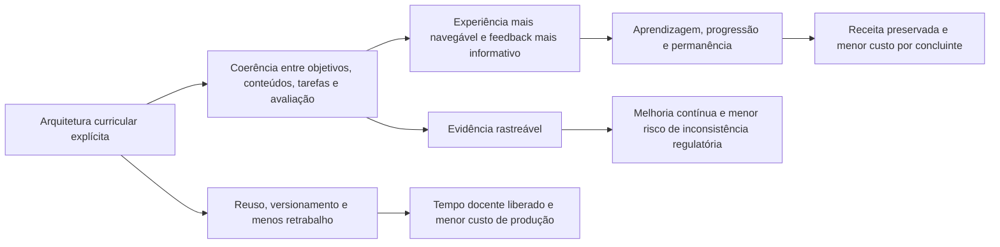

# Tese de Valor Institucional do MAPES

**Base do framework:** MAPES v0.10.0  
**Finalidade:** avaliação estratégica e comercial para instituições de educação superior  
**Status:** hipótese institucional estruturada; benefícios sujeitos a implementação e validação local

## 1. Síntese executiva

O MAPES pode ser comercialmente posicionado como uma **arquitetura institucional para elevar a qualidade e a produtividade do trabalho acadêmico**. A unidade de valor não é apenas a aula nem o material didático isolado. É a capacidade de conectar, com rastreabilidade:

> políticas institucionais -> perfil do egresso -> competências -> arquitetura curricular -> conteúdos -> tarefas -> evidências de aprendizagem -> feedback -> revisão do curso.

Essa cadeia é relevante porque instituições de educação superior enfrentam simultaneamente cinco pressões:

1. **qualidade regulatória e acadêmica:** necessidade de demonstrar coerência, implantação, acompanhamento e melhoria contínua;
2. **permanência:** evasão elevada, especialmente na rede privada e na educação a distância;
3. **escala:** expansão de ofertas e relações estudante-docente elevadas sem deterioração da experiência;
4. **custo:** pressão sobre mensalidades, pessoal, tecnologia, aquisição de alunos e retrabalho acadêmico;
5. **sustentabilidade docente:** aumento de tarefas de planejamento, documentação, avaliação, atualização e atendimento.

O MAPES não resolve automaticamente nenhuma dessas pressões. Ele oferece uma estrutura para tornar as decisões acadêmicas mais explícitas, os artefatos mais reutilizáveis, os processos mais auditáveis e os resultados mais mensuráveis.

## 2. O produto institucional não é apenas uma metodologia

No nível de uma disciplina, o MAPES organiza conhecimentos complexos como sistemas e articula Blueprint funcional, Teleonomia, Taxonomia Acelerada e Ancoragem Contextual, complementados pela Estratificação de Relevância Sistêmica.

No nível institucional, essa arquitetura pode funcionar como uma camada comum para:

- desenho e revisão de currículos;
- produção e validação de materiais;
- formação e apoio docente;
- planejamento de tarefas e avaliação;
- operação de tutoria e mediação;
- registro de decisões do NDE e da coordenação;
- análise de coerência entre unidades curriculares;
- documentação de acessibilidade, fontes, versões e responsabilidades;
- aprendizagem institucional a partir dos resultados.

A diferença comercial é relevante. Uma metodologia de sala de aula disputa espaço com dezenas de outras abordagens. Uma arquitetura institucional de qualidade e produtividade pode ser incorporada a metodologias já adotadas, ao PPC, ao AVA e aos processos de gestão.

## 3. Seis domínios de valor

### 3.1 Qualidade acadêmica projetável

O MAPES torna explícitos elementos que frequentemente permanecem distribuídos entre PPC, planos de ensino, materiais, avaliações e conhecimento tácito dos docentes:

- fronteiras e relações do domínio;
- contribuição funcional dos componentes;
- relevância curricular;
- operações cognitivas esperadas;
- tarefas que produzem evidência;
- critérios e rubricas;
- fontes, proveniência e incerteza;
- ciclos de feedback e revisão.

**Valor institucional:** maior coerência entre intenção curricular e experiência efetivamente oferecida.

**Hipótese mensurável:** unidades curriculares redesenhadas apresentam maior alinhamento entre objetivos, tarefas e avaliação, maior qualidade independente dos artefatos e melhores resultados de aprendizagem ou não inferioridade com menor custo operacional.

### 3.2 Evidência regulatória e governança

O Instrumento de Avaliação de Cursos de Graduação do Inep não avalia apenas a existência formal de documentos. Em diversos indicadores, os níveis superiores exigem implantação, acompanhamento, inovação, apropriação dos resultados e melhoria contínua.

O MAPES Core prevê registros de objetivos, relações, funções, operações cognitivas, tarefas, evidências, feedback, fontes, confiança, versões e gates de aprovação docente. Essa estrutura pode apoiar a produção de evidência para:

- PPC e sua atualização;
- atuação do NDE;
- gestão da coordenação;
- metodologia e materiais;
- avaliação formativa;
- TIC e AVA;
- tutoria e equipe multidisciplinar;
- decisões colegiadas;
- acessibilidade e melhoria contínua.

**Valor institucional:** menor dispersão documental e maior rastreabilidade entre decisão, implementação e evidência.

**Limite:** o MAPES não substitui documentos oficiais, atos colegiados, contratos, titulação, regime de trabalho, infraestrutura ou visita in loco. Aderência ao instrumento não garante conceito.

### 3.3 Permanência, conclusão e proteção de receita

A evasão reduz receita ao longo do ciclo, aumenta a dependência de novas captações e eleva o custo por concluinte. O Mapa do Ensino Superior 2026 informa evasão anual de 26,6% na rede privada presencial e 41,9% na rede privada a distância em 2024. O problema econômico central não é apenas preencher vagas; é converter matrícula em progressão e conclusão.

O MAPES pode atuar sobre mecanismos educacionais plausíveis associados à permanência:

- orientação do estudante no domínio e no percurso;
- expectativas e critérios mais explícitos;
- tarefas iniciais que revelam lacunas;
- feedback mais frequente e estruturado;
- conexão entre teoria, prática e perfil profissional;
- apoio diferenciado sem redução dos objetivos nucleares;
- identificação de pontos de desorientação;
- revisão de unidades com base em evidências.

**Valor institucional:** preservação potencial de receita e redução do custo de reposição de estudantes, caso a implementação produza melhora real de permanência.

**Limite causal:** evasão também depende de renda, emprego, saúde, transporte, financiamento, expectativas, atendimento, condições familiares e fatores externos. O MAPES não deve ser vendido como solução isolada de retenção.

### 3.4 Produtividade acadêmica e redução de retrabalho

O custo acadêmico inclui mais do que horas em sala. Inclui desenho, preparação, atualização, produção de materiais, elaboração e correção de avaliações, registro de decisões, atendimento, coordenação, tutoria e revisão.

O MAPES pode reduzir trabalho repetitivo por meio de:

- templates e estruturas comuns;
- reutilização versionada de grafos, tarefas, rubricas e fontes;
- separação entre núcleo comum e adaptações locais;
- detecção de inconsistências e lacunas;
- geração assistida de alternativas, sujeita a aprovação;
- documentação produzida durante o fluxo de trabalho;
- distribuição explícita de responsabilidades;
- redução de reconstruções integrais a cada oferta.

**Valor institucional:** menor tempo de ciclo para produzir ou revisar uma unidade curricular e maior consistência entre ofertas.

**Princípio de proteção docente:** produtividade não deve significar intensificação silenciosa. Tempo liberado deve ser medido e destinado a atividades de maior valor, como mediação, feedback responsivo, orientação, atualização e pesquisa.

### 3.5 Escala com controle de qualidade

A escala educacional não pode ser medida apenas por número de estudantes por professor ou por redução de custo unitário. Em 2024, a educação a distância alcançou 50,7% das matrículas brasileiras; 95,9% das matrículas EaD estavam na rede privada. A OCDE reportou uma relação de 62 estudantes por membro da equipe acadêmica em instituições privadas brasileiras, contra 10:1 nas públicas.

Esse cenário cria risco de escala sem presença pedagógica suficiente. O MAPES pode apoiar um modelo diferente:

- estrutura comum de alta qualidade;
- vistas e apoios proporcionais ao perfil e ao momento;
- divisão clara entre professor, tutor, equipe multidisciplinar e automação;
- tarefas e critérios reutilizáveis, mas não mecanicamente idênticos;
- dados agregados para identificar gargalos de aprendizagem;
- gate docente para decisões acadêmicas;
- registros para comparar qualidade entre polos, turmas e modalidades.

**Valor institucional:** ampliação de capacidade sem depender apenas de aumento linear do trabalho de especialistas.

**Limite:** a estrutura não compensa subdimensionamento de docentes, tutores, suporte ou infraestrutura. Escala sustentável exige capacidade mínima de interação e intervenção.

### 3.6 Diferenciação e valor percebido

No setor privado, qualidade acadêmica, empregabilidade, experiência, flexibilidade e preço competem na decisão do estudante. O MAPES pode oferecer elementos visíveis de diferenciação:

- mapas funcionais do curso e das unidades;
- clareza sobre competências e aplicações profissionais;
- tarefas autênticas desde fases iniciais;
- transparência de objetivos, critérios e progresso;
- materiais com proveniência e atualização;
- portfólio de evidências produzidas pelos estudantes;
- narrativa institucional coerente sobre inovação com controle humano.

**Valor institucional:** proposta acadêmica mais compreensível para estudantes, famílias, docentes, avaliadores e parceiros.

**Limite:** diferenciação só produz valor de mercado quando a experiência real confirma a promessa. Comunicação sem implementação aumenta risco reputacional.

## 4. Valor por decisor institucional

| Decisor | Problema típico | Entrega potencial do MAPES | Evidência requerida |
|---|---|---|---|
| Reitoria/mantenedora | qualidade, escala, margem, reputação e risco | arquitetura comum, indicadores e portfólio de melhoria | permanência, aprendizagem, custo por resultado, risco regulatório |
| Pró-reitoria acadêmica | coerência entre cursos e políticas | padrões proporcionais, rubricas e governança | auditoria de alinhamento e adoção |
| Direção de unidade | variabilidade e retrabalho | reuso, versionamento e comparação entre ofertas | tempo de ciclo, taxa de reuso e qualidade |
| Coordenação de curso | atualização do PPC e gestão | matriz integrada, plano de ação e painéis | decisões registradas, ações concluídas e resultados |
| NDE | acompanhamento e revisão curricular | evidências de alinhamento, lacunas e impacto | atas, relatórios, versões e medidas de aprendizagem |
| Professor | sobrecarga de desenho e correção | autoria assistida, estruturas e tarefas reutilizáveis | tempo líquido e qualidade independente |
| Tutor/mediador | alto volume e baixa visibilidade | protocolos, sinais de dificuldade e fluxos de intervenção | tempo de resposta, resolução e progressão |
| Estudante | fragmentação e desorientação | navegação, critérios, feedback e tarefas autênticas | aprendizagem, retenção, autonomia e contestabilidade |
| Avaliação/qualidade | documentação dispersa | rastreabilidade e evidência por indicador | completude, atualidade e verificabilidade |
| Tecnologia/dados | sistemas desconectados | modelo comum de objetos, versões e eventos | integração, segurança, disponibilidade e portabilidade |

## 5. A cadeia de valor

A cadeia não deve ser tratada como causalidade comprovada. Cada seta representa um mecanismo a testar. Uma instituição pode obter ganhos em coerência e documentação sem produzir melhora de permanência; pode reduzir tempo de produção sem reduzir custo caixa; pode melhorar aprendizagem sem gerar receita adicional em um curso público.

## 6. Posicionamento comercial defensável

### Formulação principal

> O MAPES organiza o trabalho acadêmico para que qualidade, aprendizagem, evidência e eficiência possam ser projetadas, executadas, comparadas e revisadas em escala, preservando a autoridade docente.

### Formulações complementares

- **Para qualidade:** uma arquitetura que conecta o que a instituição promete ao que o estudante efetivamente faz e demonstra.
- **Para operação:** um sistema de trabalho que reduz reconstrução, dispersão e retrabalho sem padronizar indevidamente o julgamento docente.
- **Para gestão:** uma base comum de evidências para coordenação, NDE e melhoria contínua.
- **Para escala:** estruturas reutilizáveis e intervenção orientada por evidência, com responsabilidades humanas explícitas.
- **Para finanças:** uma hipótese mensurável de proteção de receita, capacidade liberada e menor custo por resultado educacional.

## 7. O que não deve ser prometido

1. obtenção automática de conceito 4 ou 5 no Inep;
2. redução universal de evasão;
3. economia antes de medir o custo de implantação e revisão;
4. substituição de professores ou tutores;
5. personalização individual sem dados, governança e contestação;
6. qualidade apenas pela adoção de IA ou plataforma;
7. escalabilidade sem capacidade de suporte;
8. eficácia universal antes da validação multicêntrica prevista pelo próprio MAPES;
9. equivalência entre satisfação, engajamento e aprendizagem;
10. retorno financeiro calculado com premissas não auditáveis.

## 8. Recomendação de modelo de entrada

A forma comercial mais coerente com o estágio atual não é o licenciamento amplo baseado em promessas de eficácia. É um **piloto institucional orientado por valor**, com quatro componentes:

1. diagnóstico de uma amostra de cursos e processos;
2. redesign MAPES de unidades selecionadas;
3. instrumentação de aprendizagem, carga docente, operação e permanência;
4. decisão de escala baseada em critérios previamente acordados.

O piloto deve separar três perguntas:

- o framework melhora o desenho e a aprendizagem?
- o processo de implementação reduz trabalho líquido e produz evidência útil?
- o resultado econômico incremental justifica escala?

## 9. Critério final de valor

O MAPES agrega valor institucional quando produz simultaneamente:

- evidência de qualidade acadêmica;
- viabilidade operacional;
- carga docente aceitável ou reduzida;
- segurança e governança;
- benefício econômico ou capacidade institucional liberada;
- possibilidade de replicação por equipes não fundadoras.

Sem essas condições, o resultado pode ser pedagogicamente interessante, mas ainda não constitui uma proposta institucional sustentável.
